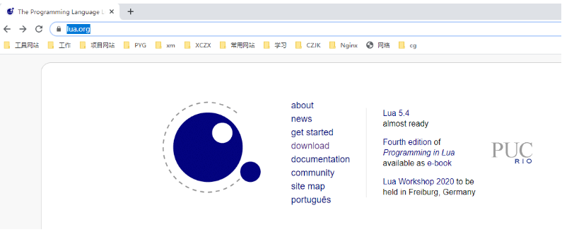
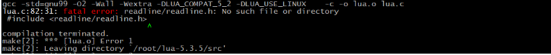
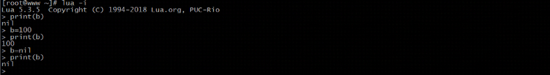

# lua概述

Lua是一种轻量、小巧的脚本语言，用标准C语言编写并以源代码形式开发。设计的目的是为了嵌入到其他应用程序中，从而为应用程序提供灵活的扩展和定制功能。

## 特性

跟其他语言进行比较，Lua有其自身的特点：

（1）轻量级

```
Lua用标准C语言编写并以源代码形式开发，编译后仅仅一百余千字节，可以很方便的嵌入到其他程序中。
```

（2）可扩展

```
Lua提供非常丰富易于使用的扩展接口和机制，由宿主语言(通常是C或C++)提供功能，Lua可以使用它们，就像内置的功能一样。
```

（3）支持面向过程编程和函数式编程

## 应用场景

Lua在不同的系统中得到大量应用，场景的应用场景如下:

游戏开发、独立应用脚本、web应用脚本、扩展和数据库插件、系统安全上。

# 安装

## Linux安装


在linux上安装Lua非常简单，只需要下载源码包并在终端解压、编译即可使用。

Lua的官网地址为:`https://www.lua.org`



1. 点击download可以找到对应版本的下载地址，我们本次课程采用的是lua-5.3.5,其对应的资源链接地址为https://www.lua.org/ftp/lua-5.4.1.tar.gz,也可以使用wget命令直接下载:

```
wget https://www.lua.org/ftp/lua-5.4.1.tar.gz
```

2. 编译安装

```
cd lua-5.4.1
make linux test
make install
```

如果在执行make linux test失败，报如下错误:



说明当前系统缺少libreadline-dev依赖包，需要通过命令来进行安装

```
yum install -y readline-devel
```

验证是否安装成功

```
lua -v
```

# 运行

## 命令式

Lua交互式编程模式可以通过命令lua -i 或lua来启用:

```
lua
```

## 脚本式

也可以通过将写好的lua代码文件执行

```sh
lua hello.lua
```

## vscode

由于openrestry无法在vscode中运行,即脚本可以在vscode运行,但是无法获取到Nginx的参数,所以学习此方法无太大意义,仅用于测试lua脚本

# 语法

由于lua底层是由c编写,所以语法上和c极为相似

## 注释

单行注释的语法为：

```
--注释内容
```

多行注释的语法为:

```
--[[
	注释内容
	注释内容
--]]
```

如果想取消多行注释，只需要在第一个--之前在加一个-即可，如：

```
---[[
	注释内容
	注释内容
--]]
```

## 运算符

Lua中支持的运算符有算术运算符、关系运算符、逻辑运算符、其他运算符。

算术运算符:

```
+   加法
-	减法
*	乘法
/	除法
%	取余
^	乘幂
-	负号
```

例如:

```
10+20	-->30
20-10	-->10
10*20	-->200
20/10	-->2
3%2		-->1
10^2	-->100
-10		-->-10
```

关系运算符

```
==	等于
~=	不等于
>	大于
<	小于
>=	大于等于
<=	小于等于
```

例如:

```
10==10		-->true
10~=10		-->false
20>10		-->true
20<10		-->false
20>=10		-->true
20<=10		-->false
```

逻辑运算符

```
and	逻辑与	 A and B     &&   
or	逻辑或	 A or B     ||
not	逻辑非  取反，如果为true,则返回false  !
```

逻辑运算符可以作为if的判断条件，返回的结果如下:

```
A = true
B = true

A and B	-->true
A or  B -->true
not A 	-->false

A = true
B = false

A and B	-->false
A or  B -->true
not A 	-->false

A = false
B = true

A and B	-->false
A or  B -->true
not A 	-->true

```

其他运算符

```
..	连接两个字符串
#	返回字符串或表的长度
```

例如:

```
> "HELLO ".."WORLD"		-->HELLO WORLD
> #"HELLO"			-->5
```

## 全局变量&局部变量

在Lua语言中，全局变量无须声明即可使用。在默认情况下，变量总是认为是全局的，如果未提前赋值，默认为nil:



要想声明一个局部变量，需要使用local来声明


## Lua数据类型

Lua有8个数据类型

```
nil(空，无效值)
boolean(布尔，true/false)
number(数值)
string(字符串)
function(函数)
table（表）
thread(线程)
userdata（用户数据）
```

可以使用type函数测试给定变量或者的类型：

```
print(type(nil))				-->nil
print(type(true))               --> boolean
print(type(1.1*1.1))             --> number
print(type("Hello world"))      --> string
print(type(io.stdin))			-->userdata
print(type(print))              --> function
print(type(type))               -->function
print(type{})					-->table
print(type(type(X)))            --> string
```

### nil

nil是一种只有一个nil值的类型，它的作用可以用来与其他所有值进行区分，也可以当想要移除一个变量时，只需要将该变量名赋值为nil,垃圾回收就会会释放该变量所占用的内存。

### boolean

boolean类型具有两个值，true和false。boolean类型一般被用来做条件判断的真与假。在Lua语言中，只会将false和nil视为假，其他的都视为真，特别是在条件检测中0和空字符串都会认为是真，这个和我们熟悉的大多数语言不太一样。


### number

在Lua5.3版本开始，Lua语言为数值格式提供了两种选择:integer(整型)和float(双精度浮点型)[和其他语言不太一样，float不代表单精度类型]。

数值常量的表示方式:

```
>4			-->4
>0.4		-->0.4
>4.75e-3	-->0.00475
>4.75e3		-->4750
```

不管是整型还是双精度浮点型，使用type()函数来取其类型，都会返回的是number

```
>type(3)	-->number
>type(3.3)	-->number
```

所以它们之间是可以相互转换的，同时，具有相同算术值的整型值和浮点型值在Lua语言中是相等的

### string

Lua语言中的字符串即可以表示单个字符，也可以表示一整本书籍。在Lua语言中，操作100K或者1M个字母组成的字符串的程序很常见。

可以使用单引号或双引号来声明字符串

```
>a = "hello"
>b = 'world'
>print(a)	-->hello
>print(b) 	-->world
```

如果声明的字符串比较长或者有多行，则可以使用如下方式进行声明

```
html = [[
<html>
<head>
<title>Lua-string</title>
</head>
<body>
<a href="http://www.lua.org">Lua</a>
</body>
</html>
]]
```

### table

​	table是Lua语言中最主要和强大的数据结构。使用表， Lua 语言可以以一种简单、统一且高效的方式表示数组、集合、记录和其他很多数据结构。 Lua语言中的表本质上是一种辅助数组。这种数组比Java中的数组更加灵活，可以使用数值做索引，也可以使用字符串或其他任意类型的值作索引(除nil外)。

创建表的最简单方式:

```
> a = {}
```

创建数组:

​	我们都知道数组就是相同数据类型的元素按照一定顺序排列的集合，那么使用table如何创建一个数组呢?

```
>arr = {"TOM","JERRY","ROSE"}
```

​	要想获取数组中的值，我们可以通过如下内容来获取:

```
print(arr[0])		nil
print(arr[1])		TOM
print(arr[2])		JERRY
print(arr[3])		ROSE
```

​	从上面的结果可以看出来，数组的下标默认是从1开始的。所以上述创建数组，也可以通过如下方式来创建

```
>arr = {}
>arr[1] = "TOM"
>arr[2] = "JERRY"
>arr[3] = "ROSE"
```

上面我们说过了，表的索引即可以是数字，也可以是字符串等其他的内容，所以我们也可以将索引更改为字符串来创建

```
>arr = {}
>arr["X"] = 10
>arr["Y"] = 20
>arr["Z"] = 30
```

当然，如果想要获取这些数组中的值，可以使用下面的方式

```
方式一
>print(arr["X"])
>print(arr["Y"])
>print(arr["Z"])
方式二
>print(arr.X)
>print(arr.Y)
>print(arr.Z)
```

当前table的灵活不进于此，还有更灵活的声明方式

```
>arr = {"TOM",X=10,"JERRY",Y=20,"ROSE",Z=30}
```

如何获取上面的值?

```
TOM :  arr[1]
10  :  arr["X"] | arr.X
JERRY: arr[2]
20  :  arr["Y"] | arr.Y
ROESE?
```

### function

在 Lua语言中，函数（ Function ）是对语句和表达式进行抽象的主要方式。

定义函数的语法为:

```
function functionName(params)

end
```

函数被调用的时候，传入的参数个数与定义函数时使用的参数个数不一致的时候，Lua 语言会通过 抛弃多余参数和将不足的参数设为 nil 的方式来调整参数的个数。

```
function  f(a,b)
print(a,b)
end

f()		--> nil  nil
f(2)	--> 2 nil
f(2,6)	--> 2 6
f(2.6.8)	--> 2 6 (8被丢弃)
```

可变长参数函数

```
function add(...)
a,b,c=...
print(a)
print(b)
print(c)
end

add(1,2,3)  --> 1 2 3
```

函数返回值可以有多个，这点和Java不太一样

```
function f(a,b)
return a,b
end

x,y=f(11,22)	--> x=11,y=22	
```

### thread

thread翻译过来是线程的意思，在Lua中，thread用来表示执行的独立线路，用来执行协同程序。

### userdata

userdata是一种用户自定义数据，用于表示一种由应用程序或C/C++语言库所创建的类型。

## Lua控制结构

Lua 语言提供了一组精简且常用的控制结构，包括用于条件执行的证 以及用于循环的 while、 repeat 和 for。 所有的控制结构语法上都有一个显式的终结符： end 用于终结 if、 for 及 while 结构， until 用于终结 repeat 结构。

### if then elseif else

if语句先测试其条件，并根据条件是否满足执行相应的 then 部分或 else 部分。 else 部分 是可选的。

```
function testif(a)
 if a>0 then
 	print("a是正数")
 end
end

function testif(a)
 if a>0 then
 	print("a是正数")
 else
 	print("a是负数")
 end
end
```

如果要编写嵌套的 if 语句，可以使用 elseif。 它类似于在 else 后面紧跟一个if。根据传入的年龄返回不同的结果，如

```
age<=18 青少年，
age>18 , age <=45 青年
age>45 , age<=60 中年人
age>60 老年人

function show(age)
if age<=18 then
 return "青少年"
elseif age>18 and age<=45 then
 return "青年"
elseif age>45 and age<=60 then
 return "中年人"
elseif age>60 then
 return "老年人"
end
end
```

### while循环

顾名思义，当条件为真时 while 循环会重复执行其循环体。 Lua 语言先测试 while 语句 的条件，若条件为假则循环结束；否则， Lua 会执行循环体并不断地重复这个过程。

语法：

```
while 条件 do
  循环体
end
```

例子:实现数组的循环

```
function testWhile()
 local i = 1
 while i<=10 do
  print(i)
  i=i+1
 end
end
```

### repeat循环

顾名思义， repeat-until语句会重复执行其循环体直到条件为真时结束。 由于条件测试在循环体之后执行，所以循环体至少会执行一次。

语法

```
repeat
 循环体
 until 条件
```


```
function testRepeat()
 local i = 10
 repeat
  print(i)
  i=i-1
 until i < 1
end
```

### for循环

数值型for循环

语法

```
for param=exp1,exp2,exp3 do
 循环体
end
```

param的值从exp1变化到exp2之前的每次循环会执行 循环体，并在每次循环结束后将步长(step)exp3增加到param上。exp3可选，如果不设置默认为1

```
for i = 1,100,10 do
print(i)
end
```

泛型for循环

泛型for循环通过一个迭代器函数来遍历所有值，类似于java中的foreach语句。

语法

```
for i,v in ipairs(x) do
	循环体
end
```

i是数组索引值，v是对应索引的数组元素值，ipairs是Lua提供的一个迭代器函数，用来迭代数组，x是要遍历的数组。

例如:

```
arr = {"TOME","JERRY","ROWS","LUCY"}
for i,v in ipairs(arr) do
 print(i,v)
end
```

上述实例输出的结果为

```
1	TOM
2	JERRY
3	ROWS
4	LUCY
```

但是如果将arr的值进行修改为

```
arr = {"TOME","JERRY","ROWS",x="JACK","LUCY"}
```

同样的代码在执行的时候，就只能看到和之前一样的结果，而其中的x为JACK就无法遍历出来，缺失了数据，如果解决呢?

我们可以将迭代器函数变成pairs,如

```
for i,v in pairs(arr) do
 print(i,v)
end
```

上述实例就输出的结果为

```
1	TOM
2	JERRY
3	ROWS
4	LUCY
x	JACK
```

## Lua导入模块

### require

安装openrestry后,require支持导入外部模块

语法

```
local 变量 = require('文件名')
```

### new对象

本地文件lua不需要解析,只要导入外部模块时,需要解析

```
local 对象 = require('文件名')
local 变量 = 对象:new()
```

### 

# Nginx函数

以下介绍常用的ngx函数,更多操作可百度或者查看https://www.cnblogs.com/JohnABC/p/6182915.html

| 函数                                               | 作用                                                         |
| -------------------------------------------------- | ------------------------------------------------------------ |
| *ngx.say()                                         | 向Nginx返回结果,等效Nginx的Return,直接向前端返回             |
| ngx.log(级别,..)                                   | 将信息输出到error.log                                        |
| ngx.ERR                                            | 错误级别                                                     |
| ngx.NOTICE                                         | 正常级别                                                     |
| print(..)                                          | 等效与ngx.log(ngx.NOTICE, ...)                               |
| *ngx.exit(状态码)                                  | 返回状态码                                                   |
| *ngx.req.get_uri_args()                            | 获取路径参数,多用于获取GET参数                               |
| *ngx.req.get_uri_args()                            | 获取请求头                                                   |
| *ngx.req.read_body()                               | 获取请求体,多用于获取POST参数和json                          |
| *ngx.var[1]                                        | nginx中location正则表达式匹配数据,location ~ /item/api/(d+){...},其中()匹配的值进入var,多用于获取路径参数 |
| *ngx.shared.item_cache                             | 获取本地缓存对象                                             |
| *ngx.location.capture(uti,{method=方法,args=参数}) | 发送http请求                                                 |

## 发送http请求

```lua
local function read_http(path, params)
    local resp = ngx.location.capture(path,{
        method = ngx.HTTP_GET,
        args = params,
    })
    if not resp then
        -- 记录错误信息，返回404
        ngx.log(ngx.ERR, "http not found, path: ", path , ", args: ", args)
        ngx.exit(404)
    end
    return resp.body
end
```


# 外部模块

## Redis

| 函数                                         | 作用                          |
| -------------------------------------------- | ----------------------------- |
| red:set_timeout(建立,发送,接收)              | 设置超时时间,单位毫秒         |
| red:set_keepalive(连接的空闲时间,连接池大小) | 设置连接池,并归还连接         |
| red:close()                                  | 释放对象,使用连接池就不能使用 |
| red:connect(ip, 端口)                        | 连接redis                     |
| red:get(键)                                  | 从redis获取值                 |
| red:set(键,值)                               | 存值到redis                   |


```lua
local redis = require('resty.redis') --导入redis
local red = redis:new() --创建redis对象
redis:set_timeout(1000,1000,1000) --单位毫秒,建立请求超时时间,发送超时时间,响应超时时间

--释放redis,归还至连接池
local function close_redis(red)
    local ok, err = red:set_keepalive(10000, 100) --归还至连接池,空闲时间100000毫秒,连接池数100
    if not ok then
        ngx.log(ngx.ERR, "放入redis连接池失败: ", err) --向error.log输出错误信息
    end
end

-- 查询redis的方法 ip和port是redis地址，key是查询的key
local function read_redis(ip, port, key)
    local ok, err = red:connect(ip, port) -- 获取一个连接
    
    if not ok then
        ngx.log(ngx.ERR, "连接redis失败 : ", err)--向error.log输出错误信息
        return nil
    end
    
    local resp, err = red:get(key) --获取值
    
    if not resp then
        ngx.log(ngx.ERR, "查询Redis失败: ", err, ", key = " , key)--向error.log输出错误信息
    end
    
    --得到的数据为空处理
    if resp == ngx.null then
        resp = nil
        ngx.log(ngx.ERR, "查询Redis数据为空, key = ", key) --向error.log输出错误信息
    end
    close_redis(red) --释放redis,归还至连接池
    return resp --返回结果
end

return read_redis
```


## Mysql

一般不建议在nginx使用mysql,这里作为了解即可

| 函数                                                         | 作用                                       |
| ------------------------------------------------------------ | ------------------------------------------ |
| db:connect({host="ip", port=端口, user="用户", password="密码",            database="表"}) | 接到MySQL服务器                            |
| db:set_timeout(建立,发送,接收)                               | 设置超时时间,单位毫秒                      |
| db:send_query("sql语法")                                     | 发送sql语句                                |
| db:read_result(数值)                                         | 从MySQL服务器返回结果中读取n行数据,默认为4 |
| db:close()                                                   | 关闭当前MySQL连接                          |

```lua
local mysql = require('resty.mysql') --导入redis
local db = mysql:new() --创建redis对象

local function read_mysql(sql,row)
    local ok,err = db:connect{
            host="192.168.200.111",
            port=3306,
            user="root",
            password="123456",
            database="nginx_db"
        } --建立连接
    db:set_timeout(1000) --设置超时时间
    db:send_query(sql)--发送sql
    local res,err,errcode,sqlstate = db:read_result(row) --获取结果
    db:close() --关闭连接
    return res;
    end
return read_mysql
```

## cjson

| 函数               | 作用              |
| ------------------ | ----------------- |
| cjson.decode(json) | json转table       |
| cjson.encode(值)   | table转json```lua |

```lua
local cjson = require('cjson') --导入cjson

arg1 = {xx=1};
arg2 = {yy=2};

arg3.xx = arg1.xx;
arg3.yy = arg2.yy;

argJson = cjson.encode(arg3) 

ngx.say(argJson)
```

