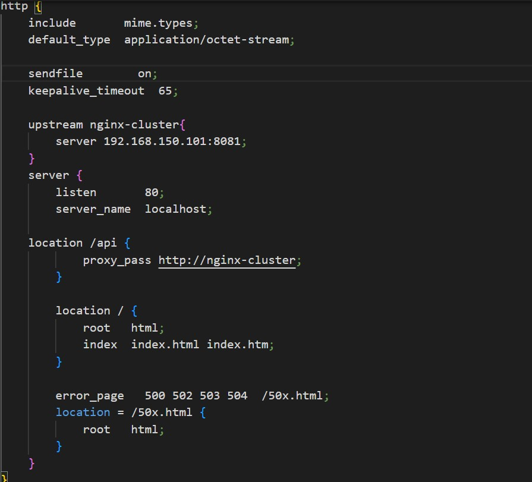
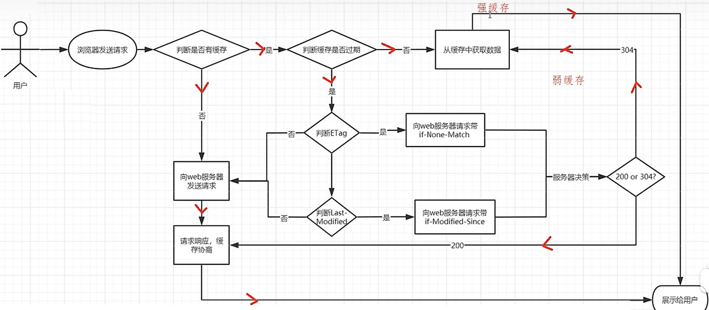
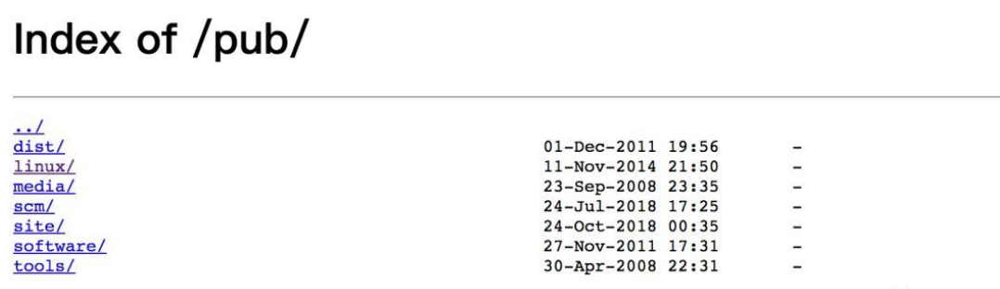
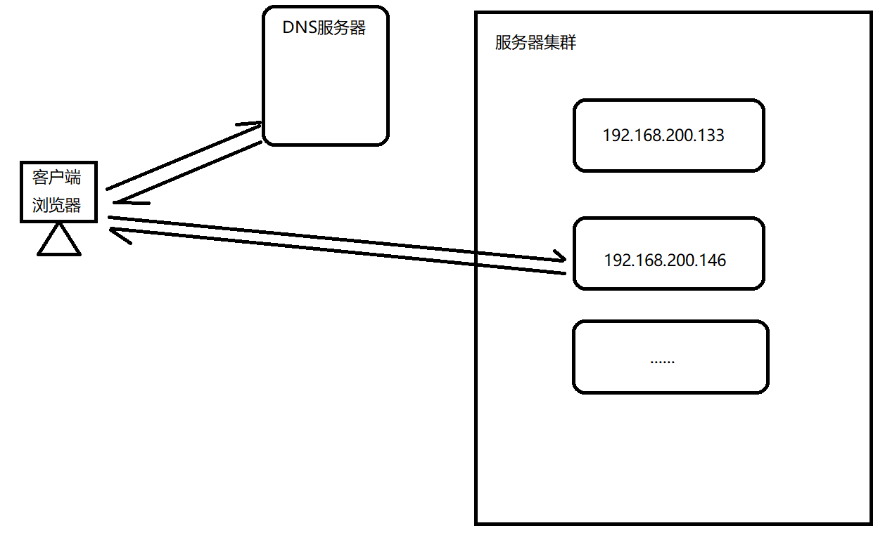
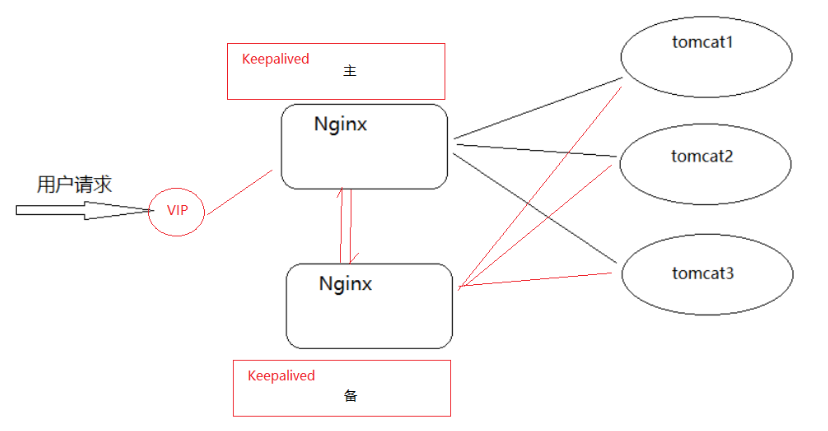

# Nginx介绍

## 背景介绍

Nginx是一个高性能的***HTTP***和***反向代理***的***Web服务***,同时也是一个***POP3/SMTP/IMAP代理服务器***,由伊戈尔·塞索耶夫(俄罗斯人)用C语言开发

## Nginx优点

+ 速度更快,并发更高
+ 配置简单,拓展性强
+ 高可靠
+ 热部署
+ 成本低、BSD许可证

## Nginx功能特性

Nginx的功能特性大体上可分为***基本HTTP服务***、***高级HTTP服务***、***邮件服务***

### 基本HTTP服务

+ 处理静态文件
+ 反向代理
+ 负载均衡
+ 文件压缩
+ SSL协议

### 高级HTTP服务

+ 设置虚拟主机
+ 支持网络监控
+ 支持FLV和MP4流媒体传输

### 邮件服务

+ 支持内部IMAP/POP3代替服务
+ 支持内部SMTP服务

# 环境安装

## 源代码安装(推荐)

### 1.下载Nginx

可在官网下载Lunx/Windows的Nginx,http://nginx.org/

下载好后解压nginx

```sh
tar -xzf 文件包
```

### 1.2下载OpenRestry

OpenRestry自带对应的Nginx,并且内部支持使用Lua脚本

可在官网下载OpenRestry,http://openresty.org/cn/download.html

下载好后解压OpenRestry

```sh
tar -xzf 文件包
```

### 2.确认环境

由于Nginx是基于c语言开发,因此我们需要确认是否由c语言环境

```sh
yun install -y gcc
gcc --version
```

由于Nginx需要用上正则表达式来操作Rewirte,因此需要安装PCRE

```sh
yum install -y pcre pcre-devel
rpm -qa pcre pcre-devel
```

由于Nginx使用了一些压缩算法,因此需要安装zlib

```sh
yum install -y zlib zlib-devel
rpm -qa zlib zlib-devel
```

可以一键安装,若已安装会更新为最新版

```sh
yum install -y gcc pcre pcre-devel zlib zlib-devel openssl openssl-devel
```

### 3.安装

先执行configure

```sh
./configure
```

若需要特殊配置,可添加指令

```sh
./configure --prefix=/usr/local/nginx \
--sbin-path=/usr/local/nginx/sbin/nginx \
--modules-path=/usr/local/nginx/modules \
--conf-path=/usr/local/nginx/conf/nginx.conf \
--error-log-path=/usr/local/nginx/logs/error.log \
--http-log-path=/usr/local/nginx/logs/access.log \
--pid-path=/usr/local/nginx/logs/nginx.pid \
--lock-path=/usr/local/nginx/logs/nginx.lock

```

详细的配置可自行百度,或者

```sh
configure --help
```

最后安装

```sh
make && make install
```

+ Nginx默认安装/usr/local/nginx
+ OpenRestry默认安装/usr/local/openrestry/nginx

## yum安装

``` sh
yum -y install nginx
```

查看是否安装成功

```sh
whereis nginx
```

启动nginx,进入sbin里打开nginx

```sh
cd ../user/sbin
./nginx
```

+ /etc/nginx/nginx.conf  //yum方式安装后默认配置文件的路径
+ /usr/share/nginx/html  //nginx网站默认存放目录
+ /usr/share/nginx/html/index.html //网站默认主页路径

# 目录结构

在nginx里,有几个重要的文件

+ html:存放静态资源
+ conf:存放配置文件
  + nginx.conf:nginx的配置
+ log:存放日志文件
  + error.log:错误日志
  + access.log:访问日志

# Nginx控制

## 命令行控制

命令行控制需要在./sbin目录下执行

| 命令                | 效果                                    |
| ------------------- | --------------------------------------- |
| ./nginx             | 开启nginx                               |
| ./nginx -t          | 测试配置文件语法是否正确                |
| ./nginx -T          | 测试配置文件语法是否正确,并输出配置信息 |
| ./nginx -s stop     | 立刻关闭整个服务                        |
| ./nginx -s quite    | 关闭整个服务                            |
| ./nginx -s reopen   | 重新打开日志                            |
| ./nginx -s reload   | 重新读取配置                            |
| ./nginx -p:prefix   | 指定nginx目录,默认/user/local/nginx/    |
| ./nginx -c:filename | 指定nginx配置,默认conf/nginx.conf       |
| ./nginx -g          | 补充配置                                |

## 信号量控制

信号量就是操控进程,可以通过直接操控进程来操控nginx

通常情况下,一个nginx含有一个master进程和多个worker进程


作为管理员,我们只需要控制master进程就可以控制整个nginx

在控制nginx前,我们需要获取nginx对应的进程pid

方法一:

```sh
ps -ef | grep nginx
```

方法二:

在log目录下有一个nginx.pid文件,打开此文件可获取对应master的pid

```sh
cd ./user/local/nginx/log
./nginx.pid
```

要想使用信号,格式为:

```sh
kill -信号 PID
```

| 信号     | 作用             |
| -------- | ---------------- |
| TERM/INT | 立即关闭整个服务 |
| QUIT     | 关闭整个服务     |
| HUP      | 重新读取配置     |
| USER1    | 重新打开日志     |
| USER2    | 更新nginx        |
| WINCH    | 关闭worker进程   |

# Nginx配置

nginx.conf配置文件有三大块:全局快、events块、http块

## 全局块


```tex
指令名	指令值;  #全局块，主要设置Nginx服务器整体运行的配置指令
```

| 指令名            | 指令值  | 默认值        | 作用                                         |
| ----------------- | ------- | ------------- | -------------------------------------------- |
| user              | 用户    | nobody        | 指定访问文件夹(静态文件)的用户,若无权限则403 |
| master_processes  | on/off  | on            | 指定是否开启工作进程                         |
| *worker_processes | 数值    | 1             | 配置nginx并发数,建议与cpu内核数一致或更低    |
| daemon            | on/off  | on            | 是否后台执行nginx                            |
| pid               | 路径    | .../nginx.pid | 存储pid的文件路径                            |
| error_log         | 路径    | .../error.log | 存储错误日志路径                             |
| include           | xx.conf | 无            | 引入其他配置                                 |


## events块


```tex
#events块,主要设置,Nginx服务器与用户的网络连接,这一部分对Nginx服务器的性能影响较大
events {	 
    指令名	指令值;
}
```

| 指令                | 指令值                   | 默认值           | 作用                                            |
| ------------------- | ------------------------ | ---------------- | ----------------------------------------------- |
| accept_mutex        | on/off                   | on               | 网络连接序列化                                  |
| *multi_accept       | on/off                   | off              | 是否运行同时收到多个网络连接,建议设置on         |
| *worker_connections | 数值                     | 512              | 单个worker最大连接数                            |
| *use                | select/poll/epoll/kqueue | 根据操作系统而定 | nginx底层使用的函数.在linux2.6以上默认使用epoll |


## http块



```tex
#http块，是Nginx服务器配置中的重要部分，代理、缓存、日志记录、第三方模块配置...             
http {		
    指令名	指令值;
    #server块，是Nginx配置和虚拟主机相关的内容
    server {
    	#location块，基于Nginx服务器接收请求字符串与location后面的		值进行匹配，对特定请求进行处理
    	指令名	指令值;
    	location uri { 
    		指令名	指令值;
        	...
        }
        ...
    }
	...
}
```

| 指令                           | 指令值                                                       | 默认值                                 |        作用块        | 作用                                                         |
| ------------------------------ | ------------------------------------------------------------ | -------------------------------------- | :------------------: | ------------------------------------------------------------ |
| *include                       | 导入外部配置                                                 | 无                                     |         http         | 通常会在http块中导入mime.type,这是用来解析前端响应的资源,使用default必须导入mime.type |
| *default_type                  | 资源类型如:application/json、application/octet-stream(二级制文件) | text/plain                             | http/server/location | 设置响应的资源类型                                           |
| access_log                     | log路径 格式名(不填则默认)                                   | logs/access.log combined               | http/server/location | 设置log输出路径                                              |
| log_format                     | 格式名 格式                                                  | combined "..."                         |         http         | 格式化log输出样式                                            |
| *sendfile                      | on/off                                                       | off                                    | http/server/location | 是否使用sendfile()函数提升文件传输性能,建议设置为on          |
| *tcp_nopus                     | on/off                                                       | off                                    | http/server/location | sendfile打开的状态下才会生效,提高网络传输效率,建议设置为on   |
| *tcp_nodelay                   | on/off                                                       | off                                    | http/server/location | 有网的的情况下才生效,保证网络连接实效性,建议设置为on         |
| *keepalive_timeout             | 数值                                                         | 75s                                    | http/server/location | http长连接超时时间                                           |
| keepalive_requests             | 数值                                                         | 100                                    | http/server/location | 一个长连接最多被使用次数                                     |
| *listen                        | 数值                                                         | 80                                     |        server        | 监听端口                                                     |
| *server_name                   | ip/域名                                                      | localhost                              |        server        | 监听的IP/域名                                                |
| *root                          | 资源目录                                                     | 无                                     |       location       | 静态资源所对应的目录                                         |
| alias                          | 资源目录                                                     | 无                                     |       location       | 同root                                                       |
| *index                         | 静态资源                                                     | 无                                     |       location       | 访问uri默认打开的静态资源                                    |
| *error_page                    | 状态码 uri                                                   | 无                                     |        server        | 当出现该状态码时,响应某location的uri                         |
| *gizp                          | on/off                                                       | off                                    | http/server/location | 打开压缩模块,建议设置为on                                    |
| *gzip_types                    | 资源类型如:application/json                                  | text/html                              | http/server/location | 指定压缩文件类型                                             |
| *gzip_comp_level               | 1-9                                                          | 1                                      | http/server/location | 压缩强度,1最低,9最高,建议设置为5或6                          |
| *gzip_vary                     | on/off                                                       | off                                    | http/server/location | 被压缩文件是否带“Vary:Accept-Encoding”的响应头,建议设置为on  |
| gzip_buffers                   | 空间数 大小                                                  | 32 4k                                  | http/server/location | 压缩申请的空间数和大小                                       |
| *gzip_disable                  | 正则表达式                                                   | 无                                     | http/server/location | "User-Agent"请求头匹配正则表达式,则不压缩,建议设置为"MSIE [1-6]\.",对IE6以下浏览器禁用压缩 |
| gzip_http_version              | 1.0/1.1                                                      | 1.1                                    | http/server/location | 针对不同HTTP协议版本选择性地开启Gzip功能                     |
| *gzip_min_length               | 数据大小                                                     | 20                                     | http/server/location | 超过指定数据大小则不压缩,建议设置为1k                        |
| *gzip_proxied                  | off/any/请求头信息                                           | off                                    | http/server/location | 建议设置为expired no-cache no-store private auth             |
| *gzip_static                   | on/off                                                       | off                                    | http/server/location | 避免gzip和sendfile,建设置为on                                |
| *add_header                    | 响应头信息                                                   | 无                                     | http/server/location | 设置响应头信息                                               |
| *expires                       | time/off/max                                                 | off                                    | http/server/location | 设置缓存时间(add_header也可以设置)                           |
| valid_referers                 | none/blocked/server_names/正则表达式                         | 无                                     |   server/location    | 设置防盗链                                                   |
| *proxy_pass                    | url                                                          | 无                                     |       location       | 设置被代理服务器地址                                         |
| *proxy_set_header              | 请求头 信息                                                  | 无                                     |       location       | 代理时,更改/添加请求头信息                                   |
| proxy_redirect                 | 被代理IP 代理IP/default/off                                  | default                                |       location       | 代理时,更改请求头Refer和响应头Location为代理IP               |
| ssl                            | off                                                          | on/off                                 |     http、server     | 启HTTPS,可以使用 listen 443 ssl                              |
| ssl_certificate                | 路径                                                         | 无                                     |     http、server     | PEM格式证书                                                  |
| ssl_certificate_key            | 路径                                                         | 无                                     |     http、server     | 证书Key                                                      |
| ssl_session_cache              | off/none/builtin/shared                                      | none                                   |     http、server     | SSL会话缓存                                                  |
| ssl_session_timeout            | 时间                                                         | 5m                                     |     http、server     | 缓存中的会话参数时间                                         |
| ssl_ciphers                    | 密码格式                                                     | HIGH:!aNULL:!MD5                       |     http、server     | 指出允许的密码                                               |
| ssl_prefer_server_ciphers      | on/off                                                       | off                                    |     http、server     | 指定是否服务器密码优先客户端密码                             |
| proxy_cache_path               | 路径 属性                                                    | 无                                     |         http         | 设置Nginx本地缓存路径                                        |
| proxy_cache                    | name/off                                                     | off                                    | http/server/location | 指定Nginx本地缓存名字                                        |
| proxy_cache_key                | 值                                                           | $scheme$proxy_host$request_uri         | http/server/location | 设置Nginx缓存文件名使用的是什么值的MD5                       |
| proxy_cache_valid              | 状态码 时间                                                  | 无                                     | http/server/location | 设置Nginx缓存状态码和状态码缓存时间                          |
| proxy_cache_min_uses           | 数值                                                         | 1                                      | http/server/location | 设置资源被访问多少次后被缓存                                 |
| proxy_cache_methods            | 请求方法                                                     | GET                                    | http/server/location | 设置缓存哪些HTTP方法                                         |
| proxy_cache_purge              | name key                                                     | 无                                     | http/server/location | 清除缓存                                                     |
| proxy_no_cache                 | 条件                                                         | 无                                     | http/server/location | 符合条件不缓存                                               |
| proxy_cache_bypass             | 条件                                                         | 无                                     | http/server/location | 符合条件不从缓存中获取数据                                   |
| *proxy_buffers                 | 数量 文件大小                                                | 256 8k                                 | http/server/location | 响应体初始大小,当不够时会再申请,建议调小                     |
| *proxy_buffer_size             | 文件大小                                                     | 4k/8k                                  | http/server/location | 响应头初始大小,当不够时会再申请,建议调小                     |
| *proxy_busy_buffer_size        | 文件大小                                                     | 无                                     | http/server/location | nginx会在没有完全读完后端响应就开始向客户端传送数据，所以它会划出一部分busy状态的buffer来专门向客户端传送数据 |
| autoindex off                  | on/off                                                       | off                                    | http/server/location | 启用或禁用目录列表输出                                       |
| autoindex_exact_size           | on/off                                                       | on                                     | http/server/location | 显示目录文件的具体大小                                       |
| autoindex_format               | html/json/xml                                                | html                                   | http/server/location | 目录显示格式                                                 |
| autoindex_localtime            | on/off                                                       | off                                    | http/server/location | 显示当前时间                                                 |
| auth_basic                     | on/off                                                       | off                                    | http/server/location | 开启用户认证                                                 |
| auth_basic_user_file           | 路径                                                         | 无                                     | http/server/location | 指定用户名和密码所在文件                                     |
| *charset                       | 编码                                                         | 无                                     | http/server/location | 指定编码,建议设置utf-8                                       |
| lua_package_path               | 路径                                                         | "user/local/openrestry/lualib/?.lua;;" |         http         | 导入第三方lua模块                                            |
| lua_package_cpath              | 路径                                                         | "user/local/openrestry/lualib/?.so;;"  |         http         | 导入c模块                                                    |
| *server_names_hash_bucket_size | 数据大小                                                     |                                        |         http         | 服务器名大小限制                                             |
| *client_header_buffer_size     | 数据大小                                                     |                                        |         http         | 请求头大小限制                                               |
| *large_client_header_buffers   | 个数 数据大小                                                |                                        |         http         | 请求行+请求头限制个数*大小                                   |
| *client_max_body_size          | 数据大小                                                     |                                        |         http         | 最大上传文件                                                 |
| limit_conn_zone                | 参数 zone=名字:带宽                                          | 无                                     |         http         | 限制参数的并发连接数以及带宽,名字可随便取,不重复就行         |


### servername详解

servername是用来用户访问的ip,若用户ip符合servername,则走该servername的逻辑

*注意:若用户ip不符合servername,比如用户通过外网ip访问,但是nginx只监听了127.0.0.1,则默认走带default_server,default_server默认是第一个server

```
server{
	listen 8080;
	server_name 127.0.0.1;
	location /{
		root html;
		index index.html;
	}
}
server{
	listen 8080 default_server;
	server_name localhost;
	default_type text/plain;
	return 444 'This is a error request';
}
#若用户以外网ip访问,则走第二个server
```

其中,servername有三种匹配方式

+ 精确匹配(ip/域名)
+ 通配符匹配(*.baidu.com/www.baidu.*)
+ 正则表达式

若三种方式同时匹配一个ip,顺序是:

```
No1:准确匹配server_name(www.baidu.com)

No2:通配符在开始时匹配server_name成功(*.baidu.com)

No3:通配符在结束时匹配server_name成功(www.baidu.*)

No4:正则表达式匹配server_name成功

No5:被默认的default_server处理，如果没有指定默认找第一个server
```

### location详解

location有四种匹配方式

+ 不带符号 uri(/abc)
+ =uri(=/abc)
+ ~正则表达式(~^/abc\w$)
+ ^~uri(^~ /abc)
+ @变量(error_page 404 @a;location @a{...})

其中^~uri优先级最高

### root详解

root访问资源路径,其访问原理为:

```
location /images {
	root /usr/local/nginx/html;
}
#root的处理结果是: root路径+location路径
#若用户以ip/images/mv.png
#则打开/usr/local/nginx/html/images/mv.png

```

因此root有个缺陷,就是访问资源路径时,必须将资源放在指定的uri文件夹(images)
而alias可以解决此问题

alias访问资源路径,其访问原理为:

```
location /images {
	alias /usr/local/nginx/html;
}
#root的处理结果是: alias路径
#若用户以ip/images/mv.png
#则打开/usr/local/nginx/html/mv.png
```

### index详解

若用户uri不指定任何文件,则访问Index文件

```
location /images {
	root /usr/local/nginx/html;
	index demo.html
}
#若用户以ip/images
#则打开/usr/local/nginx/html/demo.html
#若用户以ip/images/mv.png
#则打开/usr/local/nginx/html/images/mv.png
```

### error_page详解

error_page有三种匹配方法:

+ error_page 状态码 url :直接跳转

```
server {
	error_page 404 http://www.itcast.cn;
}
```

+ error_page 状态码 /xx.html:重定向

```
server{
	error_page 500 502 503 504 /50x.html;
	location =/50x.html{
		root html;
	}
}
```

+ error_page 状态码 @变量:通过@跳转

```
server{
	error_page 500 502 503 504 @jump_to_error;
	location @jump_to_error {
		index 50x.html;
	}
}
```

另外,error_page可以修改状态码,如用户访问404时,以200形式返回给用户

```
server{
	error_page 404 =200 /50x.html;
	location =/50x.html{
		root html;
	}
}
```

### gzip_proxied详解

反向代理时,根据请求头"Content-Length"信息来开启压缩

+ off - 关闭Nginx服务器对后台服务器返回结果的Gzip压缩
+  expired - 启用压缩，如果header头中包含 "Expires" 头信息 
+ no-cache - 启用压缩，如果header头中包含 "Cache-Control:no-cache" 头信息 
+  no-store - 启用压缩，如果header头中包含 "Cache-Control:no-store" 头信息 
+  private - 启用压缩，如果header头中包含 "Cache-Control:private" 头信息
+   no_last_modified - 启用压缩,如果header头中不包含 "Last-Modified" 头信息
+   no_etag - 启用压缩 ,如果header头中不包含 "ETag" 头信息 auth - 启用压缩 , 如果header头中包含 "Authorization" 头信息
+ any - 无条件启用压缩

### gzip_static详解

由于gzip_static使用的是http_gzip_static_module,而nginx默认安装时不导入此模块,因此需要在安装时指定导入此模块

(1)查询当前Nginx的配置参数

```
nginx -V
```

(2)将nginx安装目录下sbin目录中的nginx二进制文件进行更名

```
cd /usr/local/nginx/sbin
mv nginx nginxold
```

(3) 进入Nginx的安装目录

```
cd /root/nginx/core/nginx-1.16.1
```

(4)执行make clean清空之前编译的内容

```
make clean
```

(5)使用configure来配置参数

```
./configure --with-http_gzip_static_module
```

(6)使用make命令进行编译

```
make
```

(7) 将objs目录下的nginx二进制执行文件移动到nginx安装目录下的sbin目录中

```
mv objs/nginx /usr/local/nginx/sbin
```

(8)执行更新命令

```
make upgrade
```

### 浏览器缓存

| header        | 说明                                        |
| ------------- | ------------------------------------------- |
| Expires       | 缓存过期的日期和时间                        |
| Cache-Control | 设置和缓存相关的配置信息                    |
| Last-Modified | 请求资源最后修改时间                        |
| ETag          | 请求变量的实体标签的当前值，比如文件的MD5值 |

浏览器缓存过期,会先向Nginx服务器获取响应头,然后判断如何获取响应体



在获取资源时,有时候资源没有大小,就是走了强缓存;有时候资源只有几百B(只获取了响应头),就是走了弱缓存

可以通过配置Nginx的expires或add_header来调整浏览器的缓存方式,下表为add_header的可使用信息

| must-revalidate  | 可缓存但必须再向源服务器进行确认               |
| ---------------- | ---------------------------------------------- |
| no-cache         | 缓存前必须确认其有效性                         |
| no-store         | 不缓存请求或响应的任何内容                     |
| no-transform     | 代理不可更改媒体类型                           |
| public           | 可向任意方提供响应的缓存                       |
| private          | 仅向特定用户返回响应                           |
| proxy-revalidate | 要求中间缓存服务器对缓存的响应有效性再进行确认 |
| max-age=<秒>     | 响应最大Age值                                  |
| s-maxage=<秒>    | 公共缓存服务器响应的最大Age值                  |

### 跨域问题

跨域问题解决方法有很多,其主要原理就是通过添加对应请求头,我们可以在服务端响应数据时添加(如java的@CrossOrigin),也可以在Nginx处添加

```
location /getUser{
    add_header Access-Control-Allow-Origin *;
    add_header Access-Control-Allow-Methods GET,POST,PUT,DELETE;
    default_type application/json;
    return 200 '{"id":1,"name":"TOM","age":18}';
}
```

### 防盗链

当网站发生Http请求时,会携带一个Referer请求头,里面包含网站的Ip.Nginx可以通过检测Referer信息来判断是否运行请求获取资源

+ none: 如果Header中的Referer为空，允许访问
+ blocked:在Header中的Referer不为空，但是该值被防火墙或代理进行伪装过，如不带"http://" 、"https://"等协议头的资源允许访问
+ server_names:指定具体的域名或者IP
+ string: 可以支持正则表达式和*的字符串。如果是正则表达式，需要以`~`开头表示，例如

```
location ~*\.(png|jpg|gif){
           valid_referers none blocked www.baidu.com;
           if ($invalid_referer){
                return 403;
           }
           root /usr/local/nginx/html;

}
```

遇到的问题：Referer的限制比较粗，比如随意加一个Referer，上面的方式是无法进行限制的。那么这个问题改如何解决？

此处我们需要用到Nginx的第三方模块`ngx_http_accesskey_module`

### 本地缓存

Nginx本地缓存有两种方法,一种是proxy_cache,另一种使用lua

#### proxy_cache

##### proxy_cache_path

proxy_cache主要是将服务器数据缓存已文件形式保存到本地,若不设置proxy_cache_path则默认缓存至内存

而proxy_cache_path属性配置如下:

levels: 指定该缓存空间对应的目录，最多可以设置3层，每层取值为1|2如 :

```
levels=1:2   缓存空间有两层目录，第一次是1个字母，第二次是2个字母
举例说明:
itheima[key]通过MD5加密以后的值为 43c8233266edce38c2c9af0694e2107d
levels=1:2   最终的存储路径为/usr/local/proxy_cache/d/07
levels=2:1:2 最终的存储路径为/usr/local/proxy_cache/7d/0/21
levels=2:2:2 最终的存储路径为??/usr/local/proxy_cache/7d/10/e2
```

keys_zone:用来为这个缓存区设置名称和指定大小，如：

```
keys_zone=itcast:200m  缓存区的名称是itcast,大小为200M,1M大概能存储8000个keys
```

inactive:指定缓存的数据多次时间未被访问就将被删除，如：

```
inactive=1d   缓存数据在1天内没有被访问就会被删除
```

max_size:设置最大缓存空间，如果缓存空间存满，默认会覆盖缓存时间最长的资源，如:

```
max_size=20g
```

配置实例:

```
http{
	proxy_cache_path /usr/local/proxy_cache keys_zone=itcast:200m  levels=1:2:1 inactive=1d max_size=20g;
}
```

#####  缓存清除

缓存清除可以手动去`rm -rf /usr/local/proxy_cache/......`删除,或者使用第三方模块ngx_cache_purge

（1）下载ngx_cache_purge模块对应的资源包，并上传到服务器上。

```
ngx_cache_purge-2.3.tar.gz
```

（2）对资源文件进行解压缩

```
tar -zxf ngx_cache_purge-2.3.tar.gz
```

（3）修改文件夹名称，方便后期配置

```
mv ngx_cache_purge-2.3 purge
```

（4）查询Nginx的配置参数

```
nginx -V
```

（5）进入Nginx的安装目录，使用./configure进行参数配置

```
./configure --add-module=/root/nginx/module/purge
```

（6）使用make进行编译

```
make
```

（7）将nginx安装目录的nginx二级制可执行文件备份

```
mv /usr/local/nginx/sbin/nginx /usr/local/nginx/sbin/nginxold
```

（8）将编译后的objs中的nginx拷贝到nginx的sbin目录下

```
cp objs/nginx /usr/local/nginx/sbin
```

（9）使用make进行升级

```
make upgrade
```

（10）在nginx配置文件中进行如下配置

```
server{
	location ~/purge(/.*) {
		proxy_cache_purge itcast itheima;
	}
}
```

##### proxy_no_cache

```
proxy_no_cache $cookie_nocache $arg_nocache $arg_comment;
```

##### proxy_cache_bypass

```
proxy_cache_bypass $cookie_nocache $arg_nocache $arg_comment;
```

#### lua缓存

### 下载模块

使用下载模块后,页面将会显示对应的目录的文件,用户点击后即可下载



```
location /download{
    root /usr/local;
    autoindex on;
    autoindex_exact_size on;
    autoindex_format html;
    autoindex_localtime on;
}

```

### 用户认证

实现步骤:

1.nginx.conf添加如下内容

```
location /{
    root /html;
    index index.html;
    auth_basic 'please input your auth';
    auth_basic_user_file htpasswd;
}
```

2.我们需要使用`htpasswd`工具生成

```
yum install -y httpd-tools
```

```
htpasswd -c /usr/local/nginx/conf/htpasswd username //创建一个新文件记录用户名和密码
htpasswd -b /usr/local/nginx/conf/htpasswd username password //在指定文件新增一个用户名和密码
htpasswd -D /usr/local/nginx/conf/htpasswd username //从指定文件删除一个用户信息
htpasswd -v /usr/local/nginx/conf/htpasswd username //验证用户名和密码是否正确
```


# 系统配置

如果想要启动、关闭或重新加载nginx配置文件，都需要先进入到nginx的安装目录的sbin目录，然后使用nginx的二级制可执行文件来操作，相对来说操作比较繁琐,可以通过设置为系统服务来优化,另外也可以通过系统服务来设置开机自启

## 环境变量

(1)修改`/etc/profile`文件

```sh
vim /etc/profile
在最后一行添加
export PATH=$PATH:/usr/local/nginx/sbin
```

(2)使之立即生效

```sh
source /etc/profile
```

(3)执行nginx命令

```sh
nginx -V
```


## 开机自启

(1) 在`/usr/lib/systemd/system`目录下添加nginx.service,内容如下:

```sh
vim /usr/lib/systemd/system/nginx.service
```

```tex
[Unit]
Description=nginx web service
Documentation=http://nginx.org/en/docs/
After=network.target

[Service]
Type=forking
PIDFile=/usr/local/nginx/logs/nginx.pid
ExecStartPre=/usr/local/nginx/sbin/nginx -t -c /usr/local/nginx/conf/nginx.conf
ExecStart=/usr/local/nginx/sbin/nginx
ExecReload=/usr/local/nginx/sbin/nginx -s reload
ExecStop=/usr/local/nginx/sbin/nginx -s stop
PrivateTmp=true

[Install]
WantedBy=default.target
```

(2)添加完成后如果权限有问题需要进行权限设置

```
chmod 755 /usr/lib/systemd/system/nginx.service
```

(3)使用系统命令来操作Nginx服务

```
启动: systemctl start nginx
停止: systemctl stop nginx
重启: systemctl restart nginx
重新加载配置文件: systemctl reload nginx
查看nginx状态: systemctl status nginx
开机启动: systemctl enable nginx
```


# Rewrite

Rewrite是Nginx的编程语法,主要实现URL的重写

## Set

该指令用来设置一个新的变量。

| 语法   | set $variable value; |
| ------ | -------------------- |
| 默认值 | —                    |
| 位置   | server、location、if |

variable:变量的名称，该变量名称要用"$"作为变量的第一个字符，且不能与Nginx服务器预设的全局变量同名。

value:变量的值，可以是字符串、其他变量或者变量的组合等。

### Rewrite常用全局变量

| 变量               | 说明                                                         |
| ------------------ | ------------------------------------------------------------ |
| $args              | 请求URL中的请求指令。比如http://192.168.200.133:8080?arg1=value1&args2=value2中的"arg1=value1&arg2=value2"，功能和$query_string一样 |
| $http_user_agent   | 用户访问服务的代理信息(如果通过浏览器访问，记录的是浏览器的相关版本信息) |
| $host              | 访问服务器的server_name值                                    |
| $document_uri      | 当前访问地址的URI。比如http://192.168.200.133/server?id=10&name=zhangsan中的"/server"，功能和$uri一样 |
| $document_root     | 当前请求对应location的root值，如果未设置，默认指向Nginx自带html目录所在位置 |
| $content_length    | 请求头中的Content-Length的值                                 |
| $content_type      | 请求头中的Content-Type的值                                   |
| $http_cookie       | 客户端的cookie信息，可以通过add_header Set-Cookie 'cookieName=cookieValue'来添加cookie数据 |
| $limit_rate        | Nginx服务器对网络连接速率的限制，也就是Nginx配置中对limit_rate指令设置的值，默认是0，不限制。 |
| $remote_addr       | 客户端的IP地址                                               |
| $remote_port       | 客户端与服务端建立连接的端口号                               |
| $remote_user       | 客户端的用户名，需要有认证模块才能获取                       |
| $scheme            | 访问协议                                                     |
| $server_addr       | 服务端的地址                                                 |
| $server_name       | 客户端请求到达的服务器的名称                                 |
| $server_port       | 客户端请求到达服务器的端口号                                 |
| $server_protocol   | 客户端请求协议的版本，比如"HTTP/1.1"                         |
| $request_body_file | 发给后端服务器的本地文件资源的名称                           |
| $request_method    | 客户端的请求方式，比如"GET","POST"等                         |
| $request_filename  | 当前请求的资源文件的路径名                                   |
| $request_uri       | 当前请求的URI，并且携带请求参数，比如http://192.168.200.133/server?id=10&name=zhangsan中的"/server?id=10&name=zhangsan" |
| $request           | request的所有信息                                            |
| $status            | 响应的状态码                                                 |
| $invalid_referer   | Referer请求头与防盗链是否匹配(布尔)                          |

## if指令

该指令用来支持条件判断，并根据条件判断结果选择不同的Nginx配置。

| 语法   | if (condition){...} |
| ------ | ------------------- |
| 默认值 | —                   |
| 位置   | server、location    |

condition为判定条件，可以支持以下写法：

1. 变量名。如果变量名对应的值为空或者是0，if都判断为false,其他条件为true。

```
if ($param){
	
}
2. 使用"="和"!="比较变量和字符串是否相等，满足条件为true，不满足为false
if ($request_method = POST){
	return 405;
}
```

注意：此处和Java不太一样的地方是字符串不需要添加引号。

1. 使用正则表达式对变量进行匹配，匹配成功返回true，否则返回false。变量与正则表达式之间使用"~","~*","!~","!~*"来连接。

   "~"代表匹配正则表达式过程中区分大小写，

   "~*"代表匹配正则表达式过程中不区分大小写

   "!~"和"!~*"刚好和上面取相反值，如果匹配上返回false,匹配不上返回true

```
if ($http_user_agent ~ MSIE){
	#$http_user_agent的值中是否包含MSIE字符串，如果包含返回true
}
```

注意：正则表达式字符串一般不需要加引号，但是如果字符串中包含"}"或者是";"等字符时，就需要把引号加上。

1. 判断请求的文件是否存在使用"-f"和"!-f",

   当使用"-f"时，如果请求的文件存在返回true，不存在返回false。

   当使用"!f"时，如果请求文件不存在，但该文件所在目录存在返回true,文件和目录都不存在返回false,如果文件存在返回false

```
if (-f $request_filename){
	#判断请求的文件是否存在
}
if (!-f $request_filename){
	#判断请求的文件是否不存在
}
```

1. 判断请求的目录是否存在使用"-d"和"!-d",

   当使用"-d"时，如果请求的目录存在，if返回true，如果目录不存在则返回false

   当使用"!-d"时，如果请求的目录不存在但该目录的上级目录存在则返回true，该目录和它上级目录都不存在则返回false,如果请求目录存在也返回false.

2. 判断请求的目录或者文件是否存在使用"-e"和"!-e"

   当使用"-e",如果请求的目录或者文件存在时，if返回true,否则返回false.

   当使用"!-e",如果请求的文件和文件所在路径上的目录都不存在返回true,否则返回false

3. 判断请求的文件是否可执行使用"-x"和"!-x"

   当使用"-x",如果请求的文件可执行，if返回true,否则返回false

   当使用"!-x",如果请求文件不可执行，返回true,否则返回false

## break指令

该指令用于中断当前相同作用域中的其他Nginx配置。与该指令处于同一作用域的Nginx配置中，位于它前面的指令配置生效，位于后面的指令配置无效。

| 语法   | break;               |
| ------ | -------------------- |
| 默认值 | —                    |
| 位置   | server、location、if |

使用break后,会自动覆盖原有的return,并添加对应的root和index,若index没有设置,则默认打开当前目录下的index.html

## return指令

该指令用于完成对请求的处理，直接向客户端返回响应状态代码。在return后的所有Nginx配置都是无效的。

| 语法   | return code [text];<br/>return code URL;<br/>return URL; |
| ------ | -------------------------------------------------------- |
| 默认值 | —                                                        |
| 位置   | server、location、if                                     |

code:为返回给客户端的HTTP状态代理。可以返回的状态代码为0~999的任意HTTP状态代理

text:为返回给客户端的响应体内容，支持变量的使用

URL:为返回给客户端的URL地址

## rewrite指令

该指令通过正则表达式的使用来改变URI。可以同时存在一个或者多个指令，按照顺序依次对URL进行匹配和处理。

| 语法   | rewrite regex replacement [flag]; |
| ------ | --------------------------------- |
| 默认值 | —                                 |
| 位置   | server、location、if              |

regex:用来匹配URI的正则表达式

replacement:匹配成功后，用于替换URI中被截取内容的字符串。如果该字符串是以"http://"或者"https://"开头的，则不会继续向下对URI进行其他处理，而是直接重定向给客户端。

flag:用来设置rewrite对URI的处理行为，可选值有如下：

- last:默认值.匹配成功后重写走server块执行
- break:匹配成功后直接在当前location块执行
- redirect:rewrite后临时重定向
- permanent:rewrite后永久重定向

## rewrite_log指令

该指令配置是否开启URL重写日志的输出功能。

| 语法   | rewrite_log on\|off;       |
| ------ | -------------------------- |
| 默认值 | rewrite_log off;           |
| 位置   | http、server、location、if |

开启后，URL重写的相关日志将以notice级别输出到error_log指令配置的日志文件汇总。

# SSL

开启ssl网站就可以通过https进行访问

## nginx添加SSL的支持

```
》将原有/usr/local/nginx/sbin/nginx进行备份
》拷贝nginx之前的配置信息
》在nginx的安装源码进行配置指定对应模块  ./configure --with-http_ssl_module
》通过make模板进行编译
》将objs下面的nginx移动到/usr/local/nginx/sbin下
》在源码目录下执行  make upgrade进行升级，这个可以实现不停机添加新模块的功能
```

## SSL固定格式

nginx关于ssl配置有很多,但是其有固定格式

```nginx
	listen 443 ssl http2;
	ssl_certificate PEM路径;
    ssl_certificate_key PEMkEY路径;
    ssl_protocols TLSv1.1 TLSv1.2 TLSv1.3;
    ssl_ciphers EECDH+CHACHA20:EECDH+CHACHA20-draft:EECDH+AES128:RSA+AES128:EECDH+AES256:RSA+AES256:EECDH+3DES:RSA+3DES:!MD5;
    ssl_prefer_server_ciphers on;
    ssl_session_cache shared:SSL:10m;
    ssl_session_timeout 10m;
	add_header Strict-Transport-Security "max-age=31536000";
    error_page 497  https://$host$request_uri;
```

# 负载均衡

## 负载均衡方式

+ 用户手动选择


+ DNS轮询



+ 四/七层负载均衡

四/七层负载均衡是目前最主流的负载均衡方式


所谓四层负载均衡指的是OSI七层模型中的传输层，主要是基于IP+PORT的负载均衡

```
实现四层负载均衡的方式：
硬件：F5 BIG-IP、Radware等
软件：LVS、Nginx、Hayproxy等
```

所谓的七层负载均衡指的是在应用层，主要是基于虚拟的URL或主机IP的负载均衡

```
实现七层负载均衡的方式：
软件：Nginx、Hayproxy等
```

## 七层负载均衡

### upstream指令

该指令是用来定义一组服务器，它们可以是监听不同端口的服务器，并且也可以是同时监听TCP和Unix socket的服务器。服务器可以指定不同的权重，默认为1。

| 语法   | upstream name {...} |
| ------ | ------------------- |
| 默认值 | —                   |
| 位置   | http                |

```
upstream 变量{
	server 192.168.200.146:9091;
	server 192.168.200.146:9092;
	server 192.168.200.146:9093;
}
server {
	listen 8083;
	server_name localhost;
	location /{
		proxy_pass http://变量;
	}
}
```

##### 服务器状态设置

down:将该服务器标记为永久不可用，那么该代理服务器将不参与负载均衡。


backup:将该服务器标记为备份服务器，当主服务器不可用时，将用来传递请求。

max_conns=number:用来设置代理服务器同时活动链接的最大数量，默认为0，表示不限制，使用该配置可以根据后端服务器处理请求的并发量来进行设置，防止后端服务器被压垮。


max_fails=number:设置允许请求代理服务器失败的次数，默认为1。

fail_timeout=time:设置经过max_fails失败后，服务暂停的时间，默认是10秒。

```
upstream 变量{
	server 192.168.200.133:9001 down;
	server 192.168.200.133:9002 backup;
	server 192.168.200.133:9003 max_fails=3 fail_timeout=15;
}
```

### 负载均衡策略

| 轮询       | 默认方式         |
| ---------- | ---------------- |
| weight     | 权重方式         |
| ip_hash    | 依据ip分配方式   |
| least_conn | 依据最少连接方式 |
| url_hash   | 依据URL分配方式  |
| fair       | 依据响应时间方式 |

##### 轮询

是upstream模块负载均衡默认的策略。每个请求会按时间顺序逐个分配到不同的后端服务器。轮询不需要额外的配置。

```
upstream 变量{
	server 192.168.200.146:9001 weight=1;
	server 192.168.200.146:9002;
	server 192.168.200.146:9003;
}
```

##### weight加权[加权轮询]

weight=number:用来设置服务器的权重，默认为1，权重数据越大，被分配到请求的几率越大。

```
upstream 变量{
	server 192.168.200.146:9001 weight=10;
	server 192.168.200.146:9002 weight=5;
	server 192.168.200.146:9003 weight=3;
}
```

##### ip_hash

每个Ip只能连接对应的服务器

```
upstream 变量{
	ip_hash;
	server 192.168.200.146:9001;
	server 192.168.200.146:9002;
	server 192.168.200.146:9003;
}
```

##### least_conn

最少连接，把请求转发给连接数较少的后端服务器。

```
upstream 变量{
	least_conn;
	server 192.168.200.146:9001;
	server 192.168.200.146:9002;
	server 192.168.200.146:9003;
}
```

##### url_hash

每个url只能访问对应的服务器

```
upstream 变量{
	hash &request_uri;
	server 192.168.200.146:9001;
	server 192.168.200.146:9002;
	server 192.168.200.146:9003;
}
```

##### fair

fair采用的不是内建负载均衡使用的轮换的均衡算法，而是可以根据页面大小、加载时间长短智能的进行负载均衡。那么如何使用第三方模块的fair负载均衡策略。

```
upstream 变量{
	fair;
	server 192.168.200.146:9001;
	server 192.168.200.146:9002;
	server 192.168.200.146:9003;
}
```

因为fair属于第三方模块实现的负载均衡。需要添加`nginx-upstream-fair`:

1. 下载nginx-upstream-fair模块

```
下载地址为:
	https://github.com/gnosek/nginx-upstream-fair
```

2. 将下载的文件上传到服务器并进行解压缩

```
unzip nginx-upstream-fair-master.zip
```

3. 重命名资源

```
mv nginx-upstream-fair-master fair
```

4. 使用./configure命令将资源添加到Nginx模块中

```
./configure --add-module=/root/fair
```

5. 在Nginx的源码中 src/http/ngx_http_upstream.h,找到`ngx_http_upstream_srv_conf_s`，在模块中添加添加default_port属性

```
in_port_t	   default_port
```

6. 编译

```
make
```

7. 将sbin目录下的nginx进行备份

```
mv /usr/local/nginx/sbin/nginx /usr/local/nginx/sbin/nginxold
```

8. 将安装目录下的objs中的nginx拷贝到sbin目录

```
cd objs
cp nginx /usr/local/nginx/sbin
```

9. 更新Nginx

```
cd ../
make upgrade
```

## 四层负载均衡

一般主要使用七层负载均衡,四层使用的较少

##### stream指令

该指令提供在其中指定流服务器指令的配置文件上下文。和http类似,但只能实现跳转和负载均衡。

| 语法   | stream { ... } |
| ------ | -------------- |
| 默认值 | —              |
| 位置   | main           |

```
stream {
        upstream redisbackend {
                server 192.168.200.146:6379;
                server 192.168.200.146:6378;
        }
        upstream tomcatbackend {
        		server 192.168.200.146:8080;
        }
        server {
                listen  81;
                proxy_pass redisbackend;
        }
        server {
        		listen	82;
        		proxy_pass tomcatbackend;
        }
}
```

# Keepalived

使用Keepalived来解决Nginx集群问题



## 环境搭建

环境准备

| VIP             | IP              | 主机名      | 主/从  |
| --------------- | --------------- | ----------- | ------ |
|                 | 192.168.200.133 | keepalived1 | Master |
| 192.168.200.222 |                 |             |        |
|                 | 192.168.200.122 | keepalived2 | Backup |

keepalived的安装

```
步骤1:从官方网站下载keepalived,官网地址https://keepalived.org/
步骤2:将下载的资源上传到服务器
	keepalived-2.0.20.tar.gz
步骤3:创建keepalived目录，方便管理资源
	mkdir keepalived
步骤4:将压缩文件进行解压缩，解压缩到指定的目录
	tar -zxf keepalived-2.0.20.tar.gz -C keepalived/
步骤5:对keepalived进行配置，编译和安装
	cd keepalived/keepalived-2.0.20
	./configure --sysconf=/etc --prefix=/usr/local
	make && make install
```

安装完成后，有两个文件需要我们认识下，一个是 `/etc/keepalived/keepalived.conf`(keepalived的系统配置文件，我们主要操作的就是该文件)，一个是/usr/local/sbin目录下的`keepalived`,是系统配置脚本，用来启动和关闭keepalived

## Keepalived配置文件介绍

打开keepalived.conf配置文件

这里面会分三部，第一部分是global全局配置、第二部分是vrrp相关配置、第三部分是LVS相关配置。
本次课程主要是使用keepalived实现高可用部署，没有用到LVS，所以我们重点关注的是前两部分

```
#global全局部分：
global_defs {
   #通知邮件，当keepalived发送切换时需要发email给具体的邮箱地址
   notification_email {
     tom@itcast.cn
     jerry@itcast.cn
   }
   #设置发件人的邮箱信息
   notification_email_from zhaomin@itcast.cn
   #指定smpt服务地址
   smtp_server 192.168.200.1
   #指定smpt服务连接超时时间
   smtp_connect_timeout 30
   #运行keepalived服务器的一个标识，可以用作发送邮件的主题信息
   router_id LVS_DEVEL
   
   #默认是不跳过检查。检查收到的VRRP通告中的所有地址可能会比较耗时，设置此命令的意思是，如果通告与接收的上一个通告来自相同的master路由器，则不执行检查(跳过检查)
   vrrp_skip_check_adv_addr
   #严格遵守VRRP协议。
   vrrp_strict
   #在一个接口发送的两个免费ARP之间的延迟。可以精确到毫秒级。默认是0
   vrrp_garp_interval 0
   #在一个网卡上每组na消息之间的延迟时间，默认为0
   vrrp_gna_interval 0
}
```

```
#VRRP部分，该部分可以包含以下四个子模块
#1. vrrp_script
#2. vrrp_sync_group
#3. garp_group
#4. vrrp_instance
#我们会用到第一个和第四个，
#设置keepalived实例的相关信息，VI_1为VRRP实例名称
vrrp_instance VI_1 {
    state MASTER  		#有两个值可选MASTER主 BACKUP备
    interface ens33		#vrrp实例绑定的接口，用于发送VRRP包[当前服务器使用的网卡名称]
    virtual_router_id 51#指定VRRP实例ID，范围是0-255
    priority 100		#指定优先级，优先级高的将成为MASTER
    advert_int 1		#指定发送VRRP通告的间隔，单位是秒
    authentication {	#vrrp之间通信的认证信息
        auth_type PASS	#指定认证方式。PASS简单密码认证(推荐)
        auth_pass 1111	#指定认证使用的密码，最多8位
    }
    virtual_ipaddress { #虚拟IP地址设置虚拟IP地址，供用户访问使用，可设置多个，一行一个
        192.168.200.222
    }
}
```

配置内容如下:

服务器1

```
global_defs {
	#发生切换时发送邮箱通知	
   	notification_email {
        tom@itcast.cn
        jerry@itcast.cn
   }
   notification_email_from zhaomin@itcast.cn #设置邮箱发送者
   smtp_server 192.168.200.1 #指定smpt服务地址
   smtp_connect_timeout 30 #定义邮件发送超时时间
   router_id keepalived1 #主机身份标识信息
   vrrp_skip_check_adv_addr #跳过相邻地址
   vrrp_strict #严格遵守VRRP协议
   vrrp_garp_interval 0 #接口延迟
   vrrp_gna_interval 0 #网卡延迟
}

vrrp_instance VI_1 {
    state MASTER #keepalived角色描述信息
    interface ens33 #将虚拟ip用于那块网卡
    virtual_router_id 51 #实例ID
    priority 100 #优先级
    advert_int 1 #主服务器组播包发送间隔时间
    authentication {
        auth_type PASS #采用明文认证机制
        auth_pass 1111 #明文密码
    }
    virtual_ipaddress {
        192.168.200.222 #设置虚拟ip地址信息
    }
}
```

服务器2

```
! Configuration File for keepalived

global_defs {
	#发生切换时发送邮箱通知
   	notification_email {
        tom@itcast.cn
        jerry@itcast.cn
   }
   notification_email_from zhaomin@itcast.cn #设置邮箱发送者
   smtp_server 192.168.200.1 #指定smpt服务地址
   smtp_connect_timeout 30 #定义邮件发送超时时间
   router_id keepalived2 #主机身份标识信息
   vrrp_skip_check_adv_addr #跳过相邻地址
   vrrp_strict #严格遵守VRRP协议
   vrrp_garp_interval 0 #接口延迟
   vrrp_gna_interval 0 #网卡延迟
}

vrrp_instance VI_1 {
    state BACKUPR #keepalived角色描述信息
    interface ens33 #将虚拟ip用于那块网卡
    virtual_router_id 51 #实例ID
    priority 90 #优先级
    advert_int 1 #主服务器组播包发送间隔时间
    authentication {
        auth_type PASS #采用明文认证机制
        auth_pass 1111 #明文密码
    }
    virtual_ipaddress {
        192.168.200.222 #设置虚拟ip地址信息
    }
}
```

## keepalived脚本

keepalived只能做到对网络故障和keepalived本身的监控，即当出现网络故障或者keepalived本身出现问题时，进行切换。但是这些还不够，我们还需要监控keepalived所在服务器上的其他业务，比如Nginx,如果Nginx出现异常了，仅仅keepalived保持正常，是无法完成系统的正常工作的，因此需要根据业务进程的运行状态决定是否需要进行主备切换，这个时候，我们可以通过编写脚本对业务进程进行检测监控。

实现步骤:

1. 在keepalived配置文件中添加对应的配置像

```
vrrp_script 脚本名称
{
    script "脚本位置"
    interval 3 #执行时间间隔
    weight -20 #动态调整vrrp_instance的优先级
}
```

2. 编写脚本

ck_nginx.sh

```
#!/bin/bash
num=`ps -C nginx --no-header | wc -l`
if [ $num -eq 0 ];then
 /usr/local/nginx/sbin/nginx
 sleep 2
 if [ `ps -C nginx --no-header | wc -l` -eq 0 ]; then
  killall keepalived
 fi
fi
```

Linux ps命令用于显示当前进程 (process) 的状态。

-C(command) :指定命令的所有进程

--no-header 排除标题

3. 为脚本文件设置权限

```
chmod 755 ck_nginx.sh
```

4. 将脚本添加到

```
vrrp_script ck_nginx {
   script "/etc/keepalived/ck_nginx.sh" #执行脚本的位置
   interval 2		#执行脚本的周期，秒为单位
   weight -20		#权重的计算方式
}
vrrp_instance VI_1 {
    state MASTER
    interface ens33
    virtual_router_id 10
    priority 100
    advert_int 1
    authentication {
        auth_type PASS
        auth_pass 1111
    }
    virtual_ipaddress {
        192.168.200.111
    }
    track_script {
      ck_nginx
    }
}
```

5. 如果效果没有出来，可以使用 `tail -f /var/log/messages`查看日志信息，找对应的错误信息。
6. 测试


# OpenResty

## 指令

|指令|指令值|作用|
| - | - | -|
|content_by_lua|"lua语法"|正常执行lua语法|
|*content_by_lua_file|lua脚本路径|正常执行lua脚本|
|init_by_lua|"lua语法"|启动前执行语法|
|init_by_lua_file|lua脚本路径|启动前执行脚本|
|init_worker_by_lua|"lua语法"|定时执行语法|
|init_worker_by_lua_file|lua脚本路径|定时执行脚本|
|set_by_lua|"lua语法"|正常执行,执行语法后结果以变量形式返回|
|set_by_lua_file|lua脚本路径|正常执行,执行脚本后结果以变量形式返回|
|rewrite_by_lua|"lua语法"|重定向时执行语法|
|rewrite_by_lua_file|lua脚本路径|重定向时执行脚本|
|access_by_lua|"lua语法"|内网访问时执行语法|
|access_by_lua_file|lua脚本路径|内网访问时执行脚本|
|header_filter_by_lua|"lua语法"|正常执行,lua语法结果返回到响应头信息|
|header_filter_by_lua_file|lua脚本路径|正常执行,lua脚本结果返回到响应头信息|
|body_filter_by_lua|"lua语法"|对响应数据进行过滤，如截断、替换|
|body_filter_by_lua_file|lua脚本路径|对响应数据进行过滤，如截断、替换|
|ssl_certificate_by_lua|"lua语法"|Nginx和下游服务开始一个SSL握手操作时将允许本配置项的Lua代码|
|ssl_certificate_by_lua_file|lua脚本路径|Nginx和下游服务开始一个SSL握手操作时将允许本配置项的Lua代码|

```nginx
location ~ /api/item/(\d+){
    # 默认响应类型
    default_type application/json;
    # 响应结果由lua/item.lua文件决定
    content_by_lua_file lua/item.lua
}
```

