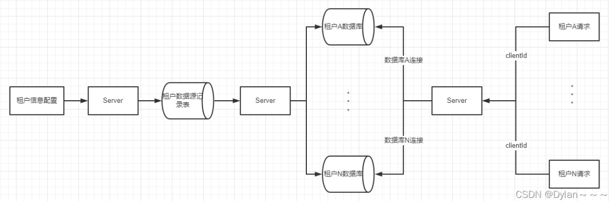

# 介绍

是一个基于springboot的快速集成多数据源的启动器,可集成多种数据库

## 特性

- 支持 **数据源分组** ，适用于多种场景 纯粹多库 读写分离 一主多从 混合模式。
- 支持数据库敏感配置信息 **加密** ENC()。
- 支持每个数据库独立初始化表结构schema和数据库database。
- 支持无数据源启动，支持懒加载数据源（需要的时候再创建连接）。
- 支持 **自定义注解** ，需继承DS(3.2.0+)。
- 提供并简化对Druid，HikariCp，BeeCp，Dbcp2的快速集成。
- 提供对Mybatis-Plus，Quartz，ShardingJdbc，P6sy，Jndi等组件的集成方案。
- 提供 **自定义数据源来源** 方案（如全从数据库加载）。
- 提供项目启动后 **动态增加移除数据源** 方案。
- 提供Mybatis环境下的 **纯读写分离** 方案。
- 提供使用 **spel动态参数** 解析数据源方案。内置spel，session，header，支持自定义。
- 支持 **多层数据源嵌套切换** 。（ServiceA >>> ServiceB >>> ServiceC）。
- 提供 **基于seata的分布式事务方案。**
- 提供 **本地多数据源事务方案。** 附：不能和原生spring事务混用。

## 约定

1. 本框架只做 **切换数据源** 这件核心的事情，并**不限制你的具体操作**，切换了数据源可以做任何CRUD。
2. 配置文件所有以下划线 `_` 分割的数据源 **首部** 即为组的名称，相同组名称的数据源会放在一个组下。
3. 切换数据源可以是组名，也可以是具体数据源名称。组名则切换时采用负载均衡算法切换。
4. 默认的数据源名称为 **master** ，你可以通过 `spring.datasource.dynamic.primary` 修改。
5. 方法上的注解优先于类上注解。
6. DS支持继承抽象类上的DS，暂不支持继承接口上的DS。

# 安装

```xml
<dependency>
  <groupId>com.baomidou</groupId>
  <artifactId>dynamic-datasource-spring-boot-starter</artifactId>
  <version>${version}</version>
</dependency>
```

# 配置

```yaml
spring:
  datasource:
    dynamic:
      primary: master #设置默认的数据源或者数据源组,默认值即为master
      strict: false #严格匹配数据源,默认false. true未匹配到指定数据源时抛异常,false使用默认数据源
      datasource:
        master:
          url: jdbc:mysql://xx.xx.xx.xx:3306/dynamic
          username: root
          password: 123456
          driver-class-name: com.mysql.jdbc.Driver # 3.2.0开始支持SPI可省略此配置
        slave_1:
          url: jdbc:mysql://xx.xx.xx.xx:3307/dynamic
          username: root
          password: 123456
          driver-class-name: com.mysql.jdbc.Driver
        slave_2:
          url: ENC(xxxxx) # 内置加密,使用请查看详细文档
          username: ENC(xxxxx)
          password: ENC(xxxxx)
          driver-class-name: com.mysql.jdbc.Driver
          
       #......省略
       #以上会配置一个默认库master，一个组slave下有两个子库slave_1,slave_2
```

```yaml
# 多主多从   
spring:
  datasource:
    dynamic:
      datasource:
        master_1:
        master_2:
        slave_1:
        slave_2:
        slave_3:
# 纯粹多库 
spring:
  datasource:
    dynamic:
    primary: master_1
      datasource:
        master_1:
        master_2:
        slave_1:
        slave_2:
        slave_3:
# 混合配置
spring:
  datasource:
    dynamic:
      datasource:
        master_1:
        master_2:
        slave_1:
        slave_2:
        slave_3:
```

# 使用

**@DS** 可以注解在方法上或类上，**同时存在就近原则 方法上注解 优先于 类上注解**

```java

@Mapper
public interface UserMapper {
 
    //通过@DS  来选择  配置文件中的master  数据源
    @DS("master")
    User Sel(int id);
 
    //通过@DS  来选择  配置文件中的master  数据源
    @DS("slave_1")
    Integer insertUser(User u);
}
```

或

```java
@Service
@DS("slave")
public class UserServiceImpl implements UserService {
 
  @Autowired
  private JdbcTemplate jdbcTemplate;
 
  public List selectAll() {
    return  jdbcTemplate.queryForList("select * from user");
  }
  
  @Override
  @DS("slave_1")
  public List selectByCondition() {
    return  jdbcTemplate.queryForList("select * from user where age >10");
  }
}
```

# 动态切换

## aop切换

```java
/**
 * 数据源拦截-aop模式
 */
@Order(1)
@Aspect
@EnableAspectJAutoProxy(proxyTargetClass = true)
@Component
@Slf4j
public class DataSourceChangeAdvisor {
    /**
     * 按需设置需要切换的模式
     */
    @Pointcut("@within(org.springframework.web.bind.annotation.RestController)")
    public void pointDataSource() {
    }

    /**
     * 需要定义模块的规则
     * @param joinPoint
     * @return
     * @throws Throwable
     */
    @Around("pointDataSource()")
    public Object doAround(ProceedingJoinPoint joinPoint) throws Throwable {
        try {
            //获取当前请求对象
            ServletRequestAttributes attributes = (ServletRequestAttributes) RequestContextHolder.getRequestAttributes();
            if (attributes != null) {
                HttpServletRequest request = attributes.getRequest();
                String uri = request.getRequestURI();
                //String url = request.getRequestURL().toString();
                String[] uriArr = uri.split("/");
                if (uriArr[uriArr.length - 1].equals("detail")) {
                    log.info("datasource1------");
                    DynamicDataSourceContextHolder.push("master");
                } else {
                    log.info("datasource2------");
                    DynamicDataSourceContextHolder.push("slave_1");
                } 
            }
        } catch (Exception e) {
            log.error("日志拦截异常", e);
        } finally {
            return joinPoint.proceed();
        }
    }
}
```

## 拦截器

```java
@Slf4j
public class DynamicDataSourceChangeInterceptor implements HandlerInterceptor {

    @Override
    public boolean preHandle(HttpServletRequest request, HttpServletResponse response, Object handler) throws Exception {
        String uri = request.getRequestURI();
        //String url = request.getRequestURL().toString();
        String[] uriArr = uri.split("/");
        if (uriArr[uriArr.length - 1].equals("detail")) {
            log.info("interceptor datasource1------");
            DynamicDataSourceContextHolder.push("master");
        } else {
            log.info("interceptor datasource2------");
            DynamicDataSourceContextHolder.push("slave_1");
        } 
        return true;
    }
}
```

```java
@Configuration
public class DynamicDataSourceChangeInterceptorConfig implements WebMvcConfigurer {
    @Override
    public void addInterceptors(InterceptorRegistry registry) {
        //如果拦截全部可以设置为 /**
        String [] path = {"/tenantDataSource/**"};
        //不需要拦截的接口路径
        String [] excludePath = {};
        DynamicDataSourceChangeInterceptor dynamicDataSourceChangeInterceptor = new DynamicDataSourceChangeInterceptor();
        registry.addInterceptor(dynamicDataSourceChangeInterceptor).addPathPatterns(path).excludePathPatterns(excludePath);
    }
}
```

# 多租户模式

多租户的设计方案要考虑租户隔离数据和租户共享数据，共享数据好实现，但是隔离数据相对复杂一些，一般要考虑隔离性、扩展性、租户成本和运维复杂性；
通常SaaS多租户在数据存储上存在三种主要的方案：

+ 独立数据库：一个租户一个数据库。
+ 共享数据库，隔离数据架构：多个或所有租户共享database，但不同的tenant和schema。
+ 共享数据库，共享数据架构：租户共享一个database、一个schema，在表中通过tenantID区分租户的数据。

## 方案:

在配置数据库信息的时候,用一个数据源配置表记录用户和数据源的关系

用户在登录获取信息后,拿到数据源信息,可根据自身数据源信息去相应数据源获取数据



```java
@Log4j2
@Aspect // FOR AOP
@Configuration // 配置类
public class TransformDataSource {

    @Pointcut("execution( * com.sk.controller..*.*(..))")
    /**
     * 这个方法的方法名要和下面注解方法名一致
     */
    public void doPointcut() {
    }

    @Before("doPointcut()")
    public void doBefore(JoinPoint joinPoint) {
        // 请求开始时间
        ServletRequestAttributes sra = (ServletRequestAttributes) RequestContextHolder.getRequestAttributes();
        String headValue = sra.getRequest().getHeader("clientId");
        log.info("--------------clientId:{}", headValue);
        DynamicDataSourceContextHolder.poll();
        DynamicDataSourceContextHolder.push(headValue);
    }

    @After("doPointcut()")
    public void doAfter() {
        System.out.println("==doAfter==");
    }

}
```

