# 初识MQ

## 同步和异步通讯

+ 同步通讯

  微服务直接的直接调用就属于同步通讯

  优点:

  ​	**时效性强,可立即得到结果**

  缺点:
  	**耦合性高**

  ​	**性能和吞吐能力低**

  ​	**有额外的资源消耗**

  ​	**有级联失效问题**

  常用场景:
  	需要即可得到结果的服务之间使用同步通讯

  ​	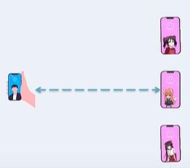

+ 异步通讯

  异步通讯使用一个中间件Broker,当某个服务想要发起请求时,直接向Broker发起事件,然后继续执行自己的代码.

  Broker接收到事件后,会向其他服务发起调用,若该服务处于繁忙或宕机,则缓存等待后再发起.

  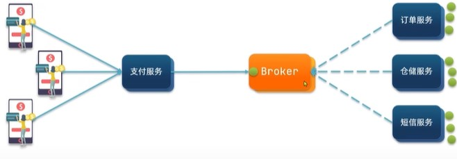

  优点:

  ​	**耦合度低**

  ​	**吞吐量提升**

  ​	**故障隔离**

  ​	**流量削峰**

  缺点:

  ​	**依赖于Broker的可靠性、安全性、吞吐能力**

  ​	**架构复杂,业务没有明显流程,不方便追钟问题**

  

## MQ常见技术

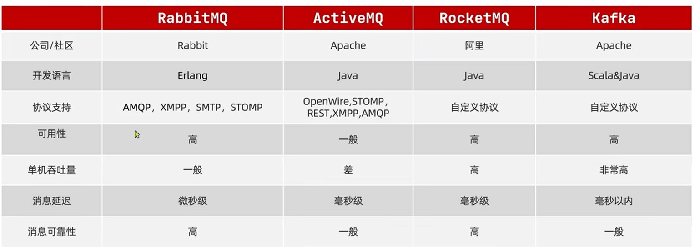


# RabbitMQ

## 概述和安装

docker拉取镜像

```tex
docker pull rabbitmq:3-management
```

运行rabbitmq

```text
docker run \
 -e RABBITMQ_DEFAULT_USER=用户名 \
 -e RABBITMQ_DEFAULT_PASS=密码 \
 -v mq-plugins:/plugins \
 --name mq \
 --hostname mq1 \
 -p 15672:15672 \
 -p 5672:5672 \
 -d \
镜像id

```

rabbit有两个端口,15672是管理员端口,从web可进入管理员页面,5672是用户端口,可从该端口使用rabbitmq

## 消息模型

rabbitMQ官方提供了6种消息模型,实际能用的有5种

+ 基础队列模型

  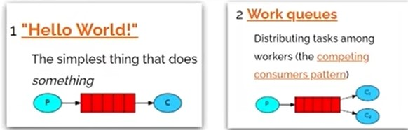

+ 工作消息队列

  + 广播
  + 路由
  + 主题

  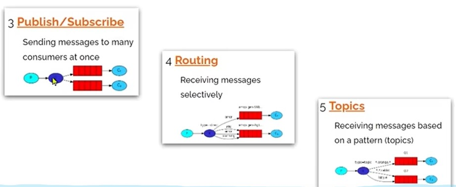

## 入门案例

该入门案例使用的是官方的rabbitmq提供的连接方式,了解即可,后面使用spring提供的AMQP快捷连接

### 导入依赖

```xml
		<dependency>
            <groupId>com.rabbitmq</groupId>
            <artifactId>amqp-client</artifactId>
            <version>3.0.4</version>
        </dependency>
```

### 发送端

```java
// 1.建立连接
ConnectionFactory factory = new ConnectionFactory();
// 1.1设置连接参数,分别是:主机Ip、端口、vhost、用户名、密码
factory.setHost("主机IP");
factory.setPort(端口);
factory.setVirtualHost("vhost");
factory.setUsername("用户名");
factory.setPassword("密码");
// 1.2建立连接
connection = factory.newConnection();

// 2.创建通道
channel = connection.createChannel();

// 3.创建队列
String queueName = "队列名";
channel.queueDeclare(queue, false, false, false, null);

// 4.发送消息
String message = "hello,rabbitMQ";
channel.basicPublish("",queueName,null,message.getBytes());

// 5.关闭通道和连接
channel.close();
connection.close();
```

### 接收端

```java
// 1.建立连接
ConnectionFactory factory = new ConnectionFactory();
// 1.1设置连接参数,分别是:主机Ip、端口、vhost、用户名、密码
factory.setHost("主机IP");
factory.setPort(端口);
factory.setVirtualHost("vhost");
factory.setUsername("用户名");
factory.setPassword("密码");
// 1.2建立连接
connection = factory.newConnection();

// 2.创建通道
channel = connection.createChannel();

// 3.创建队列
String queueName = "队列名";
channel.queueDeclare(queue, false, false, false, null);

// 4.订阅消息
channel.basicConsume(queueName,true,new DefaultConsumer(channel){
    @Override
	public void handleDelivery(String consumerTag, Envelope envelope, AMQP.BasicProperties properties, byte[] body) throws IOException {
        // 5.处理消息
        String message = new String(body);
        System.out.println(message);
	}
});
```

# Spring AMQP

spring AMQP是spring提供的一个可以快捷发送和接收mq消息的框架

## 安装

导入依赖

```xml
<dependency>
    <groupId>org.springframework.boot</groupId>
    <artifactId>spring-boot-starter-amqp</artifactId>
</dependency>
```

配置

```properties
spring.rabbitmq.host=主机IP
spring.rabbitmq.port=端口
spring.rabbitmq.virtual-host=vhost
spring.rabbitmq.username=用户名
spring.rabbitmq.password=密码
```

## 基础队列模型

### 发送端

```java
@Autowired
private RabbitTemplate rabbitTemplate;

@GetMapping("/xx")
	rabbitTemplate.convertAndSend(队列名,消息);
}
```

### 接收端

```java
@Component
public class SpringRabbitListenner {
    @RabbitListener(queues = "test.queue")
    public void listenDemo(String message) throws InterruptedException{
        System.out.println("收到rabbit消息:"+message);
    }
}
```

## WorkQueue模型

对比简单模型,如果服务1一次只能处理50条消息,而队列来了60条,那么就会有10条消息在队列等待那50条先处理完再处理,这样就会导致队列越来越多而服务器崩掉

因此需要两个服务来接收队列消息,这样的操作就是WorkQueue工作模型

***WorkQueue是负载均衡发送,即只有一个消费者消费,如果想要发送给集群内所有服务,可以使用广播、路由***

```java
@RabbitListener(queues = "test.queue")
    public void listenDemo1(String message) throws InterruptedException{
        System.out.println("收到rabbit消息1:"+message);
    }
@RabbitListener(queues = "test.queue")
    public void listenDemo2(String message) throws InterruptedException{
        System.out.println("收到rabbit消息2:"+message);
    }
```

在工作模型中,服务会***预取***队列的消息,比如来了60条消息,就会平均分给两个服务器,而服务只会向队列里拿自己预取的消息

一般情况下两个接收端是在不同的服务器下运行,若服务器1性能强一点,一次能处理多个,而服务器2性能弱一点,就不能使用预取

```properties
#预取上限
spring.rabbitmq.listener.simple.prefetch=1
```

## Fanout(广播)模型

fanout模型使用fanout交换机,发送端将消息推送(发送)至交换机里,由交换机分发至各个队列

对比之前的简单模型和工作模型,它们一旦接收到到消息就会销毁消息,不会保存.
***因此如果想一条消息发给多个服务,需要使用广播模型***

广播模型使用前需先创建队列和交换机,并把队列和交换机绑定

### 创建和绑定交换机

```java
@Configuration
public class FanoutConfig {
    // 创建Fanout交换机
    @Bean
    public FanoutExchange fanoutExchange(){
        return new FanoutExchange("fanouttest.exchange");
    }
    // 创建队列1
    @Bean
    public Queue fanoutQueue1(){
        return new Queue("fanouttest.queue1");
    }
    // 创建队列2
    @Bean
    public Queue fanoutQueue2(){
        return new Queue("fanouttest.queue2");
    }
    //交换机和队列1绑定
    @Bean
    public Binding fanoutBinding1(Queue fanoutQueue1,FanoutExchange fanoutExchange){
        return BindingBuilder.bind(fanoutQueue1).to(fanoutExchange);
    }
    //交换机和队列1绑定
    @Bean
    public Binding fanoutBinding2(Queue fanoutQueue2,FanoutExchange fanoutExchange){
        return BindingBuilder.bind(fanoutQueue2).to(fanoutExchange);
    }

}
```

或者使用注解方式

```java
@RabbitListener(bindings = @QueueBinding(
        value = @Queue(name = 队列名),
        exchange = @Exchange(name = 交换机名,type = ExchangeTypes.交换机类型),
        key = {key1,key2}
))
public void listenDemo(String message) throws InterruptedException{
    System.out.println(message);
}
```

### 推送(发送)和订阅(接收)

​	订阅和基础队列模型一样,只用推送有一点不同

```java
rabbitTemplate.convertAndSend(交换机名,"",消息);
```

## Direct(路由)模型

Direct Exchange会按照规则发送至指定的队列内

在创建队列时,为队列设置好bindKey,交换机发送时,会发给对应的bindKey的队列

一个队列可以有多个key,若两个队列key相同,则都发送,和广播模型效果相同,因此路由模型是广播模型的一种优化

### 推送

```java
rabbitTemplate.convertAndSend(交换机名,队列key,消息);
```

### 订阅

```java
@RabbitListener(bindings = @QueueBinding(
        value = @Queue(name = 队列名),
        exchange = @Exchange(name = 交换机名,type = ExchangeTypes.DIRECT),
        key = {key1,key2}
))
public void listenDirecDemo2(String message) throws InterruptedException{
    System.out.println("bule,yellow收到directest消息:"+message);
}
```

## Topic(话题)模型

Topic exchange也是按照一定规则发送至指定队列
相比Direct路由模型优势在于它的规则有点像正则表达式,可以用符号表达

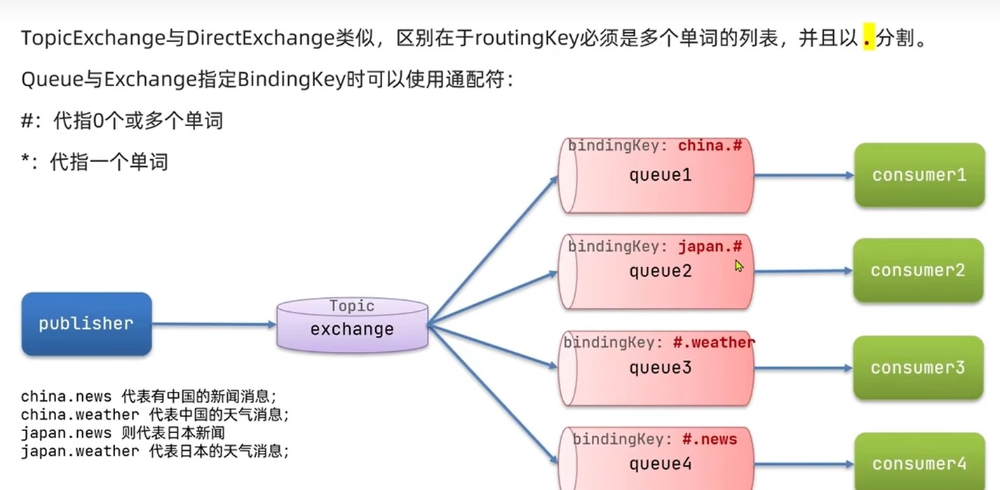

### 推送

```java
rabbitTemplate.convertAndSend(交换机名,xx.yy,消息);
```

### 订阅

```java
@RabbitListener(bindings = @QueueBinding(
        value = @Queue(name = 队列名),
        exchange = @Exchange(name = 交换机名,type = ExchangeTypes.TOPIC),
        key = {#.yy,xx.#}
))
public void Demo(String message) throws InterruptedException{
    System.out.println(message);
}
```

## 消息转化

AMQP发送和接收的类型都是Object,因此理论上不止String类型可发送,什么类型都可以发送
但是***不推荐直接发送对象***至队列里,因为如果要发送对象,必然要将对象序列化,而序列化后对象的字节数就变长了,导致传送过程变慢
因此***推荐发送Json对象***即可,Json对象本身就是序列化对象

但是每次都要将对象转Json很麻烦,因此可以用一个转换器,在每次发送对象前,将对象转为Json

### json依赖

```xml
<dependency>
    <groupId>com.fasterxml.jackson.dataformat</groupId>
    <artifactId>jackson-dataformat-xml</artifactId>
    <version>2.13.3</version>
</dependency>
```

### 添加转换器

在推送和订阅服务中添加转换器

```java
@Bean
public MessageConverter jsonMessageConverter(){
    return new Jackson2JsonMessageConverter();
}
```

## 消息可靠性

确保消息能发送到消费者

有以下情况会导致消息丢失

+ 发送时丢失:
  + 生产者发送的消息未到exchange
  + 消息到达exchange后未到queue
+ MQ宕机,queue将消息丢失
+ consumer收到消息后未消费就宕机

### 生产者消息确认

RabbitMQ使用了一个publisher机制来避免消息丢失.当发送消息后,生产者会收到一个结果来确认发送状态

+ publisher-confirm,生产者确认
  + 消息成功发送到交换机,返回ack
  + 消息未发送到交换机,返回nack
+ publisher-return,生产者回执
  + 消息发送到交换机,但交换机没将消息发送到队列,返回ack,执行returncallback函数

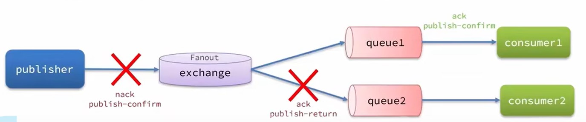

首先，修改publisher服务中的application.yml文件，添加下面的内容：

```yaml
spring:
  rabbitmq:
    publisher-confirm-type: correlated
    publisher-returns: true
    template:
      mandatory: true
   
```

说明：

- `publish-confirm-type`：开启publisher-confirm，这里支持两种类型：
  - `simple`：同步等待confirm结果，直到超时
  - `correlated`：异步回调，定义ConfirmCallback，MQ返回结果时会回调这个ConfirmCallback
- `publish-returns`：开启publish-return功能，同样是基于callback机制，不过是定义ReturnCallback
- `template.mandatory`：定义消息路由失败时的策略。true，则调用ReturnCallback；false：则直接丢弃消息

#### 重写ReturnCallback

交换机的消息到不了队列触发

returncallback主要在RabbitTemplate里面,我们在启动spring时添加我们的配置,因此使用ApplicationContextAware,ApplicationContextAware接口会在bean准备好后执行setApplicationContext

```java
@Slf4j
@Configuration
public class CommonConfig implements ApplicationContextAware {
    @Override
    public void setApplicationContext(ApplicationContext applicationContext) throws BeansException {
        // 获取RabbitTemplate
        RabbitTemplate rabbitTemplate = applicationContext.getBean(RabbitTemplate.class);
        // 设置ReturnCallback
        rabbitTemplate.setReturnCallback((message, replyCode, replyText, exchange, routingKey) -> {
            // 投递失败，记录日志
            log.info("消息发送失败，应答码{}，原因{}，交换机{}，路由键{},消息{}",
                     replyCode, replyText, exchange, routingKey, message.toString());
            // 如果有业务需要，可以重发消息
        });
    }
}
```

#### 定义ConfirmCallback

消息到不了交换机触发

这个比较简单,在发送消息时可以定义对应的ConfirmCallback函数,这里使用内部类

```java
public void testSendMessage2SimpleQueue() throws InterruptedException {
    // 1.消息体
    String message = "hello, spring amqp!";
    // 2.全局唯一的消息ID，需要封装到CorrelationData中
    CorrelationData correlationData = new CorrelationData(UUID.randomUUID().toString());
    // 3.添加callback
    correlationData.getFuture().addCallback(
        result -> {
            if(result.isAck()){
                // 3.1.ack，消息成功
                log.debug("消息发送成功, ID:{}", correlationData.getId());
            }else{
                // 3.2.nack，消息失败
                log.error("消息发送失败, ID:{}, 原因{}",correlationData.getId(), result.getReason());
            }
        },
        ex -> log.error("消息发送异常, ID:{}, 原因{}",correlationData.getId(),ex.getMessage())
    );
    // 4.发送消息
    rabbitTemplate.convertAndSend("task.direct", "task", message, correlationData);

    // 休眠一会儿，等待ack回执
    Thread.sleep(2000);
}
```


### 消息持久化

未防止,MQ宕机,queue将消息丢失.我们可以将消息持久化到硬盘中

默认情况下，SpringAMQP发出的任何交换机、队列、消息都是持久化的，不用特意指定。

RabbitMQ安全保存主要分为三种:

- 交换机持久化
- 队列持久化
- 消息持久化

可以在RabbitMQ控制台看到持久化的都会带上`D`的标示：

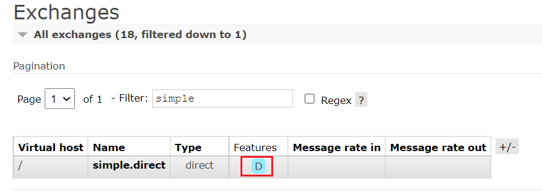

#### 交换机持久化

将交换机信息保存到硬盘,重启MQ后仍能找到交换机

SpringAMQP中可以通过代码指定交换机持久化：

```java
@Bean
public DirectExchange simpleExchange(){
    // 三个参数：交换机名称、是否持久化、当没有queue与其绑定时是否自动删除
    return new DirectExchange("simple.direct", true, false);
}
```

#### 队列持久化

将队列信息保存到硬盘,重启MQ后仍能找到队列

SpringAMQP中可以通过代码指定交换机持久化：

```java
@Bean
public Queue simpleQueue(){
    // 使用QueueBuilder构建队列，durable就是持久化的
    return QueueBuilder.durable("simple.queue").build();
}
```

#### 消息持久化

将消息保存到硬盘,重启MQ后仍能找到消息

```java
public void testSendMessage2SimpleQueue() throws InterruptedException {
    // 1.消息体
    String message = "hello, spring amqp!";
    Message message = MessageBuilder
        .withBody("hello, spring amqp!".getBytes(StandardCharsets.UTF_8))
        .setDeliveryMode(MessageDeliveryMode.PERSISTENT)//持久化
        .build();
    // 2.消息ID，需要封装到CorrelationData中
    CorrelationData correlationData = new CorrelationData(UUID.randomUUID().toString());
    // 3.发送消息
    rabbitTemplate.convertAndSend("交换机", "队列", message, correlationData);

    // 休眠一会儿，等待ack回执
    Thread.sleep(2000);
}
```

### 消费者消息确认

RabbitMQ消息被消费者确认后会立刻删除,而SpringAMQP则允许配置三种确认模式,默认是none模式：

+ manual：手动ack，需要在业务代码结束后，调用api发送ack,不推荐使用,容易被人恶意注入错误的api。

+ auto：自动ack，由spring监测listener代码是否出现异常，没有异常则返回ack；抛出异常则返回nack,而消息则不断尝试发送

+ none：关闭ack，MQ假定消费者获取消息后会成功处理，因此消息投递后立即被删除

#### none模式(默认)

```yaml
spring:
  rabbitmq:
    listener:
      simple:
        acknowledge-mode: none # 关闭ack
```

#### auto模式

```yaml
spring:
  rabbitmq:
    listener:
      simple:
        acknowledge-mode: auto # 关闭ack
```

出现异常listener会被不断执行,因为RabbitMQ消息未被确认,会一直尝试发送

### 消费失败重试机制

当消费者出现异常后，消息会不断requeue（重入队）到队列，再重新发送给消费者，然后再次异常，再次requeue，无限循环，导致mq的消息处理飙升，带来不必要的压力

有两种方法解决失败重试机制:

+ 本地重试:在本地重试,而不是MQ重试
+ 失败策略:设置本地重试结束后执行的策略

#### 本地重试

开启本地重试时，消息处理过程中抛出异常，不会requeue到队列，而是在消费者本地重试,重试达到最大次数后，Spring会返回ack，消息会被丢弃

```yaml
spring:
  rabbitmq:
    listener:
      simple:
        retry:
          enabled: true # 开启消费者失败重试
          initial-interval: 1000 # 初识的失败等待时长为1秒
          multiplier: 1 # 失败的等待时长倍数，下次等待时长 = multiplier * last-interval
          max-attempts: 3 # 最大重试次数
          stateless: true # true无状态；false有状态。如果业务中包含事务，这里改为false
```

#### 失败策略

+ RejectAndDontRequeueRecoverer:重试后向MQ发送确认,MQ会删除消息(默认)
+ ImmediateRequeueMessageRecoverer:重试后向MQ发送nack，MQ会重新发送
+ RepublishMessageRecoverer:重试后向MQ发送确认,MQ会删除消息,同时向某交换机发送消息(推荐)

推荐使用RepublishMessageRecoverer,在业务上,当重试次数耗尽时,就代表这里出现了异常,可以将此异常通过交换机发送到对应的异常日志服务进行记录,然后人工介入时就可以快速找到问题

```java
@Configuration
public class ErrorMessageConfig {
    //定义重试结束后,发送的交换机
    @Bean
    public DirectExchange errorMessageExchange(){
        return new DirectExchange("error.direct");
    }
    //定义重试结束后,发送的队列
    @Bean
    public Queue errorQueue(){
        return new Queue("error.queue", true);
    }
    //关联交换机和队列
    @Bean
    public Binding errorBinding(Queue errorQueue, DirectExchange errorMessageExchange){
        return BindingBuilder.bind(errorQueue).to(errorMessageExchange).with("error");
    }
	//声明使用RepublishMessageRecoverer策略
    @Bean
    public MessageRecoverer republishMessageRecoverer(RabbitTemplate rabbitTemplate){
        return new RepublishMessageRecoverer(rabbitTemplate, "error.direct", "error");
    }
}
```

## 死信交换机(DLX)

当交换机出现死信时,我们可以通过给交换机配置死信交换机把死信转发到死信交换机里

产生死信的原因:

- 消费者使用basic.reject或 basic.nack声明消费失败，并且消息的requeue参数设置为false(requeue禁止MQ重试)
- 消息是一个过期消息，超时无人消费
- 要投递的队列消息满了，无法投递

一般情况下,消息成为死信,MQ就会将消息丢弃

如果配置了死信交换机,那么死信就不会丢弃,而是发送到死信交换机里

与消费失败重试转异常交换机区别在于一个是从消费者发送到交换机,一个是从交换机发送到另一个交换机

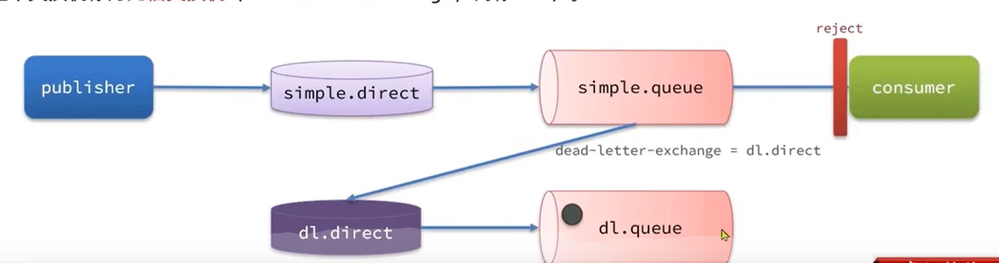

死信交换机功能:

+ 和失败重试转异常交换机一样,出现异常时发送异常
+ 消息过期时,发送过期消息到死信交换机

死信交换机配置:

在消费者服务创建普通队列时,同时绑定交换机

```java
// 声明普通的队列，并且为其指定死信交换机：dl.direct
@Bean
public Queue simpleQueue2(){
    return QueueBuilder.durable("普通队列") // 指定队列名称
        .deadLetterExchange("死信交换机") // 指定死信交换机
        //.deadLetterRoutingKey("dl") // 指定key
        .build();
}
// 声明死信交换机 dl.direct
@Bean
public DirectExchange dlExchange(){
    return new DirectExchange("死信交换机", true, false);
}
// 声明存储死信的队列 dl.queue
@Bean
public Queue dlQueue(){
    return new Queue("死信队列", true);
}
// 将死信队列 与 死信交换机绑定
@Bean
public Binding dlBinding(){
    return BindingBuilder.bind(dlQueue()).to(dlExchange()).with("simple");
}
```

### 过期时间TTL

TTL就是一个消息的存活时间,当消息过期时就会被放入死信交换机

TTL可以用来做延迟发送,就是将消息发给一个没有消费者的队列,超时后会转发给另一个有消费者的队列,从而实现延迟发送

~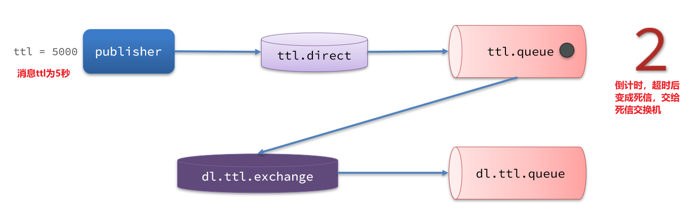

#### 生产者配置过期时间

在发送消息时,指定消息的存活时间

```java
@Test
public void testTTLQueue() {
    // 创建消息
    String message = "hello, ttl queue";
    // 消息ID，需要封装到CorrelationData中
    CorrelationData correlationData = new CorrelationData(UUID.randomUUID().toString());
    // 发送消息
    rabbitTemplate.convertAndSend("死信交换机", "死信队列", message, correlationData);
    // 记录日志
    log.debug("发送消息成功");
}
```

#### 消费者配置过期时间

在创建队列时,设置消息的存活时

***当生产者与消费者同时配置TTL,以最短的为准***

```java
// 声明普通的 simple.queue队列，并且为其指定死信交换机：dl.direct
@Bean
public Queue simpleQueue2(){
    return QueueBuilder.durable("普通队列") // 指定队列名称，并持久化
        .ttl(10000) // 设置队列的超时时间，10秒
        .deadLetterExchange("死信交换机") // 指定死信交换机
        //.deadLetterRoutingKey("dl") // 指定key
        .build();
}
// 声明死信交换机 dl.direct
...
// 声明存储死信的队列 dl.queue
...
// 将死信队列 与 死信交换机绑定
...
}
```

### 延迟队列

我们在业务中经常遇到以下场景,这时需要用上延迟队列:

- 延迟发送短信
- 用户下单，如果用户在15 分钟内未支付，则自动取消
- 预约工作会议，20分钟后自动通知所有参会人员

我们想要实现消息的延迟发送,可以使用以下方案:

+ TTL,将消息发送给没有消费者的队列,超时后转发
+ 延迟插件

#### DelayExchange插件

##### 安装

可以去对应的GitHub页面下载3.8.9版本的插件，地址为https://github.com/rabbitmq/rabbitmq-delayed-message-exchange/releases/tag/3.8.9这个对应RabbitMQ的3.8.5以上版本。

基于Docker安装，所以需要先查看RabbitMQ的插件目录对应的数据卷。之前设定的RabbitMQ的数据卷名称为`mq-plugins`，所以我们使用下面命令查看数据卷：

```sh
docker volume inspect mq-plugins
```

可以得到下面结果：

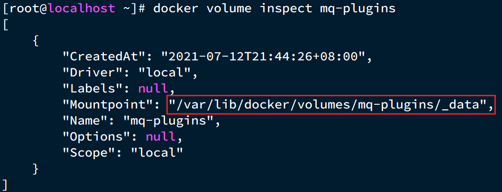

接下来，将插件上传到这个目录即可：

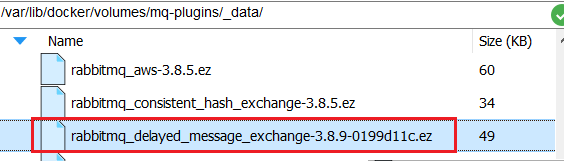

最后就是安装了，需要进入MQ容器内部来执行安装。我的容器名为`mq`，所以执行下面命令：

```sh
docker exec -it mq bash
```

执行时，请将其中的 `-it` 后面的`mq`替换为你自己的容器名.

进入容器内部后，执行下面命令开启插件：

```sh
rabbitmq-plugins enable rabbitmq_delayed_message_exchange
```

结果如下：

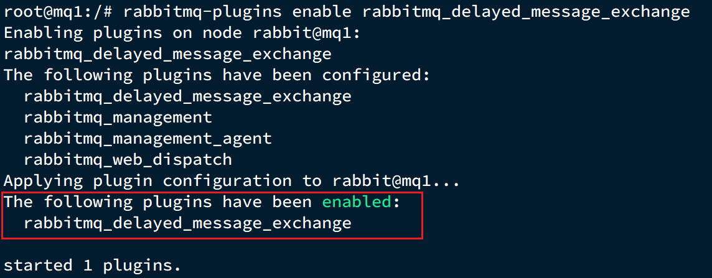

##### 网站使用

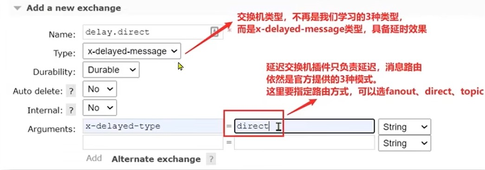

在网站内直接创建交换机,类型未x-deleyed-message

在发消息的时候需要指定消息头x-delay和时间

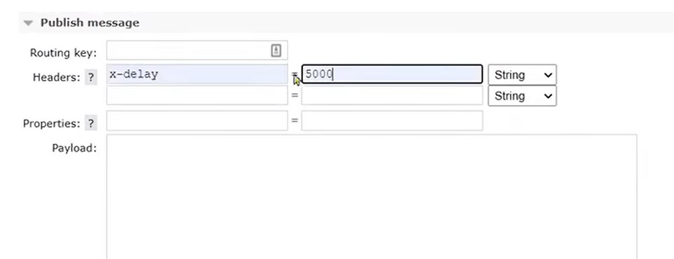

##### springAMQP使用

基于注解方式（推荐）：

```java
@RabbitListener(bindings = @QueueBinding(
        value = @Queue(name = 队列名),
        exchange = @Exchange(name = "交换机类型.名称",delayed=ture),
        key = {#.yy,xx.#}
))
public void Demo(String message) throws InterruptedException{
    System.out.println(message);
}
```

也可以基于@Bean的方式：

```java
@Configuration
public class DirectConfig {
    // 创建交换机
    @Bean
    public DirectExchange directExchange(){
        return new ExchangeBuilder
            .directExchange("交换机类型.名称")
            .delayed()//开启插件
            .durable(ture)//持久化
            .builder;
    }
    // 创建队列
    @Bean
    ...
    //交换机和队列绑定
    @Bean
    ...
    }
}
```

消息生产者发送消息时指定消息头x-delay和时间

```java
public void testSendMessage2SimpleQueue() throws InterruptedException {
    // 1.消息体
    String message = "hello, spring amqp!";
    Message message = MessageBuilder
        .withBody("hello, spring amqp!".getBytes(StandardCharsets.UTF_8))
        .setDeliveryMode(MessageDeliveryMode.PERSISTENT)//持久化
        .setHeader("x-delay",int毫秒)
        .build();
    // 2.消息ID，需要封装到CorrelationData中
    CorrelationData correlationData = new CorrelationData(UUID.randomUUID().toString());
    // 3.发送消息
    rabbitTemplate.convertAndSend("交换机", "队列", message, correlationData);
}
```

## 惰性队列

当生产者发送消息的速度超过了消费者处理消息的速度，就会导致队列中的消息堆积，直到队列存储消息达到上限。之后发送的消息就会成为死信，可能会被丢弃，这就是消息堆积问题

- 增加更多消费者，提高消费速度。也就是我们之前说的work queue模式
- 增加消费者性能,比如使用多线程
- 扩大队列容积，提高堆积上限,在安装MQ时配置,默认一个队列大小上限是内存的40%
- 使用惰性队列,将消息存到磁盘而非硬盘

#### 修改队列为惰性

设置一个队列为惰性队列，只需要在声明队列时，指定x-queue-mode属性为lazy即可。可以通过命令行将一个运行中的队列修改为惰性队列：

```sh
rabbitmqctl set_policy Lazy "^lazy-queue$" '{"queue-mode":"lazy"}' --apply-to queues  
```

命令解读：

- `rabbitmqctl` ：RabbitMQ的命令行工具
- `set_policy` ：添加一个策略
- `Lazy` ：策略名称，可以自定义
- `"^lazy-queue$"` ：用正则表达式匹配队列的名字
- `'{"queue-mode":"lazy"}'` ：设置队列模式为lazy模式
- `--apply-to queues  `：策略的作用对象，是所有的队列

#### 创建惰性队列

需要注意,队列和交换机(有用上交换机的话),必须持久化才能使用惰性队列

基于注解方式（推荐）：

```java
@RabbitListener(bindings = @QueueBinding(
        value = @Queue(name = 队列名),
        durable = "ture",
		arguments = @Argument(name = "x-queue-mode",model = "lazy")
))
public void Demo(String message) throws InterruptedException{
    System.out.println(message);
}
```

也可以基于@Bean的方式：

```java
@Configuration
public class DirectConfig {
    // 创建交换机
    @Bean
    ...
    // 创建队列
    @Bean
    public LazyQueue lazyQueue(){
        return new QueueBuilder
            .durable("队列名")
            .lazy()//开启惰性队列
            .builder;//持久化
    }
    //交换机和队列绑定
    @Bean
    ...
    }
}
```


## MQ集群

RabbitMQ的是基于Erlang语言编写，而Erlang又是一个面向并发的语言，天然支持集群模式。RabbitMQ的集群有两种模式：

+ **普通集群**：是一种分布式集群，将队列分散到集群的各个节点，从而提高整个集群的并发能力。

+ **镜像集群**：是一种主从集群，普通集群的基础上，添加了主从备份功能，提高集群的数据可用性。

镜像集群虽然支持主从，但主从同步并不是强一致的，某些情况下可能有数据丢失的风险。因此在RabbitMQ的3.8版本以后，推出了新的功能：**仲裁队列**来代替镜像集群，底层采用Raft协议确保主从的数据一致性。

### 普通集群

普通集群，或者叫标准集群（classic cluster），具备下列特征：

- 会在集群的各个节点间共享部分数据，包括：交换机、队列元信息。不包含队列中的消息。
- 当访问集群某节点时，如果队列不在该节点，会从数据所在节点传递到当前节点并返回
- 队列所在节点宕机，队列中的消息就会丢失

结构如图：

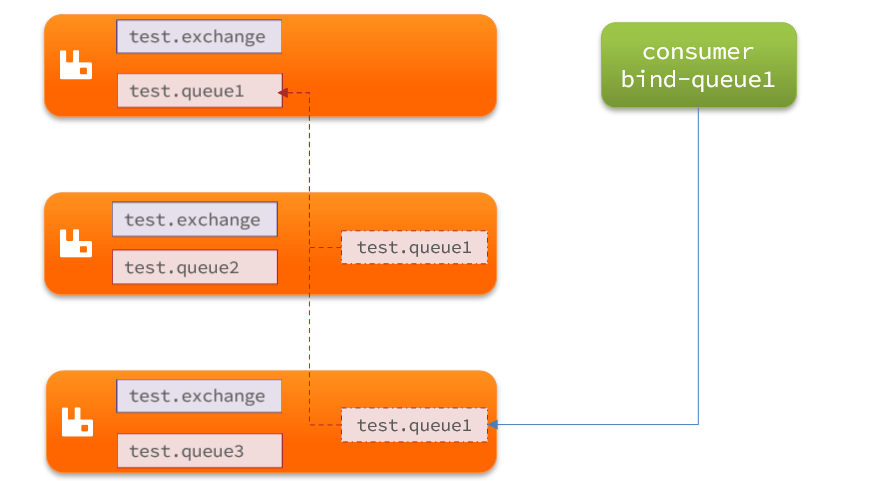

我们先在之前启动的mq容器中获取一个cookie值，作为集群的cookie。执行下面的命令：

```sh
docker exec -it mq cat /var/lib/rabbitmq/.erlang.cookie
```

可以看到cookie值如下：

```sh
FXZMCVGLBIXZCDEMMVZQ
```

接下来，停止并删除当前的mq容器，我们重新搭建集群。

```sh
docker rm -f mq
```

在/tmp目录新建一个配置文件 rabbitmq.conf：

```sh
cd /tmp
# 创建文件
touch rabbitmq.conf
```

文件内容如下：

```nginx
loopback_users.guest = false
listeners.tcp.default = 5672
cluster_formation.peer_discovery_backend = rabbit_peer_discovery_classic_config
cluster_formation.classic_config.nodes.1 = rabbit@mq1
cluster_formation.classic_config.nodes.2 = rabbit@mq2
cluster_formation.classic_config.nodes.3 = rabbit@mq3
```

再创建一个文件，记录cookie

```sh
cd /tmp
# 创建cookie文件
touch .erlang.cookie
# 写入cookie
echo "FXZMCVGLBIXZCDEMMVZQ" > .erlang.cookie
# 修改cookie文件的权限
chmod 600 .erlang.cookie
```

准备三个目录,mq1、mq2、mq3：

```sh
cd /tmp
# 创建目录
mkdir mq1 mq2 mq3
```

然后拷贝rabbitmq.conf、cookie文件到mq1、mq2、mq3：

```sh
# 进入/tmp
cd /tmp
# 拷贝
cp rabbitmq.conf mq1
cp rabbitmq.conf mq2
cp rabbitmq.conf mq3
cp .erlang.cookie mq1
cp .erlang.cookie mq2
cp .erlang.cookie mq3
```

创建一个网络：

```sh
docker network create mq-net
```

运行命令

```sh
docker run -d --net mq-net \
-v ${PWD}/mq1/rabbitmq.conf:/etc/rabbitmq/rabbitmq.conf \
-v ${PWD}/.erlang.cookie:/var/lib/rabbitmq/.erlang.cookie \
-e RABBITMQ_DEFAULT_USER=itcast \
-e RABBITMQ_DEFAULT_PASS=123321 \
--name mq1 \
--hostname mq1 \
-p 8071:5672 \
-p 8081:15672 \
rabbitmq:3.8-management
```

```sh
docker run -d --net mq-net \
-v ${PWD}/mq2/rabbitmq.conf:/etc/rabbitmq/rabbitmq.conf \
-v ${PWD}/.erlang.cookie:/var/lib/rabbitmq/.erlang.cookie \
-e RABBITMQ_DEFAULT_USER=itcast \
-e RABBITMQ_DEFAULT_PASS=123321 \
--name mq2 \
--hostname mq2 \
-p 8072:5672 \
-p 8082:15672 \
rabbitmq:3.8-management
```

```sh
docker run -d --net mq-net \
-v ${PWD}/mq3/rabbitmq.conf:/etc/rabbitmq/rabbitmq.conf \
-v ${PWD}/.erlang.cookie:/var/lib/rabbitmq/.erlang.cookie \
-e RABBITMQ_DEFAULT_USER=itcast \
-e RABBITMQ_DEFAULT_PASS=123321 \
--name mq3 \
--hostname mq3 \
-p 8073:5672 \
-p 8083:15672 \
rabbitmq:3.8-management
```

如图，在mq2和mq3两个控制台也都能看到：

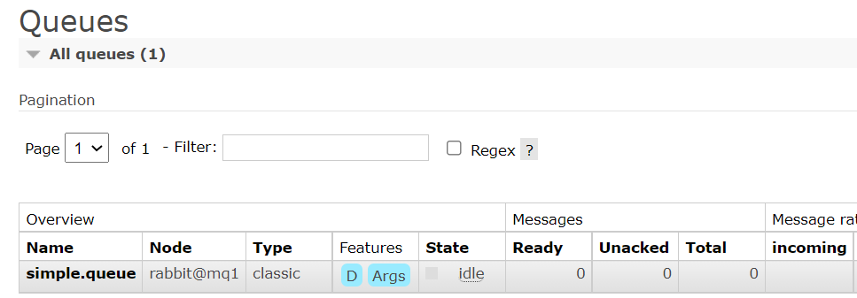

### 镜像集群

镜像集群：本质是主从模式，具备下面的特征：

- 交换机、队列、队列中的消息会在各个mq的镜像节点之间同步备份。
- 创建队列的节点被称为该队列的**主节点，**备份到的其它节点叫做该队列的**镜像**节点。
- 一个队列的主节点可能是另一个队列的镜像节点
- 所有操作都是主节点完成，然后同步给镜像节点
- 主宕机后，镜像节点会替代成新的主

结构如图：

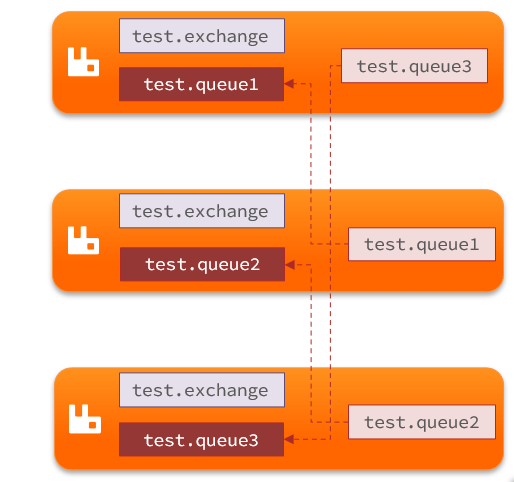


和普通集群部署一样,在部署好后通过docker进入任意一个节点进行配置即可:

```sh
docker exec -it mq1 bash
```

镜像模式的配置有3种模式：

| ha-mode         | ha-params         | 效果                                                         |
| :-------------- | :---------------- | :----------------------------------------------------------- |
| 准确模式exactly | 队列的副本量count | 集群中队列副本（主服务器和镜像服务器之和）的数量。count如果为1意味着单个副本：即队列主节点。count值为2表示2个副本：1个队列主和1个队列镜像。换句话说：count = 镜像数量 + 1。如果群集中的节点数少于count，则该队列将镜像到所有节点。如果有集群总数大于count+1，并且包含镜像的节点出现故障，则将在另一个节点上创建一个新的镜像。 |
| all             | (none)            | 队列在群集中的所有节点之间进行镜像。队列将镜像到任何新加入的节点。镜像到所有节点将对所有群集节点施加额外的压力，包括网络I / O，磁盘I / O和磁盘空间使用情况。推荐使用exactly，设置副本数为（N / 2 +1）。 |
| nodes           | *node names*      | 指定队列创建到哪些节点，如果指定的节点全部不存在，则会出现异常。如果指定的节点在集群中存在，但是暂时不可用，会创建节点到当前客户端连接到的节点。 |

这里我们以rabbitmqctl命令作为案例来讲解配置语法。

语法示例：

#### exactly模式

```
rabbitmqctl set_policy ha-two "^two\." '{"ha-mode":"exactly","ha-params":2,"ha-sync-mode":"automatic"}'
```

- `rabbitmqctl set_policy`：固定写法
- `ha-two`：策略名称，自定义
- `"^two\."`：匹配队列的正则表达式，符合命名规则的队列才生效，这里是任何以`two.`开头的队列名称
- `'{"ha-mode":"exactly","ha-params":2,"ha-sync-mode":"automatic"}'`: 策略内容
  - `"ha-mode":"exactly"`：策略模式，此处是exactly模式，指定副本数量
  - `"ha-params":2`：策略参数，这里是2，就是副本数量为2，1主1镜像
  - `"ha-sync-mode":"automatic"`：同步策略，默认是manual，即新加入的镜像节点不会同步旧的消息。如果设置为automatic，则新加入的镜像节点会把主节点中所有消息都同步，会带来额外的网络开销

#### all模式

```
rabbitmqctl set_policy ha-all "^all\." '{"ha-mode":"all"}'
```

- `ha-all`：策略名称，自定义
- `"^all\."`：匹配所有以`all.`开头的队列名
- `'{"ha-mode":"all"}'`：策略内容
  - `"ha-mode":"all"`：策略模式，此处是all模式，即所有节点都会称为镜像节点

#### nodes模式

```
rabbitmqctl set_policy ha-nodes "^nodes\." '{"ha-mode":"nodes","ha-params":["rabbit@nodeA", "rabbit@nodeB"]}'
```

- `rabbitmqctl set_policy`：固定写法
- `ha-nodes`：策略名称，自定义
- `"^nodes\."`：匹配队列的正则表达式，符合命名规则的队列才生效，这里是任何以`nodes.`开头的队列名称
- `'{"ha-mode":"nodes","ha-params":["rabbit@nodeA", "rabbit@nodeB"]}'`: 策略内容
  - `"ha-mode":"nodes"`：策略模式，此处是nodes模式
  - `"ha-params":["rabbit@mq1", "rabbit@mq2"]`：策略参数，这里指定副本所在节点名称

### 仲裁队列

仲裁队列是镜像模式的替代方案,使用数据强一致方案,有效防止了数据丢失问题

### 网站使用

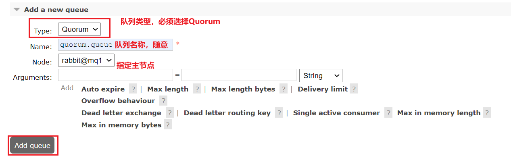

### SpringAMQP使用

```java
@Bean
public Queue quorumQueue() {
    return QueueBuilder
        .durable("quorum.queue") // 持久化
        .quorum() // 仲裁队列
        .build();
}
```

### SpringAMQP使用集群

注意，这里用address来代替host、port方式

```java
spring:
  rabbitmq:
    addresses: 192.168.150.105:8071, 192.168.150.105:8072, 192.168.150.105:8073
    username: itcast
    password: 123321
    virtual-host: /
```

