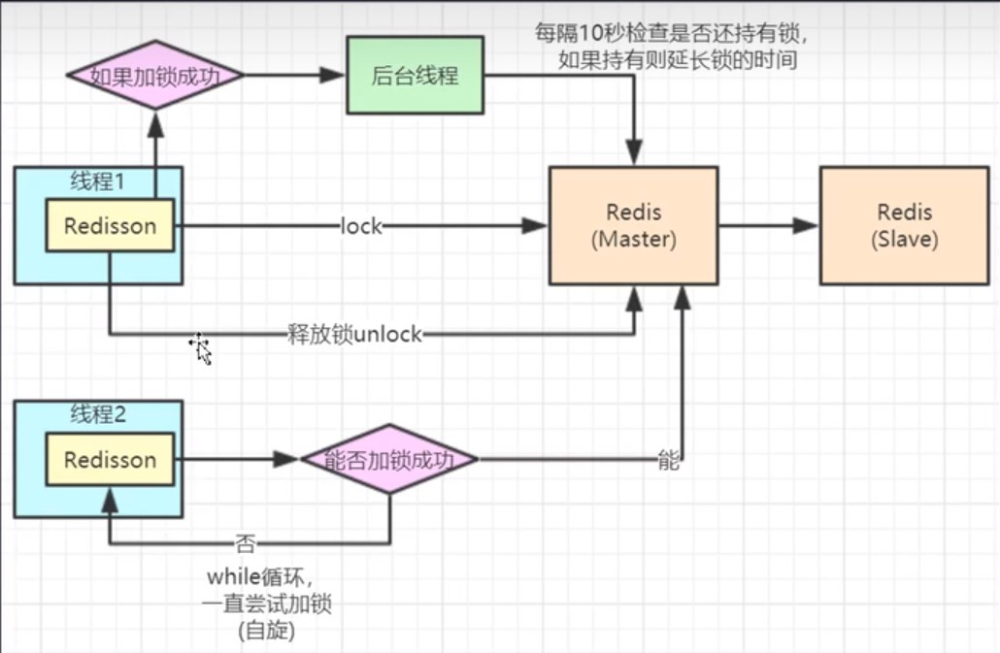

# 介绍

Redisson是一个在Redis的基础上实现的Java驻内存数据网格（In-Memory Data Grid）。它不仅提供了一系列的分布式的Java常用对象，还提供了许多分布式服务。

Redisson的宗旨是促进使用者对Redis的关注分离（Separation of Concern），从而让使用者能够将精力更集中地放在处理业务逻辑上

简而言之就是避免多个线程操作同个数据时发生数据不一致问题

# 传统解决方法

使用锁的方案可确保当一个线程在运行时,没有其他线程干扰,以下是常用的锁类型:

+ 互斥锁
+ 快速反馈锁
+ 读写锁

## Synchronized

使用**互斥锁**,以确保同一时刻只有一个线程能够反复进入同步块

```java
synchronized(this) {
	//执行逻辑...
}
```

1. 如果锁没有被其他线程占用，那么当前线程会获得锁并进入同步代码块或方法。
2. 如果锁已经被其他线程占用，那么当前线程将进入等待状态，直到锁被释放。其他线程在释放锁后，等待队列中的线程将有机会竞争获取锁。

问题:

1. **死锁**：如果多个线程互相持有不同的锁，并且互相等待对方释放锁，就会发生死锁，导致所有线程都无法继续执行。
2. **饥饿**：某些线程可能会因为竞争较激烈，一直无法获得锁，从而导致饥饿现象，即某些线程无法得到执行的机会。

## Lock

### ReentrantLock

synchronized的升级版,使用**快速反馈锁**,可对某个线程进行保护,直到该线程被解锁之前,其他线程无法进入,但被保护的线程可反复进入

```java
private Lock lock = new ReentrantLock();

public void performTask() {
    lock.lock(); // 上锁
    try {
        //执行逻辑
    } finally {
        lock.unlock(); // 解锁
    }
}
```

ReentrantLock区别与synchronized是当其他线程进了的时候,可以选择线程等待或是执行其他逻辑

```java
private Lock lock = new ReentrantLock();

public void performTask() {
    if (lock.tryLock(3, TimeUnit.SECONDS)) {// 上锁,设置等待时间
        try {
            //执行逻辑A
        } finally {
            lock.unlock(); // 解锁
        }
    }else {
        //执行逻辑B
    }
}
```

### ReentrantReadWriteLock和ReentrantReadWriteLock

使用**读写锁**，它允许多个线程同时读取共享资源，但只允许一个线程写入共享资源。这在读多写少的情况下可以提高并发性能，因为多个线程可以同时读取资源，而写操作需要互斥

```java
private Lock lock = new ReentrantLock();

public int readData() {
    readWriteLock.readLock().lock();
    try {
        // 读取数据
        return data;
    } finally {
        readWriteLock.readLock().unlock();
    }
}

public void writeData(int newData) {
    readWriteLock.writeLock().lock(); // Acquire write lock
    try {
        // 写入数据
        data = newData;
    } finally {
        readWriteLock.writeLock().unlock();
    }
}
```

## Redis分布式锁

使用SETNX实现分布式锁

```powershell
setnx key valye
```

若key的值不存在,则执行set key value,若存在则不做任何操作

```java
String clientId = UUID.randomUUID().toString();

Boolean success = redisTemplate.opsForValue().setIfAbsent("key", "locked",10,TimeUnit.SECONDS);
try{
    //执行逻辑
}finally{   if(clientId.equals(redisTemplate.opsForValue().get("key")))
    redisTemplate.delete("key");
}
```


# Redssion分布式锁

synchronized和Lock无法对分布式项目进行线程保护,因为传统方案使用的锁是JVM锁

Redis分布式锁如果线程执行较长,key过期了线程还未结束,就出现操作同一数据问题

Redssion对Redis分布式锁进行了封装,并使用定时任务,若key过期了线程还未结束,就自动加时间

## 安装

```xml
<!-- redis依赖-->
<dependency>
    <groupId>org.springframework.boot</groupId>
    <artifactId>spring-boot-starter-data-redis</artifactId>
</dependency>
<!-- redission依赖-->
<dependency>
    <groupId>org.redisson</groupId>
    <artifactId>redisson-spring-boot-starter</artifactId>
    <version>3.13.0</version>
</dependency>
```

## 配置

```java
@Bean
public Redisson redisson(){
    // 设置单机
    Config config = new Config();
    config.useSingleServer().setAddress("redis://localhost:6379");
    return (Redisson) Redisson.create(config);
}
```

## 使用

```java
@Autowrite
private Redisson redisson;

public void performTask() {
    RLock redissonLock = redisson.getLock("key");
    try {
        redissonLock.lock(); // 上锁
        //执行逻辑
    } finally {
        redissonLock.unlock();// 解锁
    }
}
```


