# 认识Elasitcsearch

一个开源的分布式搜索引擎,可以用来实现搜索、日志统计、分析、系统监控等

Elesticsearch核心技术就是***倒排索引***

## 倒排索引和正向索引

### 正向索引

传统数据库如Mysql就是使用正向索引


根据ID搜索数据,数据库就会使用B+树来进行快速查询

但如果是查询词条,就没有ID,而是逐行查询,这样一旦数据过多就会导致查询速度过慢

### 倒向索引

倒向索引弥补传统数据库正向索引中,查询词条过慢的技术

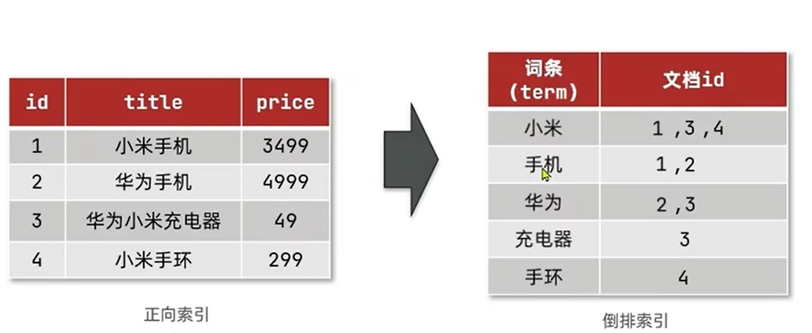

根据ID,把正向索引数据以***文档id***和***词条***形式保存至倒向索引内,

用户查询时根据词条使用B+树查询

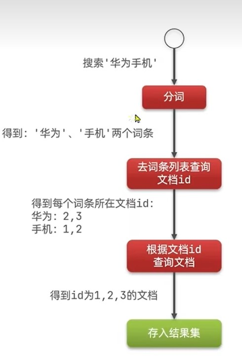

根据词条可以得到对应的ID,这样就可以根据ID直接查询数据库,避免数据库逐行查询

## Mysql和ES

### mysql和Es概念区别

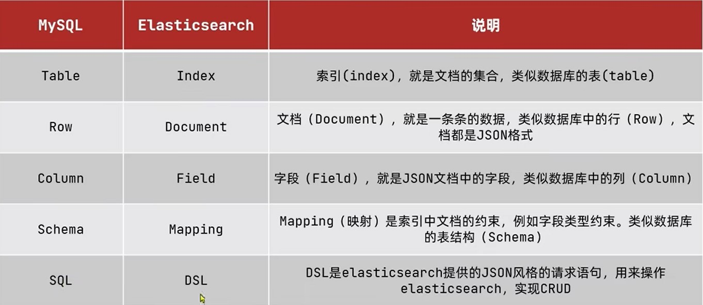

### mysql和Es的关系

mysql和Es是互补关系,一个项目中往往同时存在

Mysql擅长事务操作,负责***数据增删改***
Es擅长海量数据搜索,负责***查询***

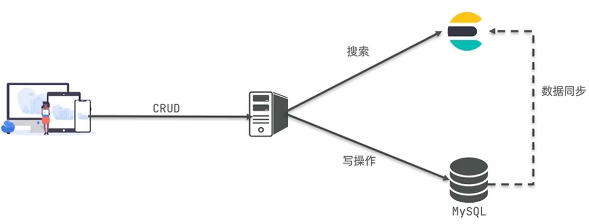

## 安装

### 安装Es

```tex
docker pull elasticsearch:7.17.7
```

```tex
docker network create es-net
```


```sh
docker run -d \
   --name elasticsearch \
   -e ES_JAVA_OPTS="-Xms64m -Xmx128m" \
   -e "discovery.type=single-node" \
   -v es-data:/usr/share/elasticsearch/data \
   -v es-plugins:/usr/share/elasticsearch/plugins \
   --privileged \
   --network es-net \
   -p 9200:9200 \
   -p 9300:9300 \
elasticsearch:7.17.7

docker run -d \
   --name elasticsearch \
   -e "discovery.type=single-node" \
   -v es-data:/usr/share/elasticsearch/data \
   -v es-plugins:/usr/share/elasticsearch/plugins \
   --privileged \
   --network es-net \
   -p 9200:9200 \
   -p 9300:9300 \
elasticsearch:7.17.7
```


### 安装kibana

kibana是一个Es可视化界面

```tex
docker pull kibana:7.12.1
```

```tex
docker run -d \
    --name kibana \
    -e ELASTICSEARCH_HOSTS=http://elasticsearch:9200 \
    --network es-net \
    -p 5601:5601 \
kibana:7.12.1

```

### 安装分词器

官方默认的分词方式对中文效果不好,因此需要额外下载一个分词器

进入github下载对应的中文分词
https://github.com/medcl/elasticsearch-analysis-ik

查找Es设置目录
```tex
docker volume inspect es-plugins
```

将下载的压缩包解压,重命名为ik,并放入_data目录

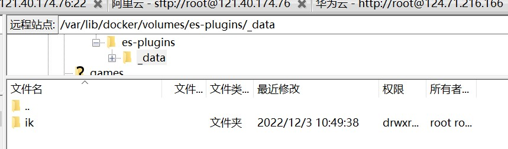

```json
POST /_analyze
{
  "analyzer": "ik_smart",
  "text": "黄大旭真的帅"
}
```

# 分词器

## 分词器拓展和停用

ik分词器有ik_smart和ik_max_word

通常情况下,分词器没法对当前热词进行分词,需要我们手动拓展,或者当我们需要手动设置敏感和无关词汇停用时,也需要手动配置

在ik分词器目录中的config中的IKAnalyzer.cfg.xml定义自己的分词器

# DSL语句操作

## mapping属性

mapping是对索引库中文档的约束,常见的索引有

+ type :字段数据类型,常见的简单类型有:
  + 字符串:text(可分词的文本)、keyword(精准值,如:品牌、国家、Ip地址)
  + 数值:long、interger、short、byte、double、float
  + 布尔:boolean
  + 日期:date
  + 对象:object
  + 坐标:geo_point(经纬度)、geo_shape(区域)
  + 自动补全completion
+ index:是否创建倒排索引,默认为ture(无倒排索引不会被查询)
+ analyzer:使用哪种分词器
+ properties:该字段的子字段

## 创建索引库

Es使用的是DQL语法,这个和json相似,也没必要记住,直接CV

```json
PUT /索引库名称
{
  "mappings": {
    "properties": {
      "字段名":{
        "type": "text",
        "analyzer": "ik_smart"
      },
      "字段名2":{
        "type": "keyword",
        "index": false
      },
      "字段名3":{
        "type": "object",
        "properties": {
          "子字段": {
            "type": "keyword"
          }
        }
      },
      // ...略
    }
  }
}
```

### 创建拼音分词器索引库

拼音分词注意事项

+ 若想要索引库按拼音来分词,应先用中文分词,分出来的词再用拼音分,因而需要使用analysis

+ 官方拼音分词有一些默认设置需要改动,比如我们不需要一个字一个字的分成拼音,需要再filter内改动,下面已经改好了
+ 由于使用中文转拼音分词,所以当用户搜索中文时,可能会搜索到同音的数据,为避免这种情况,可以用search_analyzer设置搜索时只用中文分词,这样当用户搜索中文不会分词直接找索引库内的中文字段,当用户搜索拼音时直接找索引库内的拼音字段

```json
PUT /hotel
{
  "settings": {
    "analysis": {
      "analyzer": {
        "text_anlyzer": {
          "tokenizer": "ik_max_word",
          "filter": "py"
        }
      },
      "filter": {
        "py": {
          "type": "pinyin",
          "keep_full_pinyin": false,
          "keep_joined_full_pinyin": true,
          "keep_original": true,
          "limit_first_letter_length": 16,
          "remove_duplicated_term": true,
          "none_chinese_pinyin_tokenize": false
        }
      }
    }
  },
  "mappings": {
    "properties": {
      "字段名":{
        "type": "text",
        "analyzer": "text_anlyzer",
        "search_analyzer": "ik_smart"
      },
      "字段名2":{
        "type": "keyword",
        "index": false
      }
    }
  }
}
```

### 创建自动补全索引库

当用户需要搜索A字段如商品,可以同个搜索B字段找到A字段

自动补全注意事项:

+ 自动补全需要额外定义一个字段(建议suggesion),类型为completion
+ 用户搜索信息时找***矿泉水***,通常搜索的不仅仅是一个字段的,比如搜索***哇哈哈***或***昆仑山***,这里有两个字段品牌和生场地,因而我们希望用户搜索品牌也能找到商品,搜索地名也能找到商品,需要我们***存储在suggesion字段里的内容为数组***
+ 从设计角度思考,一般用户搜索的自动补全都是某个品牌或地名,然后用户再自己手动输入详细数据,因此自动补全的suggestion的数组内容也都是***keyword***这些数据,不是可拆分的详细数据

## 查询索引库

```json
GET /索引库名
```

## 删除索引库

```json
DELETE /索引库名
```

## 修改索引库

Es不支持修改已存在的字段,但是可以添加字段

```json
PUT /索引库名/_mapping
{
  "properties": {
    "新字段名":{
      "type": "integer"
    }
  }
}
```

## 新增文档

```json
POST /索引库名/_doc/文档id(主键id)
{
    "字段1": "值1",
    "字段2": ["值2","值3"],
    "字段3": {
        "子属性1": "值4",
        "子属性2": "值5"
    },
    // ...
}
```

## 删除文档

```json
DELETE /{索引库名}/_doc/id值
```

## 查询单个文档

```json
GET /{索引库名}/_doc/id值
```


## 修改文档

### 全量修改(覆盖)文档

全量修改是先删除再创建,执行了2次操作,而且原有数据会丢失

```json
PUT /{索引库名}/_doc/文档id
{
    "字段1": "值1",
    "字段2": "值2",
    // ... 略
}
```

### 增量修改(合并)文档

```json
POST /{索引库名}/_update/文档id
{
    "doc": {
         "字段名": "新的值",
    }
}
```

## 合并字段

将两个字段合并到一个字段里,并用分词器分开

比如用户想在百度上搜索淘宝(网站名),但是可以通过搜索阿里巴巴(公司名)搜索到

```json
PUT /索引库名称
{
  "mappings": {
    "properties": {
      "字段名":{
        "type": "text",
        "analyzer": "ik_smart",
        "copy_to":"字段名3"
      },
      "字段名2":{
        "type": "keyword",
        "index": false,
        "copy_to":"字段名3"
      },
      "字段名3":{
        "type": "text",
        "analyzer": "ik_max_word",
      }
    }
  }
}
```

## 查询字段

查询的基本语法

```json
GET/索引库名称/_search
{
    "query":{"查询类型":{"查询条件":值}}
}
```

### 查询所有

查询所有数据,一般测试用

+ match_all

```json
GET/索引库名称/_search
{
    "query":{"match_all":{}}
}
```

### 全文检索

利用分词器对用户输入的值进行分词,再去倒排索引库去匹配

+ math_query

```json
GET/索引库名称/_search
{
    "query":{
        "math_query":{"字段":"搜索值"}
    }
}
```

+ multi_match_query

  可以同时搜索多个字段,效果和all一样,不过由于多字段搜索,性能不如将数据copy到all里直接单字段查

```json
GET/索引库名称/_search
{
    "query":{
        "multi_match_query":{
            "query":"搜索值","fields":["字段1","字段2"]
        }
    }
}
```

### 精准查询

根据精准词条查询,一般查询不可分词的数据

+ ids

+ range

  范围查询,一般查询数字,日期范围

```json
GET/索引库名称/_search
{
    "query":{
        "range":{
            "字段":{
                "gte":大于等于>=,
                "gt":大于>,
                "lte":小于等于<=,
                "lt":小于<
            }
        }
    }
}
```

+ term

  精准值查询,一般查询keyword,id,数值

```json
GET/索引库名称/_search
{
    "query":{"term":{"字段":"搜索值"}}
}
```

### 地理查询

根据经纬度查询

+ geo_distance

  查询一个圆,这里圆心格式一定要是"lat,lon"

```json
GET/索引库名称/_search
{
    "query":{
        "geo_distance":{
            "distance":xxkm,
            "字段":"lat,lon"
        }
    }
}
```

+ geo_bounding_box

  查询一个矩形范围

```json
GET/索引库名称/_search
{
    "query":{
        "geo_bounding_box":{
            "字段":{
                "top_left":{
                	"lat":latitude维度,
                	"loc":longitude经度
            	},
            	"bottom_right":{
                	"lat":latitude维度,
                	"loc":longitude经度
            	}
            }
        }
    }
}
```


### 复合查询

复合查询,将上述的查询条件组合起来一起查询

+ bool

  bool可以用逻辑表达式查询,查询方式有:

  + must,相当于***与***,参与相关性打分
  + should,相当于***或***,参与相关性打分
  + must_not,相当于***否***,不参与相关性打分
  + filter,相当于***与***,不参与相关性打分

```json
GET/索引库名称/_search
{
    "bool":{
        "查询方式":[
            {"查询类型":{"查询条件":值}},
            ...
        ],
        "查询方式":[
            {"查询类型":{"查询条件":值}},
            ...
        ],
		....
    }
}
```


+ function_score
  默认的查询是由相关性算法计算得分来排序,但是我们可以人为的修改得分从而使我们希望的数据得分更高,优先展示

```json
GET/索引库名称/_search
{
    "query":{
        "function_score":{
            "query":{"查询类型":{"查询条件":"条件值"}},
            "functions":{
                "filter":{"查询类型":{"查询条件":"条件值"}},
                "算分函数":值
            },
            boost_model:"加权模式"
        }
    }
}
```

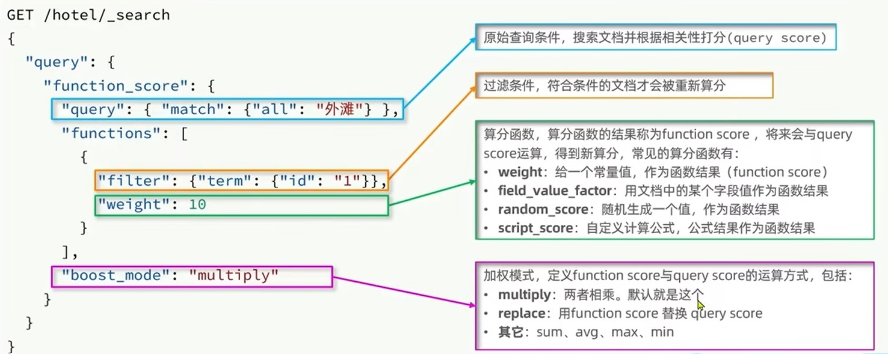

### 排序

Es默认使用相关性打分排序,如果指定其他排序,则不使用相关性打分
排序方式分为desc和asc

+ 普通排序

```json
GET/索引库名称/_search
{
    "query":{"查询类型":{"查询条件":值}},
    "sort":{"字段":"排序方式"}
}
```

+ 地理坐标排序

  地理坐标排序会返回一个sort,里面是用户与数据的距离

```json
GET/索引库名称/_search
{
    "query":{"查询类型":{"查询条件":值}},
    "sort":{
        "geo_distance":{
            "字段":"用户lat,用户lon",
            "order":"排序方式",
            "unit":"返回单位(km)"
        }
    }
}
```

### 分页

+ from+size

  优点:支持随机翻页

  缺点:深度分页问题,上限查询1万条

  场景:百度、京东、谷歌搜索都是只能翻70多页,每页10条数据

```json
GET/索引库名称/_search
{
    "query":{"查询类型":{"查询条件":值}},
    "from":"第n个数据开始,不是页!!默认为0",
    "size":"往后n条数据,默认为10"
}
```

+ after search

  优点:没有查询上限

  缺点:只能向后逐页查询

  场景:贴吧手机向下滚动查询

+ scroll(官方已放弃)

  优点:没有查询上限

  缺点:占用内存

  场景:海量数据迁移

### 高亮

用户搜索的数据,我们需要将其高亮,而前端无法分析和分词用户搜索的数据,需要Es来对搜索数据打上标签

默认情况下,搜索字段必须与高亮字段保持一致

```json
GET/索引库名称/_search
{
    "query":{"查询类型":{"match":{"搜索字段":"值"}}},
    "highlight":{
        "fildes":{
        	"高亮字段":{
                "pre_tags":"<标签,推荐em>",
                "post_tags":"</em>"
            }
    	}
    }
}
```

但是多数情况下,我们搜索都是搜索all合并字段,然后只希望合并的某个字段高亮,这时候需要关闭高亮搜索匹配
```json
GET/索引库名称/_search
{
    "query":{"查询类型":{"match":{"all":"值"}}},
    "highlight":{
        "fildes":{
        	"高亮字段":{
                "pre_tags":"<em>",
                "post_tags":"</em>",
                "require_filed_match":"false"
            }
    	}
    }
}
```

### 聚合

分词字段聚合无意义,***不可分词的字段才能被聚合***

聚合可以实现对文档数据的统计、分析和运算.聚合常见的三类有:

#### 桶(Buke)聚合

用来对文档进行分组的

+ TermAggreation:按照文档分组(类似sql的group by)

```json
GET/索引库名称/_search
{
    "size":0, // 设置size为0,结果不包含文档,只有聚合结果
    "aggs":{
        "自定义聚合名称":{
            "term":{
                "filed":"字段",
                "size":20, //可选,设置显示的聚合数量
                "order":{
                    "_count":"排序方式"//可选,按照桶大小排序
                } 
            }
        }
    }
}
```

​				如果数据量较大,聚合的数目就会变多,这时候需要限制聚合数目

```json
GET/索引库名称/_search
{
    "query":{"range":{"字段":{"gte":大于等于>=}}},
    "size":0, // 设置size为0,结果不包含文档,只有聚合结果
    "aggs":{
        "自定义聚合名称":{
            "term":{
                "filed":"字段",
                "size":20, //可选,设置显示的聚合数量
                "order":{
                    "_count":"排序方式" //可选,按照桶大小排序
                }
            }
        }
    }
}
```


+ Date Histogram:按照日期分组,如一周为一组或一月为一组

#### 度量(Metric)聚合

用来计算一些值,比如最大值最小值

+ Avg:求平均
+ Max:求最大
+ Min:求最小
+ Stats:可同时求最大最小

```json
GET/索引库名称/_search
{
    "size":0, // 设置size为0,结果不包含文档,只有聚合结果
    "aggs":{
        "自定义聚合名称":{
            "term":{
                "filed":"字段",
                "size":20, //可选,设置显示的聚合数量
                "order":{
                    "度量聚合名称.聚合函数":"排序方式" //可选,按照桶内的度量聚合结果排序
                },
                "aggs":{
                    "自定义度量聚合名称":{
                        "聚合函数":{
                            "filed":"字段"
                        }
                    }
                }
            }
        }
    }
}
```

#### 管道(Pipeline)聚合

把其他聚合的结果再聚合

#### 场景

如果用户想要搜索每个品牌的平均分,这时候用桶聚合将品牌分类,最后度量聚合求分数平均

## 自动补全

自动补全只能搜索completion类型字段

```json
GET/索引库名称/_search
{
    "suggest":{
        "自定义补全名称":{
            "text":"关键字",
            "skip_duplicates": true,//去重
            "size":10 //显示10个
        }
    }
}
```


# RestClient操作索引库

Es官方提供了不同语言的客户端,用来操作Es,不需要用户手动发送DSL

## 安装

```xml
<properties>
	<elaticsearch.version>7.17.7</elaticsearch.version></properties>
<dependency>
    <groupId>org.elasticsearch.client</groupId>
    <artifactId>elasticsearch-rest-high-level-client</artifactId>
</dependency>
```

## 初始化

```java
//使用前先创建连接
@BeforeEach
void setUp() {
    this.client = new RestHighLevelClient(RestClient.builder(
        HttpHost.create("http://124.71.216.166:9200")
    ));
}

//使用client
@Test
void contextLoads() {
    System.out.println(client);
}

//关闭连接
@AfterEach
void tearDown() throws IOException {
    this.client.close();
}
```

## 创建索引库

```java
@Test
void create(){
    // 1.创建request请求
    CreateIndexRequest request = new CreateIndexRequest("索引库名称");
    // 2.设置请求参数,String的DQL语法(不含PUT和库名,只要括号和括号内容),建议使用静态常量表示,XContentType表示语法格式
    request.source("DQL语法", XContentType.JSON);
    // 3.发起请求,RequestOptions为请求头,不用管默认是DEFAULT
    client.indices().create(request, RequestOptions.DEFAULT);
}
```

## 删除索引库

```java
@Test
void delete() throws IOException {
    // 1.创建request请求
    DeleteIndexRequest request = new DeleteIndexRequest("索引库名称");
    // 2.发起请求
    client.indices().delete(request, RequestOptions.DEFAULT);
}
```

## 查询索引库是否存在

```java
@Test
void exists() throws IOException {
    // 1.创建request请求
    GetIndexRequest request = new GetIndexRequest("索引库名称");
    // 2.发起请求
    boolean flag = client.indices().exists(request, RequestOptions.DEFAULT);
    
    System.out.println(flag ? "存在":"不存在");
}
```

## 新增文档

```java
@Test
void add() throws IOException {
    // 1.创建request请求,文档ID要String
    IndexRequest request = new IndexRequest("索引库名称").id("文档ID");
    // 2.设置请求参数,String的DQL语法(不含PUT和库名,只要括号和括号内容),建议使用静态常量表示,XContentType表示语法格式
    request.source(Json.toString(新增对象), XContentType.JSON);
    // 3.发起请求,RequestOptions为请求头,不用管默认是DEFAULT
    client.index(request, RequestOptions.DEFAULT);
}
```

## 查询单个文档

```java
@Test
void get() throws IOException {
    // 1.创建request请求,文档ID要String
    GetRequest request = new GetRequest("索引库名称","文档ID");
    // 2.发起请求,RequestOptions为请求头,不用管默认是DEFAULT
    GetResponse response = client.get(request, RequestOptions.DEFAULT);
    // 3.解析
    String json = response.getResourceAsString();
}
```

## 修改文档

### 全量修改(覆盖文档)

再次写入Id一样的文档,就会删除原有的,添加新的

### 增量修改(合并)文档

```java
@Test
void update() throws IOException {
    // 1.创建request请求,文档ID要String
    UpdateRequest request = new UpdateRequest("索引库名称","文档ID");
    // 2.准备参数
    requset.doc(
    	"age",18,
        "name","张三"
    )
    // 3.发起请求,RequestOptions为请求头,不用管默认是DEFAULT
    client.update(request, RequestOptions.DEFAULT);
}
```

## 删除文档

```java
@Test
void delete() throws IOException {
    // 1.创建request请求,文档ID要String
    DeleteRequest request = new DeleteRequest("索引库名称","文档ID");
    // 2.发起请求,RequestOptions为请求头,不用管默认是DEFAULT
    client.delete(request, RequestOptions.DEFAULT);
}
```

## 批量操作文档(适例新增)

```java
@Test
void bulk() throws IOException {
    // 1.创建request请求,文档ID要String
    BulkRequest request = new BulkRequest();
    // 2. 添加批量请求,这里以批量新增为例
    request.add(new IndexRequest("索引库名称").id("文档ID1").source(Json.toString(新增对象1), XContentType.JSON));
    request.add(new IndexRequest("索引库名称").id("文档ID2").source(Json.toString(新增对象2), XContentType.JSON));
    // 2.发起请求,RequestOptions为请求头,不用管默认是DEFAULT
    client.bulk(request, RequestOptions.DEFAULT);
}
```

## 查询字段

查询字段基本语法

```java
@Test
void delete() throws IOException {
    // 1.创建request请求,文档ID要String
    SearchRequest request = new SearchRequest("索引库名称");
    // 2.组织DSL参数
    request.source().query(QueryBuilders.查询参数);
    // 3.发起请求,RequestOptions为请求头,不用管默认是DEFAULT
    SearchResponse response= client.search(request, RequestOptions.DEFAULT);
    // 4.处理请求
    SearchHits searchHits = response.getHits();
    // 4.1获取总条数
    Long total = searchHits.getTotalHits().value;
    // 4.2获取数据
    SearchHit[] hits = searchHits.getHits();
    List<String> jsons = Arrays.stream(hits).map(hit -> hit.getSourceAsString()).collect(Collectors.toList());
}
```

对应的查询参数有:
### 查询所有

```java
QueryBuilders.matchAllQuery()
```

### 全文检索

+ math_query

```java
QueryBuilders.matchQuery("字段","搜索值")
```

+ multi_match_query

  可以同时搜索多个字段,效果和all一样,不过由于多字段搜索,性能不如将数据copy到all里直接单字段查

```java
QueryBuilders.multiMatchQuery("搜索值","字段1","字段2",...)
```

### 精准查询

+ range

  范围查询,一般查询数字,日期范围

```java
QueryBuilders.termQuery("字段").gte(小于).lt(大于)
```

+ term

  精准值查询,一般查询keyword,id,数值

```java
QueryBuilders.termQuery("字段","搜索值")
```

### 地理查询

### 复合查询

+ bool

  bool可以用逻辑表达式查询,查询方式有:

  + must,相当于***与***,参与相关性打分
  + should,相当于***或***,参与相关性打分
  + must_not,相当于***否***,不参与相关性打分
  + filter,相当于***与***,不参与相关性打分

```java
// 添加布尔查询,不建议链式写,因为只能复合一条
BoolQueryBuilder boolQueryBuilder = QueryBuilders.boolQuery();
// 复合查询
boolQueryBuilder.查询方式(QueryBuilders.查询参数1);
boolQueryBuilder.查询方式(QueryBuilders.查询参数2);
```

### 排序

Es默认使用相关性打分排序,如果指定其他排序,则不使用相关性打分
排序方式分为desc和asc

+ 普通排序

```java
// 查询
request.source().query(QueryBuilders.查询参数);
// 排序
request.source().sort(SortOrder.排序方式)
```

+ 地理排序

  地理坐标排序会返回一个sort,里面是用户与数据的距离

```java
request.source.sort(SortBuilders.geoDistanceSort("字段",new GeoPoint("经度,纬度")).order(SortOrder.排序方式).unit(DistanceUnit.距离单位))
```

### 分页

+ from+size

​				优点:支持随机翻页
​				缺点:深度分页问题,上限查询1万条
​				场景:百度、京东、谷歌搜索都是只能翻70多页,每页10条数据

```java
// 查询
request.source().query(QueryBuilders.查询参数);
// 分页
request.source().form(第n个数据开始).size(往后n个数据)
request.source().sort()
```

### 高亮

用户搜索的数据,我们需要将其高亮,而前端无法分析和分词用户搜索的数据,需要Es来对搜索数据打上标签

默认情况下,搜索字段必须与高亮字段保持一致

```java
request.source().highlighter(new HighlightBuilder().field("字段").preTags("默认<em>").postTags("默认</em>"));
```

但是多数情况下,我们搜索都是搜索all合并字段,然后只希望合并的某个字段高亮,这时候需要关闭高亮搜索匹配

```java
request.source().highlighter(new HighlightBuilder().field("搜索字段").requireFieldMatch(false).preTags("默认<em>").postTags("默认</em>"));
```

```java
//高亮数据解析
List<String> jsons = Arrays.stream(hits).map(
                hit -> hit.getHighlightFields().get("高亮字段").getFragments()[0].toString())
                .collect(Collectors.toList());
```


### 聚合

分词字段聚合无意义,***不可分词的字段才能被聚合***

聚合可以实现对文档数据的统计、分析和运算.聚合常见的三类有:

#### 桶(Buke)聚合

用来对文档进行分组的

+ TermAggreation:按照文档分组(类似sql的group by)

```java
request.source().size(0);
request.source().aggregation(
	AggregationBuilders
    				.term("聚合名称")
    				.filed("聚合字段")
    				.size(int);//可选,聚合显示数目
);
```

```java
//聚合解析
// 1. 解析结果
Aggregations aggregations = response.getAggregations();
// 2. 根据名称获取想要的聚合结果
Term brandTerms = aggregations.get("聚合名称");
// 3. 获取桶数据
List<? extends Terms.Bucket> buckets = brandTerms.getBuckets();
// 4. 遍历
for(Terms.Bucket bucket : buckets){
    String result = bucket.getKeyAsString();
}
```


+ Date Histogram:按照日期分组,如一周为一组或一月为一组

#### 度量(Metric)聚合

用来计算一些值,比如最大值最小值

+ Avg:求平均
+ Max:求最大
+ Min:求最小
+ Stats:可同时求最大最小

#### 管道(Pipeline)聚合

把其他聚合的结果再聚合

#### 场景

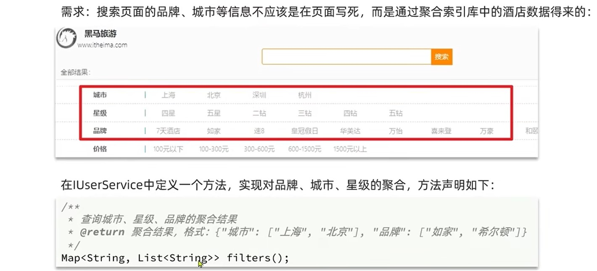

### 自动补全

```java
        request.source().suggest(new SuggestBuilder().addSuggestion(
            "自定义补全名称",
            SuggestBuilders.completionSuggestion("字段")
            .prefix("关键字")
            .skipDuplicates(true)//去重
            .size(10)
        ));  
```

```java
//解析
// 1.解析结果
Suggest suggest = response.getSuggest();
// 2.根据补全查询名称，获取补全结果
CompletionSuggestion suggestions = suggest.getSuggestion("自定义补全名称");
// 3.获取options
List<CompletionSuggestion.Entry.Option> options = suggestions.getOptions();
// 4.遍历
List<String> list = new ArrayList<>(options.size());
for (CompletionSuggestion.Entry.Option option : options) {
	String text = option.getText().toString();
	list.add(text);
}
```


# 相关性算法

在Es中,分词查询后得到多个数据,我们需要对这些数据进行打分,让关联度高的数据优先展示

## TF(词条频率)


比如一个数据叫***虹桥如家酒店真不错***,它可拆分为***虹桥***,***如家***,***酒店***和***真不错***四个数据
那么如果用户搜索***虹桥如家***,它可拆分为***虹桥***和***如家***两个数据

其中,用户输入的***虹桥***的TF是0.25,***如家***的TF是0.25,那么总得分就是0.25+0.25=0.5

+ 缺点

  相关性搜索不够高

  如果另一个数据叫***如家酒店***,那么用户输入的***虹桥***的TF是0,***如家***的TF是0.5,那么总得分就是0+0.5=0.5

## TF-IDF

当前搜索最流行的算法
这个算法是在求频率的基础上加了权重


比如有两个数据

***虹桥如家酒店真不错***,它可拆分为***虹桥***,***如家***,***酒店***和***真不错***四个数据|
***如家酒店***,它可拆分为***如家***,***酒店***两个数据
那么如果用户搜索***虹桥如家***,它可拆分为***虹桥***和***如家***两个数据

其中,用户输入的***如家***两个数据都有,它的IDF(权重)为0,而***虹桥***的IDF(权重)为0.3

因此,数据一的得分是:0.25 * 0.3+0.25 * 0=0.075
数据二的得分是0 * 0.3 + 0.5 * 0 = 0

## BM25算法

ES5以后使用的算法
我看不懂,我大为震撼


# 数据同步

## 同步调用(Fegin)

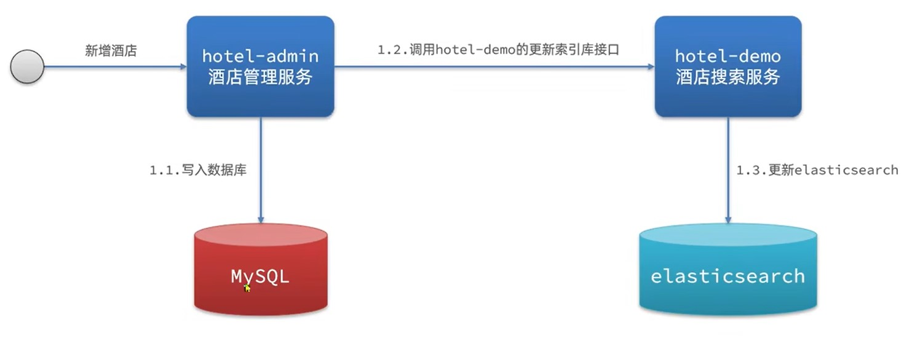

+ 优点:实现简单
+ 缺点:慢

## 异步调用(MQ)

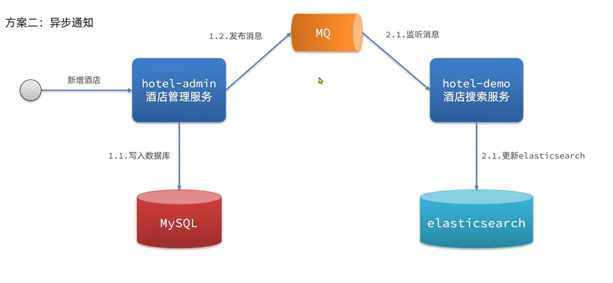

+ 优点:快
+ 缺点:依赖MQ可靠性

## 监听binlog(cannel)

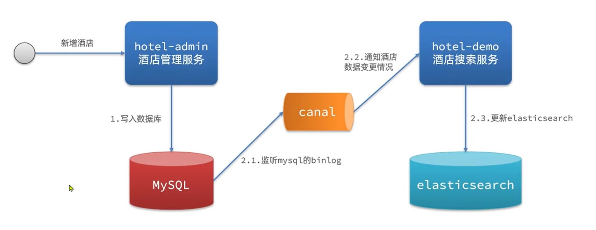

+ 优点:快,而且低耦合,存储sql的服务不需要额外操作
+ 缺点:sql压力增加

# 集群

单机的Es做数据存储,必然面对两个问题:海量存储数据和单点故障

+ 海量存储问题:将索引库拆分成N个分片,存储到多个节点
+ 单点故障问题:将不同分片在不同节点备份

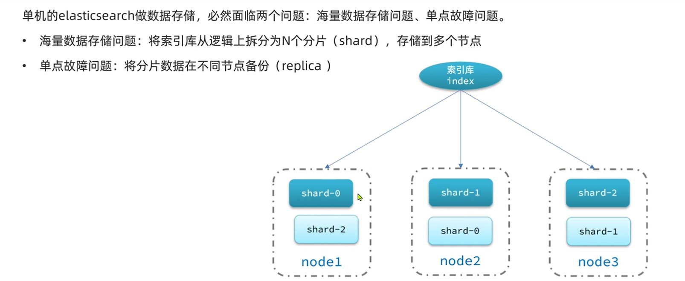

## 搭建集群

使用docker-compose一键部署多个镜像

```yaml
version: '2.2'
services:
  es01:
    image: elasticsearch:版本
    container_name: es01
    environment:
      - node.name=es01
      - cluster.name=es-docker-cluster
      - discovery.seed_hosts=es02IP,es03IP(相同服务器就写容器名)
      - cluster.initial_master_nodes=es01,es02,es03
      - "ES_JAVA_OPTS=-Xms512m -Xmx512m"# 不填默认1g
    volumes:
      - data01:/usr/share/elasticsearch/data
    ports:
      - 9200:9200
    networks:
      - elastic
  es02:
    image: elasticsearch:版本
    container_name: es02
    environment:
      - node.name=es02
      - cluster.name=es-docker-cluster
      - discovery.seed_hosts=es01IP,es03IP(相同服务器就写容器名)
      - cluster.initial_master_nodes=es01,es02,es03
      - "ES_JAVA_OPTS=-Xms512m -Xmx512m"# 不填默认1g
    volumes:
      - data02:/usr/share/elasticsearch/data
    ports:
      - 9201:9200
    networks:
      - elastic
  es03:
    image: elasticsearch:版本
    container_name: es03
    environment:
      - node.name=es03
      - cluster.name=es-docker-cluster
      - discovery.seed_hosts=es01IP,es02IP(相同服务器就写容器名)
      - cluster.initial_master_nodes=es01,es02,es03
      - "ES_JAVA_OPTS=-Xms512m -Xmx512m"# 不填默认1g
    volumes:
      - data03:/usr/share/elasticsearch/data
    networks:
      - elastic
    ports:
      - 9202:9200
volumes:
  data01:
    driver: local
  data02:
    driver: local
  data03:
    driver: local

networks:
  elastic:
    driver: bridge
```

如果启动失败,可能是linux内存不足,可以放开内存限制(不安全)
es运行需要修改一些linux系统权限，修改`/etc/sysctl.conf`文件

```sh
vi /etc/sysctl.conf
```

添加下面的内容：

```sh
vm.max_map_count=262144
```

然后执行命令，让配置生效：

```sh
sysctl -p
```

 ### 集群小工具

比kibana好用!不用在服务器安装

https://github.com/lmenezes/cerebro

通过docker-compose启动集群：

```sh
docker-compose up -d
```


## 集群职责

集群的每个节点都有对应的任务,默认情况下每个节点都是身兼数职

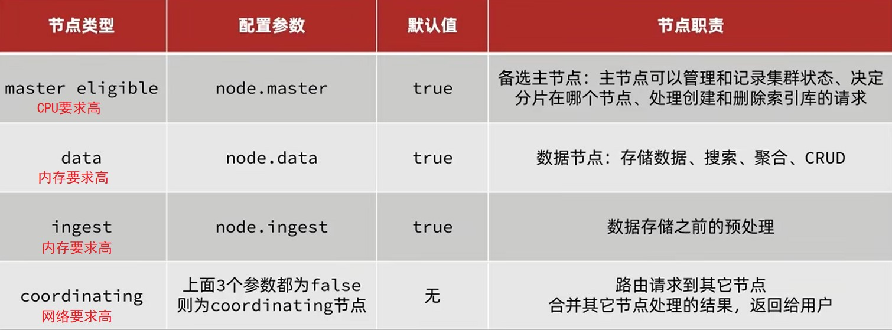

而一个健壮良好的Es集群应该是这样

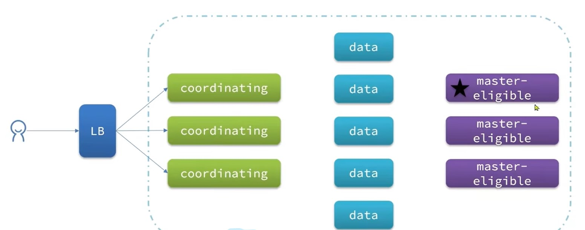

## 集群脑裂问题

早期Es有一个问题,就是如果主节点和备选主节点网络断开,备选主节点就会选出一个新的主节点,这时候网络恢复,就出行了两个主节点,这就是脑裂问题

ES7针对脑裂问题,设计了一个选举机制,超过(eligible节点数+1)/2的节点才有资格去选举主节点,这样就避免了脑裂问题

## 集群故障转移

Es集群会保证每个分片至少有两份在集群里,如果某节点宕机,那么其他节点会将它的数据和备份都拿来

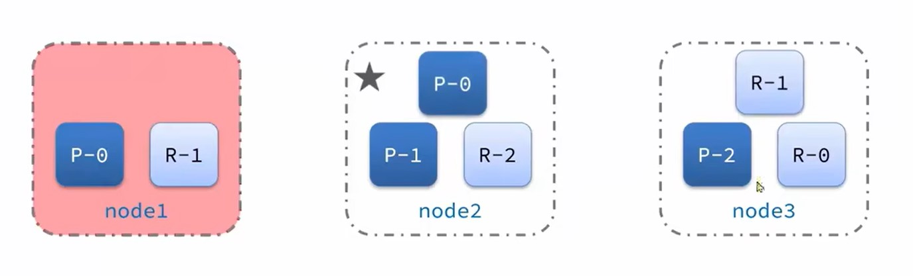

## 集群分布式存储

分布式存储会根据文档Id进行哈希运算


+ routing是文档Id,number_of_shards为总data节点数

存储步骤:

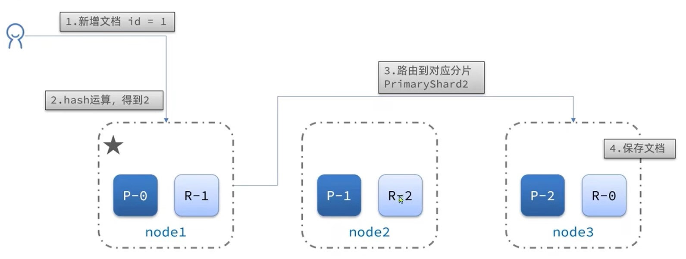

## 集群分布式查询

分布式查询就简单了,所有节点都查,然后合并


