# 微服务事务

## 理论

分布式系统无法完成三个指标,即CAP定理

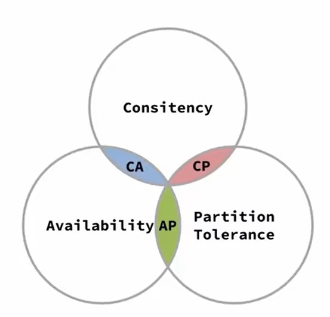

+ Consistency(一致性):各服务之间数据一致
+ Availability(可用性):访问服务必须得到响应
+ Partition Tolerance(分区容错性):各服务之间异步执行,互不影响

## 事务问题

在微服务中,一个服务出现问题,其关联的服务仍然会继续运行,这就容易出现事务问题

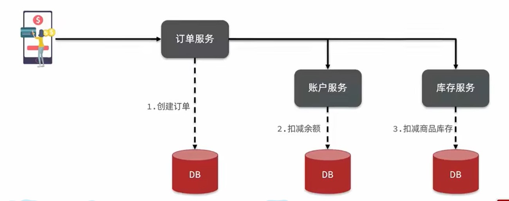

出现这种原因是分布式不可避免的CAP定理,即***分布式服务中(P)***,一旦A服务宕机,B服务为***保持可用性(A)***,不会也跟着宕机,那么***数据(C)就不一致***,产生事务问题

## 解决方法

+ AP模式:各服务在运行过程中,一旦出错则其关联服务执行弥补措施,即同时保证***可用性(A)***和***分布式(P)***

  例:创建订单和扣减余额正常运行,但是扣减库存出现问题,那么就删除订单并添加余额

+ CP模式:各服务在运行过程中,等待其关联服务运行完成后再一起提交,即同时保证***一致性(C)***和***分布式(P)***

  例:创建订单和扣减余额运行完成后等待扣减库存,扣减库存出现问题,则不提交事务

无论是AP还是CP,都需要一个中间商检测各服务的健康状况,从而判断执行什么操作,因此我们需要一个事务协调者,即Seata

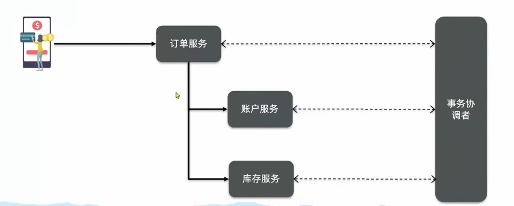

# 认识Seata

## 介绍

Seata是一个微服务/分布式的事务管理框架,其主要有3各部分组成:

+ TC-事务协调者:维护全局事务状态,协调全局事务提交或回滚
+ TM-事务管理器:定义全局事务范围、定义全局事务、提交或回滚全局事务
+ RM-资源管理器:管理分支事务资源,与TC交谈以注册事务和报告事务状态,并驱动分支事务提交或回滚

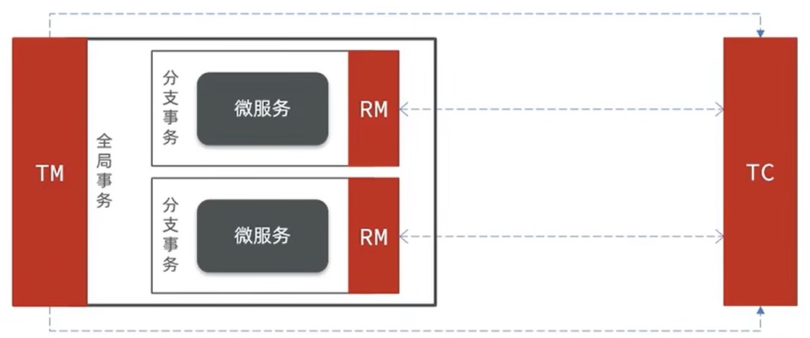

## 部署TC服务

### 1.下载TC服务

首先我们要下载seata-server包，地址在[http](http://seata.io/zh-cn/blog/download.html)[://seata.io/zh-cn/blog/download](http://seata.io/zh-cn/blog/download.html)[.](http://seata.io/zh-cn/blog/download.html)[html](http://seata.io/zh-cn/blog/download.html) 


### 2.修改本地配置


```properties
registry {
  # tc服务的注册中心类，这里选择nacos，也可以是eureka、zookeeper等
  type = "nacos"

  nacos {
    # seata tc 服务注册到 nacos的服务名称，可以自定义
    application = "seata-tc-server"
    serverAddr = "127.0.0.1:8848"
    group = "DEFAULT_GROUP"
    namespace = ""
    cluster = "SH"
    username = "nacos"
    password = "nacos"
  }
}

config {
  # 读取tc服务端的配置文件的方式，这里是从nacos配置中心读取，这样如果tc是集群，可以共享配置
  type = "nacos"
  # 配置nacos地址等信息
  nacos {
    serverAddr = "127.0.0.1:8848"
    namespace = ""
    group = "SEATA_GROUP"
    username = "nacos"
    password = "nacos"
    dataId = "seataServer.properties"
  }
}
```

### 3.nacos添加配置

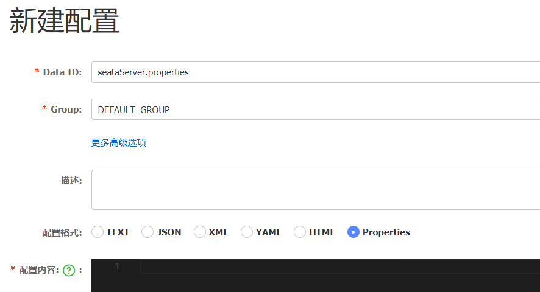

```properties
# 数据存储方式，db代表数据库
store.mode=db
store.db.datasource=druid
store.db.dbType=mysql
store.db.driverClassName=com.mysql.jdbc.Driver
store.db.url=jdbc:mysql://127.0.0.1:3306/seata?useUnicode=true&rewriteBatchedStatements=true
store.db.user=root
store.db.password=123
store.db.minConn=5
store.db.maxConn=30
store.db.globalTable=global_table
store.db.branchTable=branch_table
store.db.queryLimit=100
store.db.lockTable=lock_table
store.db.maxWait=5000
# 事务、日志等配置
server.recovery.committingRetryPeriod=1000
server.recovery.asynCommittingRetryPeriod=1000
server.recovery.rollbackingRetryPeriod=1000
server.recovery.timeoutRetryPeriod=1000
server.maxCommitRetryTimeout=-1
server.maxRollbackRetryTimeout=-1
server.rollbackRetryTimeoutUnlockEnable=false
server.undo.logSaveDays=7
server.undo.logDeletePeriod=86400000

# 客户端与服务端传输方式
transport.serialization=seata
transport.compressor=none
# 关闭metrics功能，提高性能
metrics.enabled=false
metrics.registryType=compact
metrics.exporterList=prometheus
metrics.exporterPrometheusPort=9898
```

### 4.创建数据库

tc服务在管理分布式事务时，需要记录事务相关数据到数据库中，需要提前创建好这些表。

这些表主要记录全局事务、分支事务、全局锁信息：

```mysql

SET NAMES utf8mb4;
SET FOREIGN_KEY_CHECKS = 0;

-- ----------------------------
-- 分支事务表
-- ----------------------------
DROP TABLE IF EXISTS `branch_table`;
CREATE TABLE `branch_table`  (
  `branch_id` bigint(20) NOT NULL,
  `xid` varchar(128) CHARACTER SET utf8 COLLATE utf8_general_ci NOT NULL,
  `transaction_id` bigint(20) NULL DEFAULT NULL,
  `resource_group_id` varchar(32) CHARACTER SET utf8 COLLATE utf8_general_ci NULL DEFAULT NULL,
  `resource_id` varchar(256) CHARACTER SET utf8 COLLATE utf8_general_ci NULL DEFAULT NULL,
  `branch_type` varchar(8) CHARACTER SET utf8 COLLATE utf8_general_ci NULL DEFAULT NULL,
  `status` tinyint(4) NULL DEFAULT NULL,
  `client_id` varchar(64) CHARACTER SET utf8 COLLATE utf8_general_ci NULL DEFAULT NULL,
  `application_data` varchar(2000) CHARACTER SET utf8 COLLATE utf8_general_ci NULL DEFAULT NULL,
  `gmt_create` datetime(6) NULL DEFAULT NULL,
  `gmt_modified` datetime(6) NULL DEFAULT NULL,
  PRIMARY KEY (`branch_id`) USING BTREE,
  INDEX `idx_xid`(`xid`) USING BTREE
) ENGINE = InnoDB CHARACTER SET = utf8 COLLATE = utf8_general_ci ROW_FORMAT = Compact;

-- ----------------------------
-- 全局事务表
-- ----------------------------
DROP TABLE IF EXISTS `global_table`;
CREATE TABLE `global_table`  (
  `xid` varchar(128) CHARACTER SET utf8 COLLATE utf8_general_ci NOT NULL,
  `transaction_id` bigint(20) NULL DEFAULT NULL,
  `status` tinyint(4) NOT NULL,
  `application_id` varchar(32) CHARACTER SET utf8 COLLATE utf8_general_ci NULL DEFAULT NULL,
  `transaction_service_group` varchar(32) CHARACTER SET utf8 COLLATE utf8_general_ci NULL DEFAULT NULL,
  `transaction_name` varchar(128) CHARACTER SET utf8 COLLATE utf8_general_ci NULL DEFAULT NULL,
  `timeout` int(11) NULL DEFAULT NULL,
  `begin_time` bigint(20) NULL DEFAULT NULL,
  `application_data` varchar(2000) CHARACTER SET utf8 COLLATE utf8_general_ci NULL DEFAULT NULL,
  `gmt_create` datetime NULL DEFAULT NULL,
  `gmt_modified` datetime NULL DEFAULT NULL,
  PRIMARY KEY (`xid`) USING BTREE,
  INDEX `idx_gmt_modified_status`(`gmt_modified`, `status`) USING BTREE,
  INDEX `idx_transaction_id`(`transaction_id`) USING BTREE
) ENGINE = InnoDB CHARACTER SET = utf8 COLLATE = utf8_general_ci ROW_FORMAT = Compact;

-- ----------------------------
-- 全局锁
-- ----------------------------
DROP TABLE IF EXISTS `lock_table`;
CREATE TABLE `lock_table`  (
  `row_key` VARCHAR(128) CHARACTER SET utf8 COLLATE utf8_general_ci NOT NULL,
  `xid` VARCHAR(96) CHARACTER SET utf8 COLLATE utf8_general_ci NULL DEFAULT NULL,
  `transaction_id` BIGINT(20) NULL DEFAULT NULL,
  `branch_id` BIGINT(20) NOT NULL,
  `resource_id` VARCHAR(256) CHARACTER SET utf8 COLLATE utf8_general_ci NULL DEFAULT NULL,
  `table_name` VARCHAR(32) CHARACTER SET utf8 COLLATE utf8_general_ci NULL DEFAULT NULL,
  `pk` VARCHAR(36) CHARACTER SET utf8 COLLATE utf8_general_ci NULL DEFAULT NULL,
  `gmt_create` DATETIME NULL DEFAULT NULL,
  `gmt_modified` DATETIME NULL DEFAULT NULL,
  PRIMARY KEY (`row_key`) USING BTREE,
  INDEX `idx_branch_id`(`branch_id`) USING BTREE
) ENGINE = INNODB CHARACTER SET = utf8 COLLATE = utf8_general_ci ROW_FORMAT = COMPACT;

SET FOREIGN_KEY_CHECKS = 1;
```

### 5.启动TC服务

进入bin目录，运行其中的seata-server.bat即可：

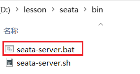

## 微服务集成Seata(部署TM,RM)

### 1.引入依赖

```xml
<dependency>
    <groupId>com.alibaba.cloud</groupId>
    <artifactId>spring-cloud-starter-alibaba-seata</artifactId>
    <exclusions>
        <!--版本较低，1.3.0，因此排除-->
        <exclusion>
            <artifactId>seata-spring-boot-starter</artifactId>
            <groupId>io.seata</groupId>
        </exclusion>
    </exclusions>
</dependency>
<!--seata starter 采用1.4.2版本-->
<dependency>
    <groupId>io.seata</groupId>
    <artifactId>seata-spring-boot-starter</artifactId>
    <version>${seata.version}</version>
</dependency>
```

### 2.修改配置文件

```yaml
seata:
  registry: # TC服务注册中心的配置，微服务根据这些信息去注册中心获取tc服务地址
    # 参考tc服务自己的registry.conf中的配置
    type: nacos
    nacos: # tc
      server-addr: 127.0.0.1:8848
      namespace: ""
      group: DEFAULT_GROUP
      application: seata-tc-server # tc服务在nacos中的服务名称
      cluster: SH
  tx-service-group: seata-demo # 事务组，根据这个获取tc服务的cluster名称
  service:
    vgroup-mapping: # 事务组与TC服务cluster的映射关系
      seata-demo: SH
```

# 解决方法

## XA模式

XA模式是一种CP模式(强一致性),等待所有服务执行完成后再一并回滚

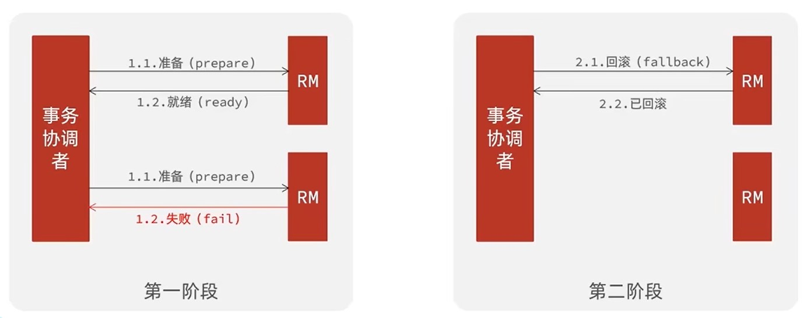

seata对XA进行了一点小调整,但大体相同

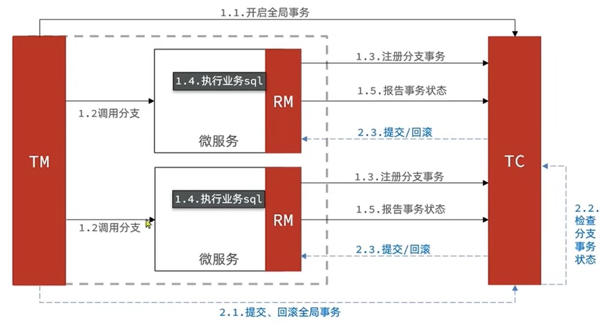

```yaml
srata:
  data-source-proxy-mode: XA
```

```jade
@service
public class xxServiceImpl implements xxService{
	@override
	@GlobalTransactional
	public void xxMethod(){
		...
	}
}
```

## AT模式(默认)

AT模式是XA模式的改进方案,属于AP模式(强可用性),不等待其他服务,先记录原始数据,再直接提交,若失败则修改数据

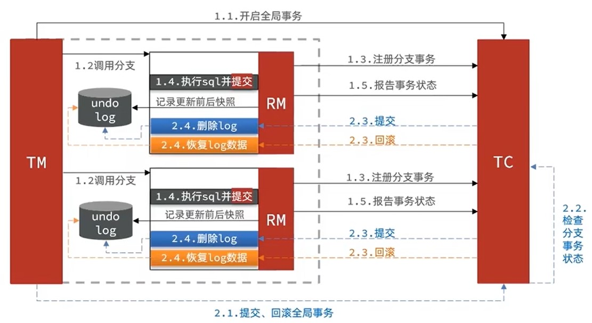

AT使用一个全局锁,保证在同一时间修改数据时只能由一个事务处理(下图假设事务1第2此提交失败)

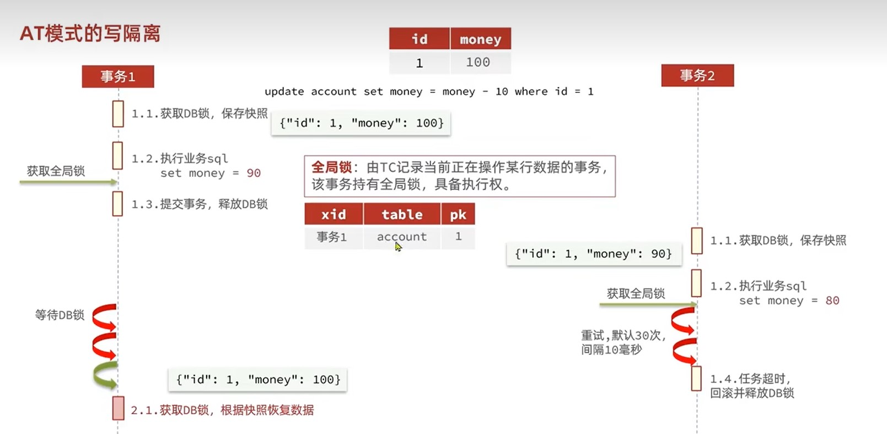

由一个极端情况,就是同一时间两个修改数据时,另一个事务不受seata管理,这时seata会报错,业务上我们捕捉这个异常,然后人工处理(途中事务1第2次提交失败)

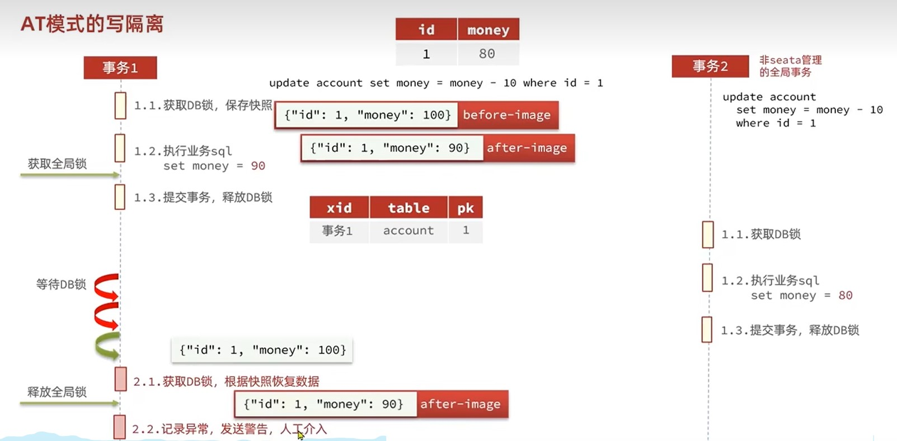

在使用前需要先在微服务数据库里创建快照undolog(不是seata数据库)

```sql
DROP TABLE IF EXISTS `undo_log`;
CREATE TABLE `undo_log`  (
  `branch_id` bigint(20) NOT NULL COMMENT 'branch transaction id',
  `xid` varchar(100) CHARACTER SET utf8 COLLATE utf8_general_ci NOT NULL COMMENT 'global transaction id',
  `context` varchar(128) CHARACTER SET utf8 COLLATE utf8_general_ci NOT NULL COMMENT 'undo_log context,such as serialization',
  `rollback_info` longblob NOT NULL COMMENT 'rollback info',
  `log_status` int(11) NOT NULL COMMENT '0:normal status,1:defense status',
  `log_created` datetime(6) NOT NULL COMMENT 'create datetime',
  `log_modified` datetime(6) NOT NULL COMMENT 'modify datetime',
  UNIQUE INDEX `ux_undo_log`(`xid`, `branch_id`) USING BTREE
) ENGINE = InnoDB CHARACTER SET = utf8 COLLATE = utf8_general_ci COMMENT = 'AT transaction mode undo table' ROW_FORMAT = Compact;

```

```yaml
srata:
  data-source-proxy-mode: AT
```

```java
@service
public class xxServiceImpl implements xxService{
	@override
	@GlobalTransactional
	public void xxMethod(){
		...
	}
}
```

## TCC模式

TCC模式是AT模式的手动挡,AT模式会提前保存原始数据,错误后恢复原始数据.而TCC模式则是分为三个模式,Try,Confirm,Cancel

+ Try:事务提交
+ Confirm:提交成功后执行
+ Cancel:提交失败后执行

且TCC没有用锁,性能是最好的

实现空回滚从而防止业务悬挂,就是各模式没有走正常流程(Try->Confirm/Cancel)而直接执行,我们需要自定义一张表来记录数据状态.在执行Confirm/Cancel前先判断状态

状态表需要自己定义,整体结构可参考此表

```sql
DROP TABLE IF EXISTS `account_freeze_tbl`;
CREATE TABLE `account_freeze_tbl`  (
  `xid` varchar(128) CHARACTER SET utf8 COLLATE utf8_general_ci NOT NULL,
  `user_id` varchar(255) CHARACTER SET utf8 COLLATE utf8_general_ci NULL DEFAULT NULL,
  `freeze_money` int(11) UNSIGNED NULL DEFAULT 0,
  `state` int(1) NULL DEFAULT NULL COMMENT '事务状态，0:try，1:confirm，2:cancel',
  PRIMARY KEY (`xid`) USING BTREE
) ENGINE = InnoDB CHARACTER SET = utf8 COLLATE = utf8_general_ci ROW_FORMAT = COMPACT;
```

整体设计流程如图:

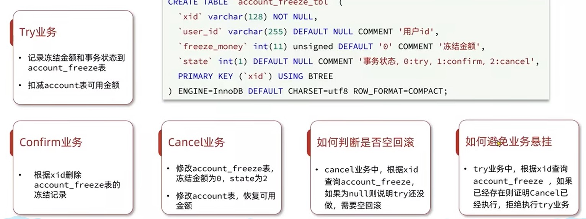

```java
@LocalTCC
public interface xxxService{
    //Try
    @TwoPhaseBusinessAction(name="try方法名称",commitMethod ="confirm方法名称" ,rollbackMethod ="cancel方法名称" )
    void Try方法(@BusinessActionContextParameter 参数);
    //在需要上下文获取的数据使用@BusinessActionContextParameter
    //confirm和cancel想要拿到参数,就需要给参数@B...Contex
    
    //context可以获取事务信息和参数
    Bollean confirm方法(BusinessActionContext context);
    
    Bollean cancel方法(BusinessActionContext context);
}
```

```java
@service
public class xxServiceImpl implements xxService{
	@override
	@Transactional
	public void Try方法(){
        // 1. 获取事务信息
        int xid = RootContext.getXID();
        // 2. 查看状态表中是否已经有事务,有则返回空(防止事务悬挂)
        ...
        // 3. 执行事务
		...
        // 4. 向状态表中添加信息
        ...
	}
    @override
    public void confirm方法(BusinessActionContext context){
        // 1. 获取事务信息
        int xid = context.getXid;
        // 2. 判断状态表,查看是否存在且状态为Try
        ...
        // 3. 删除状态
		...
	}
    @override
    public void cancel方法(BusinessActionContext context){
        // 1. 获取事务信息
        int xid = context.getXid;
        // 2. 判断状态表,查看是否存在且状态为Try
        ...
            //2.2若不存在,则空回滚,向状态表中添加空信息
            //context.getActionContext("参数")获取参数
        // 3. 恢复数据,状态改为Cancel
        ...
	}
}
```

## SAGA模式

该模式由于没有事务隔离,非常危险,不建议使用