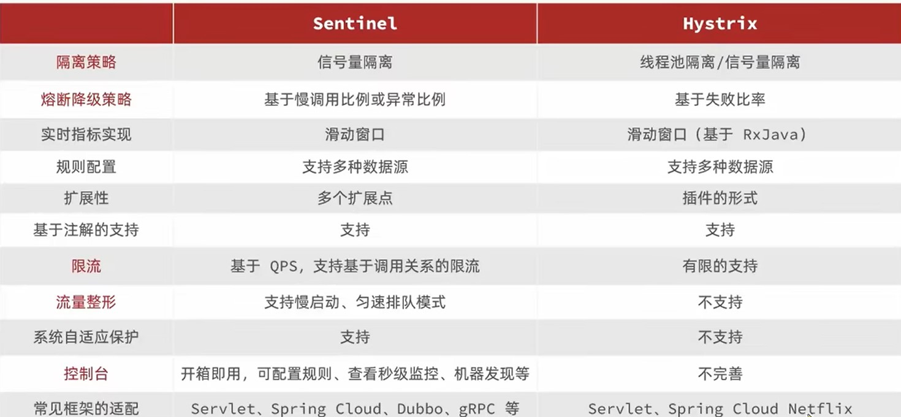
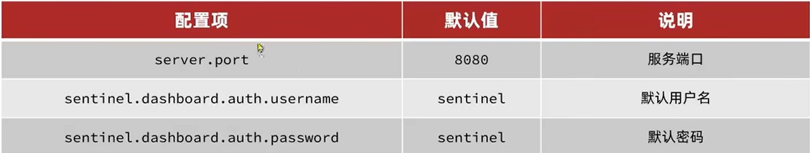
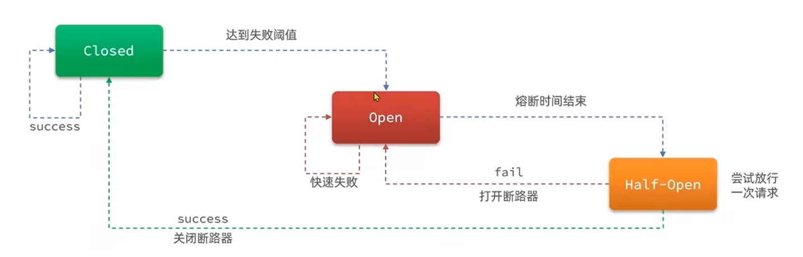
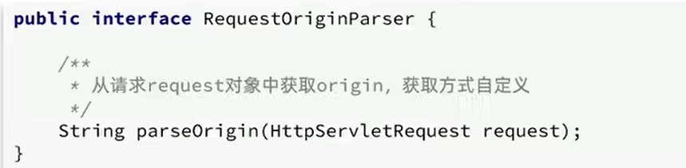
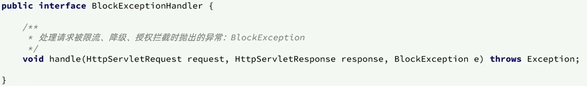
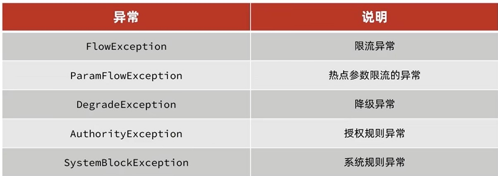

# 介绍

在学习Sentinel前,我们需要了解Sentinel能解决什么问题

## 面对的问题

1.雪崩问题

当一台服务宕机时,其关联的其他服务会一直等待响应从而宕机,因此照成雪崩


+ 超时处理:设定请求超时时间,超过时间未响应则返回错误信息,不是无休止等待
+ 舱壁模式:限定每个业务的线程数,避免因无休止等待照成资源堵塞而宕机
+ 熔断降级:由断路器统计业务异常比例,达到阈值则拦截该业务一切请求

2.流量暴增

服务请求QPS流量突然暴增,导致服务压力过大而宕机


+ 流量控制,限制业务访问的QPS

## 同类保护技术对比



Sentinel是由阿里巴巴开发的,一种相对成熟的服务器保护技术

# 安装

## 安装Sentinel管理页面

在https://github.com/alibaba/Sentinel下载最新版Sentinel管理页面

控制台输入

```shell
java -jar sentinel-dashboard-1.8.6.jar -Dserver.port=对应端口
```

进入页面:localhost:对应端口,默认账号密码为sentinel,

若需要修改其他数据,课参考此表



## 微服务整合Sentinel

引入依赖

```xml
<!--sentinel-->
<dependency>
	<groupId>com.alibaba.cloud</groupId>
    <artifactId>spring-cloud-starter-alibaba-sentinel</artifactId>
</dependency>
```

配置application.properties

```properties
#配置sentinel
spring.cloud.sentinel.transport.dashboard=localhost:8090
```

访问业务的任意端口,触发sentinel监控

# 指定监控资源

sentinel默认只检测Controler,若需要指定检测资源,需要手动添加注解

```java
@Service
@SentinelResource("资源名")
public void xxx(){
}
```

```properties
spring.cloud.sentinel.web-context-unify = false
```

## 整合Fegin

sentinel监控默认内部资源,若需要监控其连接状况,需要自定义
1. 修改配置

   ```properties
   fegin.sentinel.enable = ture
   ```

2. 编写异常处理

   ```java
   public class xxxClientFallbackFactory implements FallbackFatory<Fegin连接类>{
       @Override
       public Fegin连接类 create(Throwable throwable){
           return new Fegin连接类{
               @Override
           	public 返回类 Fegin方法 (){
                   //Fegin连接对应的方法,使用Sentinel隔离和熔断规则
                   return 返回需要的类型;
               }
           }
       }
   }
   ```

   3.Fegin连接类指定规则

   ```java
   @FeignClient(value="/xx",FallbackFatory=xxxClientFallbackFactory)
   public interface Fegin连接类{
       @GetMapping("/xx")
       返回类 Fegin方法(); 
   }
   ```

# 流控模式

流控模式对服务的并发情况进行监控,分为QPS(流量监控)和线程监控(线程隔离)

+ 直接:对当前资源限流,超过QPS/线程不予访问
+ 关联:对当前资源限流,超过QPS/线程关联资源不予访问
+ 链路:对当前资源(service/mapper)限流,超过QPS/线程不予对应链路的(controller)访问

## QPS(流量监控)

流量模式可针对服务接收的请求进行监控

### 热点模式

热点模式属于QPS(流量监控模式)的分支,可以对Restful(/{id})请求进行监控,可单独给该请求id设置独立的限流规则

## 线程监控(线程隔离)

当前技术下,线程隔离主要有一下两种

   + 线程池隔离

     为服务开启指定线程,用于不用都一直占用内存

     优点:异步,不用等待线程开启

     缺点:服务器开销大

   + 信号量隔离(sentinel使用)

     使用计数器计算服务线程数,线程数到阈值不开启线程

     优点:轻量

     缺点:不支持异常,需要等待线程开启

## 流控效果

+ 快速失败:超过QPS/线程不予访问
+ warm up:服务刚开启时,阈值逐渐上升
+ 排队等待:请求进入队列等待,计算每个请求的等待时间,超过阈值不予访问

# 熔断模式

虽然限流可以防止高并发而导致服务崩坏,但服务还会因为其他原因而崩坏,为避免雪崩,需要设置熔断降级

   熔断降级会判断服务的异常比例(close模式),若高于阈值则关闭连接n秒(open模式),时间到尝试再一次放行请求查看是否异常(Half-open模式)



+ 慢调用:熔断器计算请求连接时间,超出RT秒比例高于阈值则熔断
+ 异常比例:熔断器计算请求抛出异常比例
+ 异常数:熔断器计算请求抛出异常个数

   

# 授权模式

只有携带特定数据才能访问服务,该数据可以是请求头数据、参数等信息

通常情况下,我们希望用户从网关进入服务,但如果用户通过特殊方法获取服务ip端口,网关就不能进行监控作用.因此需要网关发送特点请求头,只有请求头携带特定的数据才允许访问

Sentinel是通过RequestOrignParser接口来判断数据是否授权,默认该接口返回default



因此只要实现此接口,将网关携带的请求头数据拿来判断是否授权即可

```java
@Component
public class HeaderOrginParser implements RequestOriginParser {
    @Override
    public String parseOrigin(HttpServletRequest httpServletRequest) {
        String orgin = httpServletRequest.getHeader("orgin");
        if (StringUtils.isEmpty(orgin)){
            return "black";
        }
        return orgin;
    }
}
```

gate配置发送请求头

```properties
spring.cloud.gateway.default-filters=AddRequestHeader=orgin,gateway
```

+ 流控应用:携带的数据
+ 白名单:数据运行通行
+ 黑名单:数据不允通行

# 自定义异常

当Sentinel发生流控、熔断、授权或热点拦截时,都会抛出异常流控异常并响应,而我们可自定义异常响应

Sentinel是通过BlockExceptionHandel接口来处理异常,我们需要实现此接口返回我们自定义的异常格式



BlockException有很多子类



```java
@Component
public class SentinelExceptionHandler implements BlockExceptionHandler {
    @Override
    public void handle(HttpServletRequest request, HttpServletResponse response, BlockException e) throws Exception {
        String msg = "未知异常";
        int status = 429;

        if (e instanceof FlowException) {
            msg = "请求被限流了";
        } else if (e instanceof ParamFlowException) {
            msg = "请求被热点参数限流";
        } else if (e instanceof DegradeException) {
            msg = "请求被降级了";
        } else if (e instanceof AuthorityException) {
            msg = "没有权限访问";
            status = 401;
        }

        response.setContentType("application/json;charset=utf-8");
        response.setStatus(status);
        response.getWriter().println("{\"msg\": " + msg + ", \"status\": " + status + "}");
    }
}
```


# 持久化

Sentinel有三种配置管理模式:

+ 原始模式:保存在内存
+ pull模式:保存在本地或数据库,定时读取
+ push模式:保存在nacos,实时获取

sentinel模式将配置保存在内存,一旦重启,所有配置将会失效

## push模式:

1. 引入依赖

   ```xml
   <dependency>
       <groupId>com.alibaba.csp</groupId>
       <artifactId>sentinel-datasource-nacos</artifactId>
   </dependency>
   ```

2. 配置nacos地址

```yaml
spring:
    sentinel:
      datasource:
        flow:
          nacos:
            server-addr: localhost:8848 # nacos地址
            dataId: orderservice-flow-rules
            groupId: SENTINEL_GROUP
            rule-type: flow # 还可以是：degrade(熔断)、authority(授权)、param-flow(热点)
        degrade:
          nacos:
            server-addr: localhost:8848 # nacos地址
            dataId: orderservice-flow-rules
            groupId: SENTINEL_GROUP
            rule-type: degrade # 还可以是：flow(限流)、authority、param-flow
```

