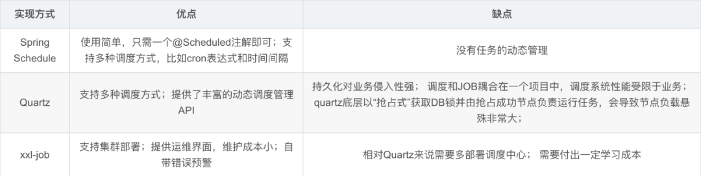

# 任务调度技术

[任务调度](https://so.csdn.net/so/search?q=任务调度&spm=1001.2101.3001.7020)是特定业务场景下的定时任务处理，在分布式架构下，分布式调度框架的设计显得尤为重要。这里简要介绍了两种常用的分布式调度框架Quartz和xxl-job的特性、基本架构和参数配置，以加深了解。



# Spring Schedule

spring自带一种基于注解的任务调度

在application中添加@EnableScheduling注解

```java
@SpringBootApplication
@EnableScheduling  //开启定时任务功能
public class SpringbootTaskApplication {

	public static void main(String[] args) {
		SpringApplication.run(SpringbootTaskApplication.class, args);
	}

}

```

在定时任务类上添加规则和方法,使用cron表达式

```java
@Slf4j
@Component
public class MyJob {
	
    //@Scheduled(cron = "0/${mytask.abc:15} * * * * ?") 在application.yml配置中添加参数可以通过配置方式指定规则 mytask.abc = 10 ;
    @Scheduled(cron = "0,15,30,45 * * * * ?")
    public void hello(){
        log.info("say hello");
    }

}
```

## 

# Quartz

## 介绍

这是一个作业调度的开源项目,一般可用和spring结合使用,在实际开发中可用用	Quartz做一个定时任务,比如每小时执行一次,或每个月上午10点执行一次,每个月下午5点执行一次

## 安装

```xml
<!--引入quartz依赖-->
<dependency>
    <groupId>org.springframework.boot</groupId> 		 		<artifactId>spring-boot-starter-quartz</artifactId>	
</dependency>
```

## 使用

+ 编写任务信息
+ 编写任务处理规则
+ 配置调度中心(启动时开启任务调度)

首先,先编写job类

```java
public class Job1 implements Job {
    private final SimpleDateFormat dateFormat = new SimpleDateFormat("yyyy-MM-dd HH:mm:ss");
 
    private void before() {
        System.out.println("任务1：开始执行-" + dateFormat.format(new Date()));
    }
 
    @Override
    public void execute(JobExecutionContext arg0) throws JobExecutionException {
        before();
        System.out.println("任务1：业务逻辑。。。");
        after();
    }
 
    private void after() {
        System.out.println("任务1：执行结束");
        System.out.println();
    }
```

再通过工具类配置规则

```java
@Component
public class QuartzSchedulerManager {
    @Autowired
    private Scheduler scheduler;
 
    // 开始执行定时器
    public void startJob() throws SchedulerException {
        startJob1(scheduler);
        startJob2(scheduler);
        scheduler.start();
    }
 
    // 获取Job信息
    public String getJobInfo(String name, String group) throws SchedulerException {
        TriggerKey triggerKey = new TriggerKey(name, group);
        CronTrigger cronTrigger = (CronTrigger) scheduler.getTrigger(triggerKey);
        return String.format("time:%s,state:%s", cronTrigger.getCronExpression(),
                scheduler.getTriggerState(triggerKey).name());
    }
 
    // 修改某个任务的执行时间
    public boolean modifyJob(String name, String group, String time) throws SchedulerException {
        Date date = null;
        TriggerKey triggerKey = new TriggerKey(name, group);
        CronTrigger cronTrigger = (CronTrigger) scheduler.getTrigger(triggerKey);
        String oldTime = cronTrigger.getCronExpression();
        if (!oldTime.equalsIgnoreCase(time)) {
            CronScheduleBuilder cronScheduleBuilder = CronScheduleBuilder.cronSchedule(time);
            CronTrigger trigger = TriggerBuilder.newTrigger().withIdentity(name, group)
                    .withSchedule(cronScheduleBuilder).build();
            date = scheduler.rescheduleJob(triggerKey, trigger);
        }
        return date != null;
    }
 
    // 暂停所有任务
    public void pauseAllJob() throws SchedulerException {
        scheduler.pauseAll();
    }
 
    // 暂停某个任务
    public void pauseJob(String name, String group) throws SchedulerException {
        JobKey jobKey = new JobKey(name, group);
        JobDetail jobDetail = scheduler.getJobDetail(jobKey);
        if (jobDetail == null)
            return;
        scheduler.pauseJob(jobKey);
    }
 
    // 恢复所有任务
    public void resumeAllJob() throws SchedulerException {
        scheduler.resumeAll();
    }
 
    // 恢复某个任务
    public void resumeJob(String name, String group) throws SchedulerException {
        JobKey jobKey = new JobKey(name, group);
        JobDetail jobDetail = scheduler.getJobDetail(jobKey);
        if (jobDetail == null)
            return;
        scheduler.resumeJob(jobKey);
    }
 
    // 删除某个任务
    public void deleteJob(String name, String group) throws SchedulerException {
        JobKey jobKey = new JobKey(name, group);
        JobDetail jobDetail = scheduler.getJobDetail(jobKey);
        if (jobDetail == null)
            return;
        scheduler.deleteJob(jobKey);
    }
 
    // 启动任务1
    private void startJob1(Scheduler scheduler) throws SchedulerException {
        // 通过JobBuilder构建JobDetail实例，JobDetail规定其job只能是实现Job接口的实例
        JobDetail jobDetail = JobBuilder.newJob(Job1.class).withIdentity("job1", "group1").build();
        // 基于表达式构建触发器
        CronScheduleBuilder cronScheduleBuilder = CronScheduleBuilder.cronSchedule("0/5 * * * * ?");
        // CronTrigger表达式触发器 继承于Trigger。TriggerBuilder 用于构建触发器实例
        CronTrigger cronTrigger = TriggerBuilder.newTrigger().withIdentity("job1", "group1")
                .withSchedule(cronScheduleBuilder).build();
        scheduler.scheduleJob(jobDetail, cronTrigger);
    }
 
    // 启动任务2
    private void startJob2(Scheduler scheduler) throws SchedulerException {
        // 通过JobBuilder构建JobDetail实例，JobDetail规定其job只能是实现Job接口的实例
        JobDetail jobDetail = JobBuilder.newJob(Job2.class).withIdentity("job2", "group2").build();
        // 基于表达式构建触发器
        CronScheduleBuilder cronScheduleBuilder = CronScheduleBuilder.cronSchedule("0/5 * * * * ?");
        // CronTrigger表达式触发器 继承于Trigger。TriggerBuilder 用于构建触发器实例
        CronTrigger cronTrigger = TriggerBuilder.newTrigger().withIdentity("job2", "group2")
                .withSchedule(cronScheduleBuilder).build();
        scheduler.scheduleJob(jobDetail, cronTrigger);
    }
}
```

若希望服务启动时运行,写以下配置类

```java
@Configuration
public class QuartzListener implements ApplicationListener<ContextRefreshedEvent> {
    @Autowired
    private QuartzSchedulerManager quartzSchedulerManager;
 
    // 初始启动quartz
    @Override
    public void onApplicationEvent(ContextRefreshedEvent event) {
        try {
            quartzSchedulerManager.startJob();
            System.out.println("任务已经启动...");
        } catch (SchedulerException e) {
            e.printStackTrace();
        }
    }
    // 初始注入scheduler
    @Bean
    public Scheduler scheduler() throws SchedulerException{
        SchedulerFactory schedulerFactoryBean = new StdSchedulerFactory();
        return schedulerFactoryBean.getScheduler(); 
    }
}
```

若希望通过api启动任务类,在controler里执行以下api

```java
@RestController
@RequestMapping("")
public class QuartzController {
    @Autowired
    private QuartzSchedulerManager quartzSchedulerManager;
 
    // @Description: 获取定时器信息
    @GetMapping("/info")
    public String getQuartzJob(String name, String group) {
        String info = null;
        try {
            info = quartzSchedulerManager.getJobInfo(name, group);
        } catch (SchedulerException e) {
            e.printStackTrace();
        }
        return info;
    }
 
    // @Description: 修改定时器的 执行时间
    @PostMapping("/modify")
    public boolean modifyQuartzJob(String name, String group, String time) {
        boolean flag = true;
 
        if (!CronExpression.isValidExpression(time)) {
            throw new RuntimeException("非法的cron表达式");
        }
        
        try {
            flag = quartzSchedulerManager.modifyJob(name, group, time);
        } catch (SchedulerException e) {
            e.printStackTrace();
        }
        return flag;
    }
 
    // @Description: 启动所有定时器
    @PostMapping("/start")
    public void startQuartzJob() {
        try {
            quartzSchedulerManager.startJob();
        } catch (SchedulerException e) {
            e.printStackTrace();
        }
    }
 
    // @Description: 暂停指定 定时器
    @PostMapping(value = "/pause")
    public void pauseQuartzJob(String name, String group) {
        try {
            quartzSchedulerManager.pauseJob(name, group);
        } catch (SchedulerException e) {
            e.printStackTrace();
        }
    }
 
    // 暂停所有定时器
    @PostMapping(value = "/pauseAll")
    public void pauseAllQuartzJob() {
        try {
            quartzSchedulerManager.pauseAllJob();
        } catch (SchedulerException e) {
            e.printStackTrace();
        }
    }
 
    // 删除指定定时器
    @PostMapping(value = "/delete")
    public void deleteJob(String name, String group) {
        try {
            quartzSchedulerManager.deleteJob(name, group);
        } catch (SchedulerException e) {
            e.printStackTrace();
        }
    }
}
```

# XXL-JOB

## 介绍

xxl-job是基于分布式集群的任务调度模块
单机情况下,一个任务调度中心可以发起一种任务调度
但在集群情况下,多个任务调度中心就会重复发一种任务调度
如我们希望在每个月1号清空积分,但用了集群分布式,有了多个调度中心,那么每个调度中心都会清空积分,这样任务就重复了,我们希望只有一个任务中心发起任务调度即可,而xxl-job就是专门解决分布式集群任务调度的开源框架

+ 执行服务:编写任务信息
+ 调度服务:编写任务规则
+ 执行服务:配置调度中心(启动时开启任务调度)

# cron表达式

对于cron表达式,如果自己写的话会比较麻烦,可以使用网络上的cron表达式在线	生成工具https://cron.qqe2.com/


