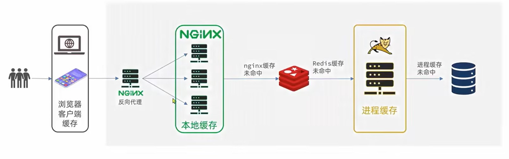
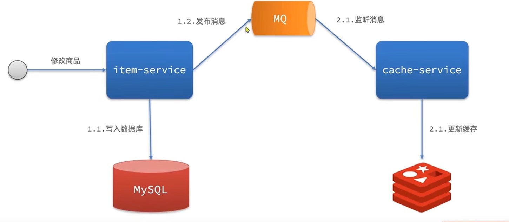
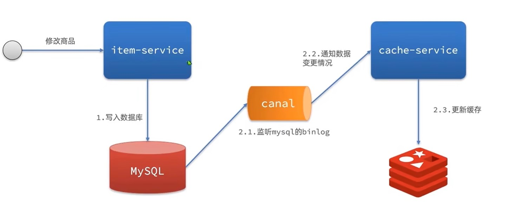

# 多级缓存概述

多级缓存是一种设计思路,充分利用请求的每个环境进行缓存,减少Tomcat的压力

+ 一级缓存:浏览器客户端缓存,主要由cookie或LocalStroage
+ 二级缓存:Nginx本地缓存
+ 三级缓存:Redis缓存,主要由Nginx用Lua发起向Redis的询问
+ 四级缓存:JVM缓存,进程缓存
+ 五级缓存:本地数据库



# JVM缓存

JVM是一种基于本地进程的缓存,相较于Redis其使用本地缓存,没有网络开销(Redis可能使用其他服务器)速度更快,但是不能数据共享.

常见的JVM缓存就是以静态变量的形式进行缓存,线程未结束,变量就不会被释放.

Spring官方推荐使用Caffeine,其内部就是使用静态Map

## 创建Caffeine

```java
//创建构造器
Cache<String,String> cache = Caffeine.newBuilder().build();
```

创建构造器时可添加其他功能

+ initialCapacity(long):存储初始化大小
+ maximumSize(long):存储最大大小
+ expireAfterWrite(Duration.ofSeconds(long)):存储存long秒后释放

一般在Config里创建Caffeine

```java
@Configuration
public class CaffeineConfig {
    @Bean
    public Cache<String,String> XXCache(){
        Cache<String,String> cache = Caffeine.newBuilder()
                .initialCapacity(1)
                .maximumSize(1)
                .expireAfterWrite(Duration.ofSeconds(10))
                .build();
        return cache;
    }
}
```

## 使用Caffeine

```java
//存数据
cache.put("键","值");
```

```java
//取数据,若无数据返回Null
cache.getIfPresent("键");
//取数据,若无数据执行方法
cache.get("键",key->{
	return "";
});
```

# Nginx使用Redis

### Nginx配置修改

使用前需要导入OpenResty

```nginx
#user  nobody;
worker_processes  1;
error_log  logs/error.log;

events {
    worker_connections  1024;
}

http {
    include       mime.types;
    default_type  application/octet-stream;
    sendfile        on;
    keepalive_timeout  65;
    #导入lua模块
    lua_package_path "user/local/openrestry/lualib/?.lua;;";
    #导入c模块
    lua_package_cpath "user/local/openrestry/lualib/?.so;;";
	#设置集群
    upstream tomcat-cluster{
        server tomcatIp1:端口;
        server tomcatIp2:端口;
    }
    server {
        #监听端口和域名
        listen       8081;
        server_name  localhost;
        #映射位置
        location / {
            root   html;
            index  index.html index.htm;
        }
        location /item{
            proxy_pass http://tomcat-cluster;
        }
        #设置某接口监听由lua脚本控制
        location ~ /api/item/(\d+){
            # 默认响应类型
            default_type application/json;
            # 响应结果由lua/item.lua文件决定
            content_by_lua_file lua/item.lua
        }
        error_page   500 502 503 504  /50x.html;
        location = /50x.html {
            root   html;
        }
    }
}
```

### 导入common.lua

```lua
-- 导入redis
local redis = require('resty.redis')
-- 初始化redis
local red = redis:new()
red:set_timeouts(1000,1000,1000)

-- 关闭redis连接的工具方法，其实是放入连接池
local function close_redis(red)
    local pool_max_idle_time = 10000 -- 连接的空闲时间，单位是毫秒
    local pool_size = 100 --连接池大小
    local ok, err = red:set_keepalive(pool_max_idle_time, pool_size)
    if not ok then
        ngx.log(ngx.ERR, "放入redis连接池失败: ", err)
    end
end
-- 查询redis的方法 ip和port是redis地址，key是查询的key
local function read_redis(ip, port, key)
    -- 获取一个连接
    local ok, err = red:connect(ip, port)
    if not ok then
        ngx.log(ngx.ERR, "连接redis失败 : ", err)
        return nil
    end
    -- 查询redis
    local resp, err = red:get(key)
    -- 查询失败处理
    if not resp then
        ngx.log(ngx.ERR, "查询Redis失败: ", err, ", key = " , key)
    end
    --得到的数据为空处理
    if resp == ngx.null then
        resp = nil
        ngx.log(ngx.ERR, "查询Redis数据为空, key = ", key)
    end
    close_redis(red)
    return resp
end
-- 封装函数，发送http请求，并解析响应
local function read_http(path, params)
    local resp = ngx.location.capture(path,{
        method = ngx.HTTP_GET,
        args = params,
    })
    if not resp then
        -- 记录错误信息，返回404
        ngx.log(ngx.ERR, "http not found, path: ", path , ", args: ", args)
        ngx.exit(404)
    end
    return resp.body
end
-- 将方法导出
local _M = {  
    read_http = read_http,
    read_redis = read_redis
}  
return _M
```

### 导入item.lua

```lua
-- 导入common库,获取发送http请求方法
local common = require('common')
local read_http = common.read_http
local read_redis = common.read_redis
-- 导入json库
local cjson = require('cjson')

-- 获取路径参数
local id = ngx.var[1]

-- 封装查询函数,先查redis,后发http
function read_data(key,path,params)
    -- 先查redis
    local resp = read_redis("127.0.0.1",6379,key)
    -- 判断查询结果,未空则发http
    if not resp then
        ngx.log(ngx.ERR,"redis查询失败,尝试查询http,key:",key)
        resp = read_http(path,params)
    end
    return resp
end
-- 查询
local itemJson = read_data("item.id"..id,"/item/"..id,nil)
local itemStockJson = read_data("item.stock.id"..id,"/item/stock/"..id,nil)
-- 组合json
local item  = cjson.decode(itemJson)
local stock = cjson.decode(itemStockJson)
item.stock = stock.stock
item.sold = stock.sold

-- 返回结果
ngx.say(cjson.encode(item))
```

# Nginx本地缓存

OpenResty为Nginx提供了shard dict的功能,在nginx的多个worker之间共享数据,实现缓存功能.

### Nginx配置修改

在nginx.conf中添加配置

```nginx
#开启本地缓存,名字为item_cache,大小为150m
lua_shard_dict item_cache 150m
```

```nginx

#user  nobody;
worker_processes  1;
error_log  logs/error.log;

events {
    worker_connections  1024;
}

http {
    include       mime.types;
    default_type  application/octet-stream;
    sendfile        on;
    keepalive_timeout  65;
    #导入lua模块
    lua_package_path "user/local/openrestry/lualib/?.lua;;";
    #导入c模块
    lua_package_cpath "user/local/openrestry/lualib/?.so;;";
    #开启本地缓存,名字为item_cache,大小为150m
	lua_shard_dict item_cache 150m;
	#设置集群
    upstream tomcat-cluster{
        server tomcatIp1:端口;
        server tomcatIp2:端口;
    }
    server {
        #监听端口和域名
        listen       8081;
        server_name  localhost;
        #映射位置
        location / {
            root   html;
            index  index.html index.htm;
        }
        location /item{
            proxy_pass http://tomcat-cluster;
        }
        #设置某接口监听由lua脚本控制
        location ~ /api/item/(\d+){
            # 默认响应类型
            default_type application/json;
            # 响应结果由lua/item.lua文件决定
            content_by_lua_file lua/item.lua
        }
        error_page   500 502 503 504  /50x.html;
        location = /50x.html {
            root   html;
        }
    }
}
```

### 本地缓存操作

在lua中操作

```lua
-- 获取本地缓存对象
local item_cache = ngx.shared.item_cache
-- 存储,指定key,value,过期时间,单位s,默认0为永不过期
item_cache:set('key','value',1000)
-- 读取
local val = item_cache:get('key')
```

### 修改item.lua

如在上文的item.lua中,可先查询本性再查询redis,最后发送http

```lua
-- 导入common库,获取发送http请求方法
local common = require('common')
local read_http = common.read_http
local read_redis = common.read_redis
-- 导入json库
local cjson = require('cjson')
-- 获取本地缓存对象
local item_cache = ngx.shared.item_cache

-- 获取路径参数
local id = ngx.var[1]

-- 封装查询函数,先查redis,后发http
function read_data(key,expire,path,params)
    -- 查询本地缓存
    local val = item_cache:get(key)
    if not val then
    	-- 查redis
        ngx.log(ngx.ERR,"本性缓存查询失败,尝试查询redis,key:",key)
    	val = read_redis("127.0.0.1",6379,key)
    	-- 判断查询结果,未空则发http
    	if not val then
        	ngx.log(ngx.ERR,"redis查询失败,尝试查询http,key:",key)
        	val = read_http(path,params)
        end
    end
    item_cache:set(key,val,expire)
    return val
end

-- 查询
local itemJson = read_data("item.id"..id,1800,"/item/"..id,nil)
local itemStockJson = read_data("item.stock.id"..id,60,"/item/stock/"..id,nil)
-- 组合json
local item  = cjson.decode(itemJson)
local stock = cjson.decode(itemStockJson)
item.stock = stock.stock
item.sold = stock.sold

-- 返回结果
ngx.say(cjson.encode(item))
```

# 缓存同步

## MQ同步



通过MQ,当item服务更新时,发布更新消息,cache服务更新redis

优点:快

缺点:依赖MQ可靠性

## Cannel同步



通过监听mysql的binlog,一旦触发增删改事件,则同步更新redis

优点:快,低耦合(不用再item服务写代码)

缺点:依赖数据库可靠性

## 安装Cannel

### 1.修改msql配置

```sh
vi /tmp/mysql/conf/my.cnf
```

```ini
log-bin=/var/lib/mysql/mysql-bin
binlog-do-db=heima
```

配置解读：

- `log-bin=/var/lib/mysql/mysql-bin`：设置binary log文件的存放地址和文件名，叫做mysql-bin
- `binlog-do-db=heima`：指定对哪个database记录binary log events，这里记录heima这个库


 ### 2.设置用户权限

接下来添加一个仅用于数据同步的账户，出于安全考虑，这里仅提供对heima这个库的操作权限。

```mysql
create user canal@'%' IDENTIFIED by 'canal';
GRANT SELECT, REPLICATION SLAVE, REPLICATION CLIENT,SUPER ON *.* TO 'canal'@'%' identified by 'canal';
FLUSH PRIVILEGES;
```

重启mysql容器即可

```
docker restart mysql
```

测试设置是否成功：在mysql控制台，或者Navicat中，输入命令：

```
show master status;
```

### 3.创建网络

我们需要创建一个网络，将MySQL、Canal、MQ放到同一个Docker网络中：

```sh
docker network create heima
```

让mysql加入这个网络：

```sh
docker network connect heima mysql
```

### 4.安装Cannel

网络上下载cannel,可以上传到虚拟机，然后通过命令导入：

```
docker load -i canal.tar
```

然后运行命令创建Canal容器：

```sh
docker run -p 11111:11111 --name canal \
-e canal.destinations=heima \
-e canal.instance.master.address=mysql:3306  \
-e canal.instance.dbUsername=canal  \
-e canal.instance.dbPassword=canal  \
-e canal.instance.connectionCharset=UTF-8 \
-e canal.instance.tsdb.enable=true \
-e canal.instance.gtidon=false  \
-e canal.instance.filter.regex=heima\\..* \
--network heima \
-d canal/canal-server:v1.1.5
```


说明:

- `-p 11111:11111`：这是canal的默认监听端口
- `-e canal.instance.master.address=mysql:3306`：数据库地址和端口，如果不知道mysql容器地址，可以通过`docker inspect 容器id`来查看
- `-e canal.instance.dbUsername=canal`：数据库用户名
- `-e canal.instance.dbPassword=canal` ：数据库密码
- `-e canal.instance.filter.regex=`：要监听的表名称

表名称监听支持的语法：

```
mysql 数据解析关注的表，Perl正则表达式.
多个正则之间以逗号(,)分隔，转义符需要双斜杠(\\) 
常见例子：
1.  所有表：.*   or  .*\\..*
2.  canal schema下所有表： canal\\..*
3.  canal下的以canal打头的表：canal\\.canal.*
4.  canal schema下的一张表：canal.test1
5.  多个规则组合使用然后以逗号隔开：canal\\..*,mysql.test1,mysql.test2 
```

## 使用Cannel

### 导入依赖

```xml
<dependency>
    <groupId>top.javatool</groupId>
    <artifactId>canal-spring-boot-starter</artifactId>
    <version>1.2.1-RELEASE</version>
</dependency>
```

### 编写配置

```yaml
canal:
  destination: heima # canal的集群名字，要与安装canal时设置的名称一致
  server: 192.168.150.101:11111 # canal服务地址
```

### 修改实体类

通过@Id、@Column、等注解完成Item与数据库表字段的映射：

```java
package com.heima.item.pojo;

import com.baomidou.mybatisplus.annotation.IdType;
import com.baomidou.mybatisplus.annotation.TableField;
import com.baomidou.mybatisplus.annotation.TableId;
import com.baomidou.mybatisplus.annotation.TableName;
import lombok.Data;
import org.springframework.data.annotation.Id;
import org.springframework.data.annotation.Transient;

import javax.persistence.Column;
import java.util.Date;

@Data
@TableName("tb_item")
public class Item {
    @TableId(type = IdType.AUTO)
    @Id
    private Long id;//商品id
    @Column(name = "name")
    private String name;//商品名称
    private String title;//商品标题
    private Long price;//价格（分）
    private String image;//商品图片
    private String category;//分类名称
    private String brand;//品牌名称
    private String spec;//规格
    private Integer status;//商品状态 1-正常，2-下架
    private Date createTime;//创建时间
    private Date updateTime;//更新时间
    @TableField(exist = false)
    @Transient
    private Integer stock;
    @TableField(exist = false)
    @Transient
    private Integer sold;
}
```

### 编写监听类

通过实现`EntryHandler<T>`接口编写监听器，监听Canal消息。注意两点：

- 实现类通过`@CanalTable("tb_item")`指定监听的表信息
- EntryHandler的泛型是与表对应的实体类


```java
@CanalTable("tb_item")
@Component
public class ItemHandler implements EntryHandler<Item> {

    @Autowired
    private RedisHandler redisHandler;
    @Autowired
    private Cache<Long, Item> itemCache;
	
    //发生新增时触发事件
    @Override
    public void insert(Item item) {
        // 写数据到JVM进程缓存
        ....
        // 写数据到redis
  		...
    }
	
    //发生更新时触发事件
    @Override
    public void update(Item before, Item after) {
        // 写数据到JVM进程缓存
        ...
        // 写数据到redis
        ...
    }
	
    //发生删除时触发事件
    @Override
    public void delete(Item item) {
        // 删除数据到JVM进程缓存
        ...
        // 删除数据到redis
        ...
    }
}
```