# 微服务介绍

## 单体架构

单体式架构将所有服务放在同一个项目

* 部署简单
* 耦合性高

## 分布式架构

分布式价格将多种服务拆分到不同项目

* 部署麻烦
* 耦合性低
* 高可用
* 集群部署困难

## 微服务的分布式架构

微服务的分布式在原有的分布式架构上进行改良,解决了传统分布式中部署和集群等问题

常见的分布式技术

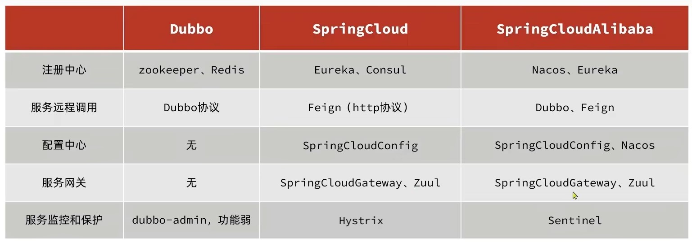

# Spring Cloud

## 项目结构

在微服务项目中,不同的功能应放在不同的项目里

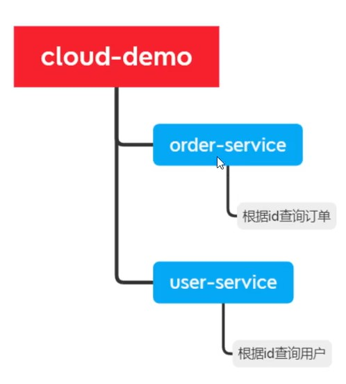

## 远程调用

不同的服务之间数据需要通信时,由于各服务已经暴露了接口位置,所以当A服务想要使用B服务的功能时,可使用http通信方式调用

### HttpUtil

这是比较传统Http通信,需要自行创建HttpUtil,再调用

```java
public class HttpUtil {
    private static String USER_AGENT = "Mozilla/4.0 (compatible; MSIE 8.0; Windows NT 6.0; Trident/4.0; SLCC1; .NET CLR 2.0.50727; .NET CLR 3.0.04506; customie8)";

    // HTTP GET request
    public static String sendGet(String url, String charset) throws Exception {
        URL realurl = new URL(url);
        HttpURLConnection con = (HttpURLConnection) realurl.openConnection();

        // optional default is GET
        con.setRequestMethod("GET");

        // add request header
        con.setRequestProperty("User-Agent", USER_AGENT);

        // int responseCode = con.getResponseCode();
        // System.out.println("Response Code : " + responseCode);

        BufferedReader in = new BufferedReader(new InputStreamReader(con.getInputStream(), charset));
        String inputLine;
        StringBuffer result = new StringBuffer();
        while ((inputLine = in.readLine()) != null) {
            result.append(inputLine);
            result.append("\r\n");
        }
        in.close();
        con.disconnect();
        return result.toString();
    }

    // HTTP POST request
    @SuppressWarnings("deprecation")
    public static String sendPost(String url, Map<String, String> param, String charset) throws Exception {
        URL realurl = new URL(url);
        HttpsURLConnection con = (HttpsURLConnection) realurl.openConnection();

        con.setRequestMethod("POST");
        // add reuqest header
        con.setRequestProperty("User-Agent", USER_AGENT);
        // con.setRequestProperty("Accept-Language", "en-US,en;q=0.5");

        // String urlParameters =
        // "sn=C02G8416DRJM&cn=&locale=&caller=&num=12345";
        StringBuffer buffer = new StringBuffer();
        if (param != null && !param.isEmpty()) {
            for (Map.Entry<String, String> entry : param.entrySet()) {
                buffer.append(entry.getKey()).append("=").append(URLEncoder.encode(entry.getValue(), charset))
                        .append("&");
            }
        }
        buffer.deleteCharAt(buffer.length() - 1);
        // Send post request
        con.setDoOutput(true);
        DataOutputStream wr = new DataOutputStream(con.getOutputStream());
        wr.writeBytes(buffer.toString());
        wr.flush();
        wr.close();
        // int responseCode = con.getResponseCode();
        // System.out.println("Post parameters : " + urlParameters);
        // System.out.println("Response Code : " + responseCode);

        BufferedReader in = new BufferedReader(new InputStreamReader(con.getInputStream(), charset));
        String inputLine;
        StringBuffer result = new StringBuffer();
        while ((inputLine = in.readLine()) != null) {
            result.append(inputLine);
            result.append("\r\n");
        }
        in.close();
        con.disconnect();
        return result.toString();
    }
}
```

```java
String json = HttpUtil.sendGet(accessTokenUrl, "utf-8");
```

### RestTemplate

RestTemplate是一种基于spring的http通信方式

使用前需要注册

```java
@Bean
public RestTemplate restTemplate(){
    return new RestTemplate();
}
```

```java
User user = restTemplate.getForObject(url,User.class)
```

### Fegin

Fegin比RestTemplate更加优雅,且兼容了负载均衡,无需更多配置

### 安装

1. 导入依赖

   ```xml
   <dependency>
       <groupId>org.springframework.cloud</groupId>
       <artifactId>spring-cloud-starter-openfeign</artifactId>
   </dependency>
   ```

2. 添加注解@EnableFeignClients在application中

   ```java
   @SpringBootApplication
   @EnableFeignClients
   public class UserServiceApplication {
   
       public static void main(String[] args) {
           SpringApplication.run(UserServiceApplication.class, args);
       }
   }
   ```

### 使用

```java
@FeginClient("ip:端口或nacose服务名")
public interface xxClint{
    @请求方式Mapping("请求路径")
    返回值类 xx(请求参数类 请求参数)
}
```

### 自定义配置

Fegin可以通过运行自定义配置来覆盖默认配置

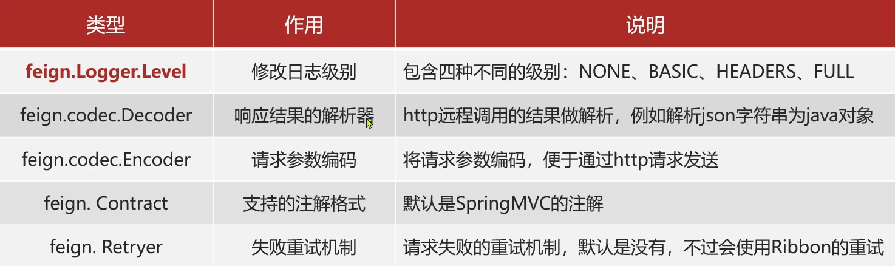

有两种方法可以修改配置

1. 基于配置文件

   ```properties
   fegin.client.config.default.类型 = 值
   ```

2. 基于Bean和注解

   先写好对应的Bean

   ```java
   @Configuration
   public class FeginClientConfiguration{
       @Bean
       public 类型(){
           return 类型.值;
       }
   }
   ```

   + 如果是全局配置,把它放到@EnableFeignClients

     ```java
     @EnableFeignClients(defaultConfiguration = FeginClientConfiguration.class)
     ```

   + 如果是局部配置,把它放到@FeginClient

     ```java
     @FeginClient(value="ip:端口" ,defaultConfiguration = FeginClientConfiguration.class)
     ```

### 优化

+ 日志尽量使用NONE

+ 使用连接池

  导入依赖

  ```xml
  <dependency>
      <groupId>io.github.openfeign</groupId>
      <artifactId>feign-httpclient</artifactId>
  </dependency>
  ```

  配置

  ```properties
  #开启配置
  feign.httpclient.enabled=true
  #最大连接数
  feign.httpclient.max-connections=200
  #每个路径最大连接数
  feign.httpclient.max-connections-per-route=50
  ```

### 最佳实践

在实际开发中,同个前人不断测试,有几种方案开发方式更受开发人员接收,这里介绍抽取Feign方法,用这个方法,其他的服务共用一个client和pojo

1. 创建一个model,命名为feign-api,引入依赖(或在父依赖里引入)

2. 将clients和pojo放入该model里写

3. 其他服务若要使用,引入feign-api依赖

4. 由于不像dubbo一样是有公共spring容器,因此还需要导入对应的api进容器里

   方法一:指定Feign所在的包

   ```java
   @EnableFeignClients(basePackages = 依赖所在的包)
   ```

   方法二:指定Feign字节码

   ```java
   @EnableFeignClients(clients = {xxClient.class})
   ```

## Eureka注册中心

如果某个服务是采用集群的方式,它就有多个端口,那么消费者如何才能找到正确的端口,这时就需要注册中心动态管理

### Eureka原理

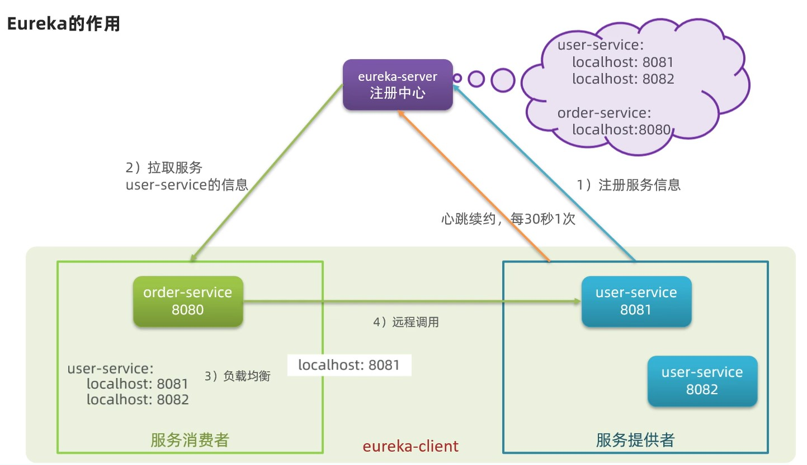

### Eureka搭建

#### 搭建注册中心

创建一个新的项目,和其他服务同级,并导入maven

```xml
<dependency>
    <groupId>org.springframework.cloud</groupId>
    <artifactId>spring-cloud-starter-netflix-eureka-server</artifactId>
</dependency>
```

在eureka服务的application中配置

```java
@SpringBootApplication
@EnableEurekaServer
public class EurakaAppliacation {
    public static void main(String[] args) {
        SpringApplication.run(EurakaAppliacation.class,args);
    }
}
```

```properties
server.port=10086
spring.application.name=eurakaservice
#eureka地址信息
eureka.client.service-url.defaultZone:http://localhost:10086/eureka
```

#### 服务注册

服务注册仅需在配置文件中写明euraka地址

```properties
# 应用名称
spring.application.name=user-service
server.port=8081
#eureka地址信息
eureka.client.service-url.defaultZone:http://localhost:10086/eureka
```

当一个服务需要部署集群,多次注册时,可以使用idea中的copy服务,

但是一定要写明端口不同

```tex
-Dservice.port=端口
```

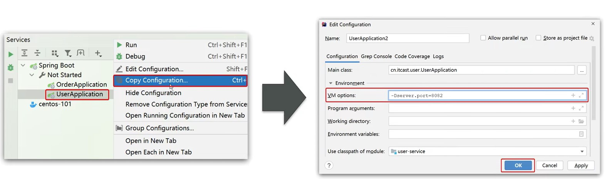

#### 服务发现

使用远程调用(这里以RestTemplate为例)

```java
@Bean
@LoadBalanced
public RestTemplate restTemplate(){
    return new RestTemplate();
}
```

```java
String url="http://orderservice/order/getOrder";
String str = restTemplate.getForObject(url,String.class);
```

注意

* 当使用微服务接口时,RestTemplate不能使用localhost或者ip调用服务,只能使用服务名称调用
* 服务名称有下划线_时,url将下划线_改为减号-
* RestTemplate访问微服务接口,在注册时要添加@LoadBalanced注解表示负载均衡

#### 整体流程(简略)


### Ribbon负载均衡

远程调用服务地址是无法通过http直接访问的,通过使用@LoadBalanced注解,可生成一个拦截器,在发送http请求时,会拉去对应的服务曲找eureka寻找对应的ip和端口,在使用Ribbon进行负载均衡

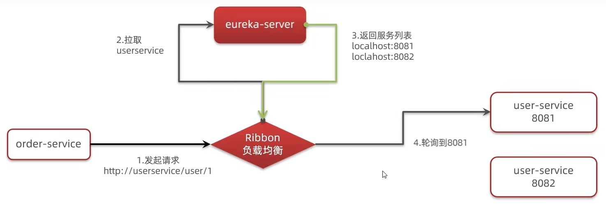

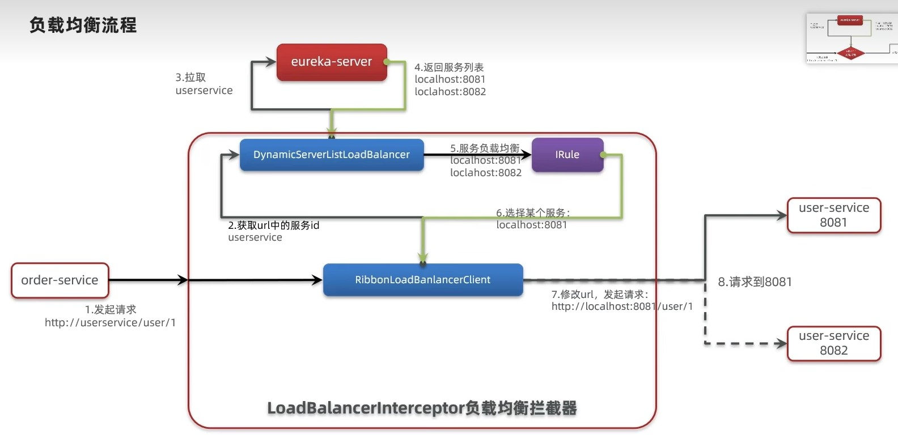

#### 负载均衡策略

负载均衡是通过一个叫IRule的接口来实现的,每个子接口都代表一个规则

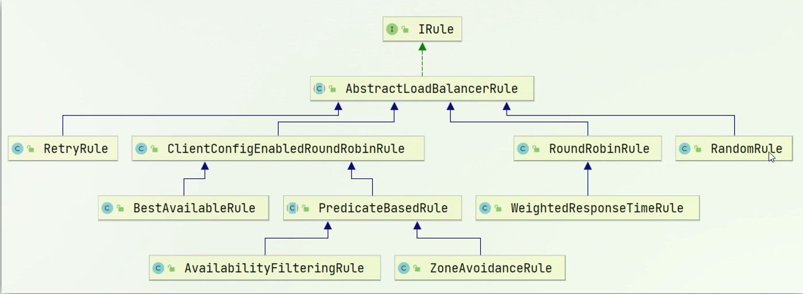

| 负载均衡规则类 | 规则描述      |
| :------------: | ------------- |
| RoundRobinRule | 轮询,默认策略 |
|   RandomRule   | 随机          |
|   RetryRule    | 轮询重试          |
|   WeightedResponseTimeRule    | 响应速度决定权重,权重越大则选中的概率越大|   
|BestAvailableRule|使用并发量最小|
|AvailabilityFilteringRule|先过滤不可用的,再使用并发量最小|
|ZoneAvoidanceRule|以区域可用的服务器为基础进行服务器选择.使用Zone对服务器进行分类.Zone可理解为一个机房.而后在对Zone进行轮询|

#### 负载均衡定义

1. 代码方式

   ```java
   @Bean
   public Irule 负载均衡规则类(){
       return new 负载均衡规则类();
   }
   ```

   服务使用此方法定义负载均衡策略,在该服务下调用的所有服务都是基于此策略进行负载均衡

2. 配置文件

   ```properties
   被调用的服务名.ribbon.NFLoadBalancerRuleClassName = com.netflix.loadbalancer.负载均衡规则类
   ```

   使用此方法,服务之间是一对一的负载均衡策略

#### 饥饿加载

Ribbon默认采用的是懒加载,即第一次访问才会去创建DynamicServiceListLoadBalancer,请求时间会很长,而饥饿加载会在服务启动时创建,从而降低第一期请求时间

```properties
ribbon.eureka.enabled=true
ribbon.eager-load.clients=xxservice,xxservice
```

如果第一次访问还是慢,可能是springboot的DispathService也是懒加载,这些也要配

## Nacos注册中心

Nacos是阿里巴巴开发的一个注册中心管理模块,现在是springCloud的一个组件,它的功能比Eureka更丰富,在国内更受欢迎

### 搭建注册中心

在nacos.io网站上去访问github,然后下载最新版,有win和liunx版本,根据自己选择下载

打开nacos后,可在http://192.168.18.1:8848/nacos/index.html中查看

在pom文件的dependencyManagement里,也就是spring-cloud-dependencies下面添加spring-cloud-alibaba依赖管理

```xml
<dependency>
    <groupId>com.alibaba.cloud</groupId>
    <artifactId>spring-cloud-alibaba-dependencies</artifactId>
    <version>2.2.5.RELEASE</version>
    <type>pom</type>
    <scope>import</scope>
</dependency>
```

然后添加依赖nacos依赖,若有其他注册中心依赖,需要把其他注册中心注释掉

```xml
<dependency>
    <groupId>com.alibaba.cloud</groupId>
    <artifactId>spring-cloud-starter-alibaba-nacos-discovery</artifactId>
</dependency>
```

### 服务注册或发现

```properties
# 应用名称
spring.application.name=user-service
server.port=8081
#nacos地址信息,默认localhost:8848
spring.cloud.nacos.server-addr=localhost:8848
```

### 多级存储模型(集群)

在实际应用中,不同的服务是在不同的地区服务器执行的,这个时候可以对不同的服务进行集群管理

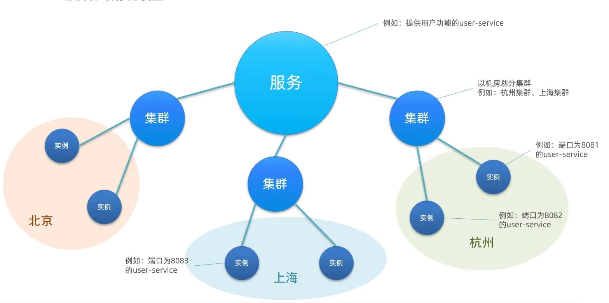

在配置文件中添加集群名称即可在nacos管理中心查看

```properties
#配置集群
spring.cloud.nacos.discovery.cluster-name= FZ
```

### 负载均衡策略(eureka基础上附加)

| 负载均衡规则类 | 规则描述             |
| :------------: | -------------------- |
|   NacosRule    | 优先随机访问相同集群 |

### 负载均衡定义

和Eureka负载均衡定义相同,不过如果使用NacosRule,它的位置和其他负载均衡规则类不同

```properties
被调用的服务名.ribbon.NFLoadBalancerRuleClassName = com.alibaba.cloud.nacos.ribbon.NacosRule
```

负载均衡权重

NacosRule虽然是随机策略,但也有权重,可以在nacos管理中心设置权重

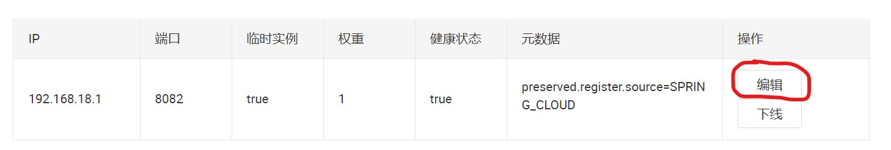

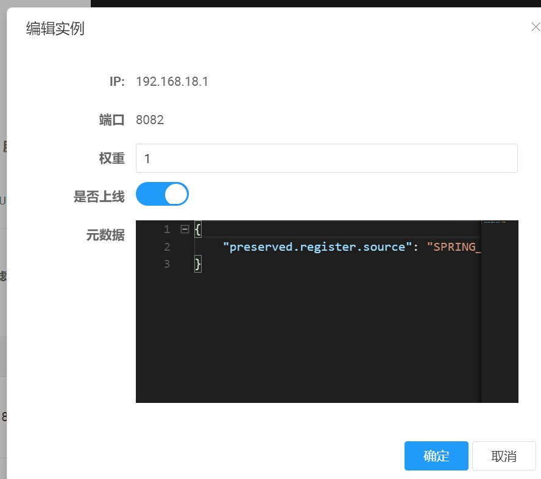

设置权重几点好处:

1. 性能差的服务器权重低,并发量也就会低
2. 若服务器需要更新,可以先将部分服务权重调0,更新好后再上调一点,放客户进来测试,最后调整正常,更新其他服务

### 环境隔离

在实际开发中,我们需要将项目分为开发、测试和上线环境,不同环境的服务是不能互相访问的,这就需要使用环境隔离

首先需要先创建Namespce命名空间

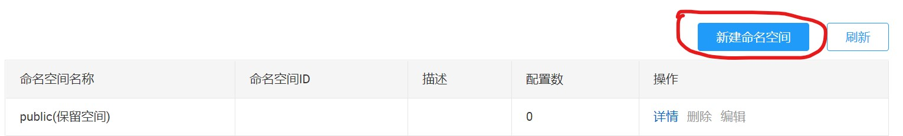

然后在配置文件中设置对应的命名空间id

```properties
spring.cloud.nacos.discovery.namespace=命名空间id
```

### 注册中心Nacos和Eureka的区别

1. Nacos会将服务分为零时实例和非零时实例

   零时示例和Eureka的服务一样,采用心跳检测,每隔30s查看服务提供者是否宕机.

   非零时示例只用当需要想服务提供者请求服务时,才询问是否宕机,若宕机则等待,和zookeeper方式一样

   零时和非临时示例配置

   ```properties
   spring.cloud.nacos.discovery.ephemeral=true
   ```

2. Nacos和Eureka的服务一样,定时获取到对应的服务ip后,会将ip缓存,但是Nacos多了一个功能就是当心跳检测发现其宕机后,会主动告诉消费者,让ip缓存清除


## Nacos配置管理服务

在实际开发中,若项目由多个服务,那么对各服务的配置一个个管理就显得麻烦,且配置完成后要重启,带来不必要损失,这时候我们就需要热更新配置

Nacos提供了一种配置管理服务,各服务读取配置管理服务,获取对应的配置

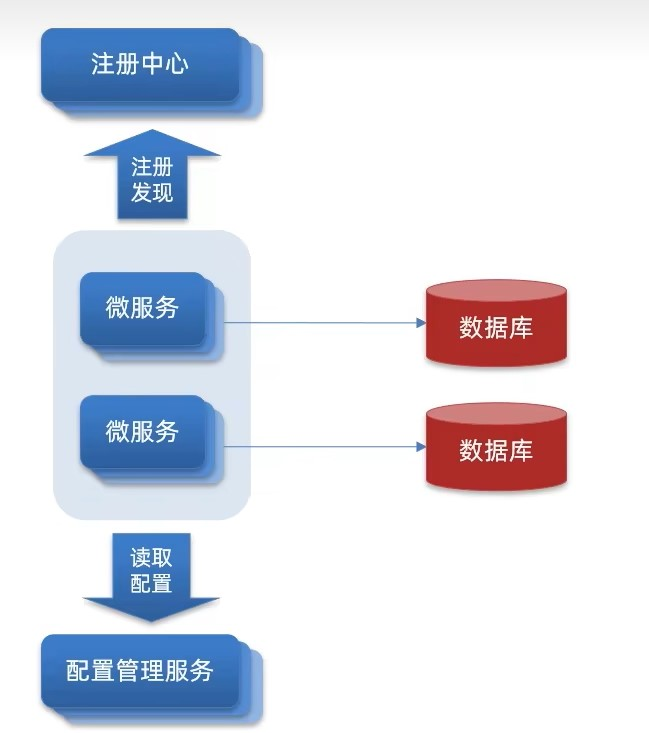

但是在实际开发中,为了节约成本,我们会把注册中心服务和配置管理服务放在一个服务里

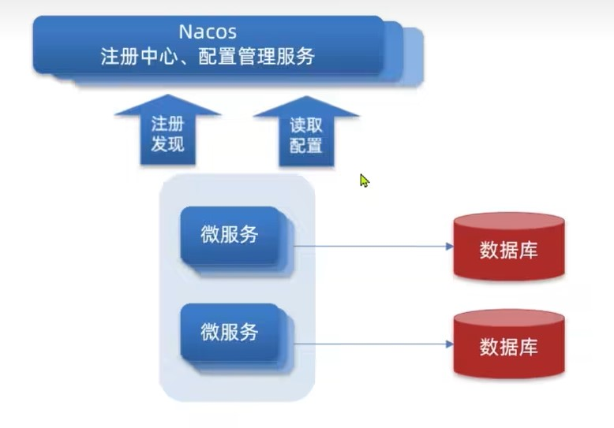

### 创建配置

在Nacos管理页中添加配置

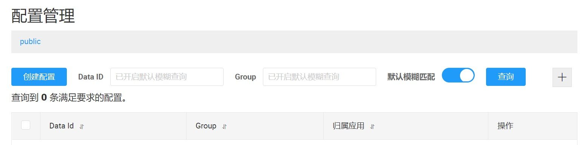

在设置配置ID时,有一个约定成俗的命名,服务名称-开发环境.xxx

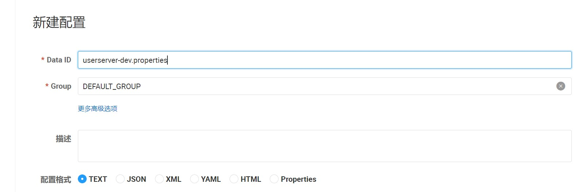

### 获取配置信息

引入Nacos配置管理依赖

```properties
<dependency>
    <groupId>com.alibaba.cloud</groupId>
    <artifactId>spring-cloud-starter-alibaba-nacos-config</artifactId>
</dependency>
```

然后再bootstrap.properties/yaml中写固定配置

```properties
# 应用名称
spring.application.name=服务名称
# 开发环境
spring.profiles.active=开发环境
# 配置文件类型
spring.cloud.nacos.config.file-extension=服务后最
# nacos ip和地址
spring.cloud.nacos.server-addr=nacosIp:端口
# 应用服务 WEB 访问端口
server.port=服务端口
```

这样,以后的所有配置都可以在nacos配置管理中心写,不用在application.properties/yaml中写了

但是实际开发中,我们一般把可能会需要改变的写在nacos中,固定不变的可以写在Bootstrap或application里

### 配置热更新

配置热更新方式有两种

1. 基于注解@RefreshScope

   ​	在controller中添加,并使用@value注入

   ```java
   @RestController
   @RefreshScope
   public class xxController{
       @value("${配置前缀.配置属性}")
       private String 对象
   }
   ```

2. 通过@ConfigurationProperties

   我们可以创建一个类,在类里面添加一个属性,然后把配置的值注入进属性中

   ```java
   @Component
   @Data
   @ConfigurationProperties("配置前缀")
   public class 自定义类{
       private String 配置属性
   }
   ```
	使用时我们仅需get数据即可
   
   ``` java
   @Autowrite
   private 自定义类 对象
   
   public void method(){
       对象.get属性
   }
   ```
   

### 多环境共享

在微服务启动时,nacos会读取多个服务

+ [spring.application.name]-[spring.profiles.active].[spring.cloud.nacos.config.file-extension],例如userservice-dev.properties
+ [spring.application.name].[spring.cloud.nacos.config.file-extension],例如userservice.properties

因此,无论环境怎么变化,[spring.application.name].[spring.cloud.nacos.config.file-extension]一定会被加载,可以把共用的配置写在这个文件

需要注意的是,多环境配置有优先级,若属性相同,以优先级高的为准

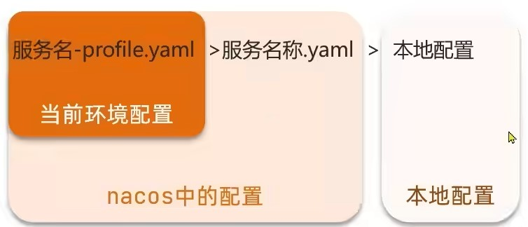

### Nacos集群

企业使用的时候,Nacos不可能在一个服务器里,因此需要配置集群

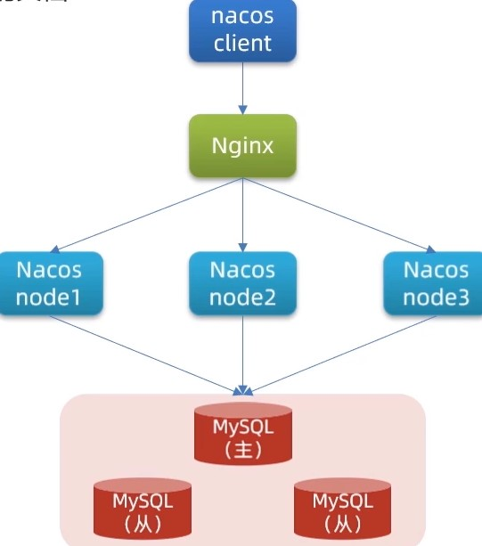

1. 搭建Nacos数据库,用来存储配置和账户等信息

2. 配置Nacos,修改端口,数据库信息等等

   在conf文件里将cluster.conf.example重命名为cluster.conf,并修改里面的值

   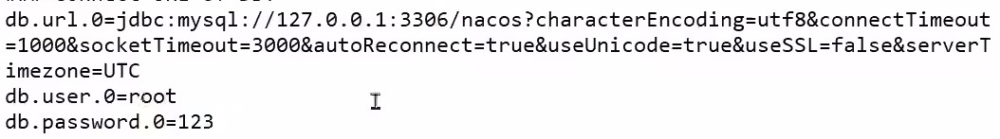

3. 直接启动Nacos,用命令startup.cmd就是集群启动

4. 配置nignx.conf

   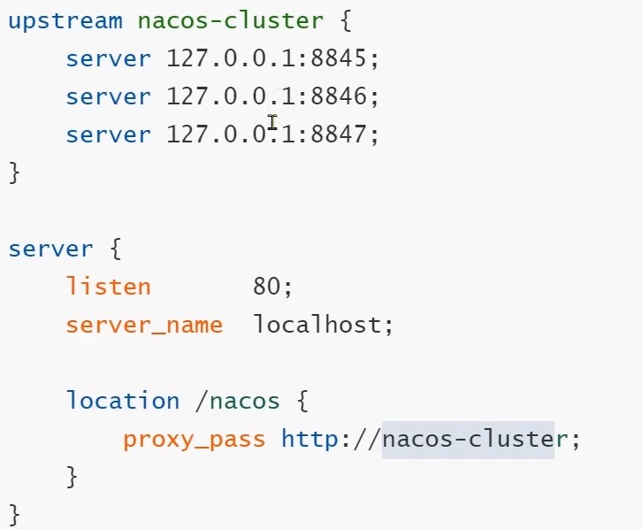

	

## Gateway网关

网关是一个服务器里的不同服务的负载均衡,流量监控的管理中心

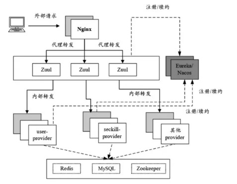

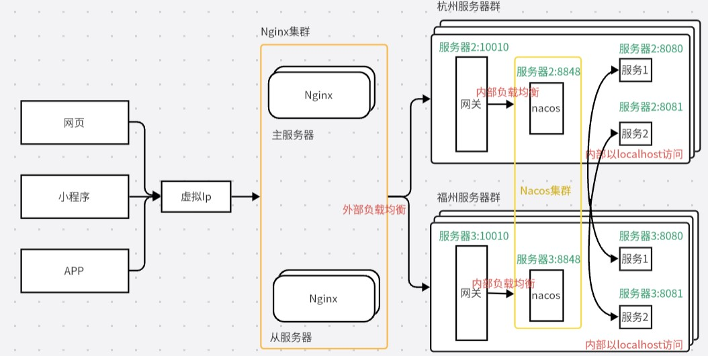

比较老的网关内部转发是Zuul,而本次学习使用最新的网关技术Gateway

### 安装

创建一个Model工程,导入依赖

```xml
<dependency>
    <groupId>org.springframework.cloud</groupId>
    <artifactId>spring-cloud-starter-gateway</artifactId>
</dependency>
<dependency>
            <groupId>org.springframework.boot</groupId>
            <artifactId>spring-boot-starter-webflux</artifactId>
        </dependency>
```

这里安装有一个注意事项,gateway和springWeb有冲突,若父工程由springWeb,需要重写springWeb为test

```xml
<dependency>
    <groupId>org.springframework.boot</groupId>
    <artifactId>spring-boot-starter-web</artifactId>
    <scope>test</scope> <!-- 特殊处理，不引入父类lib -->
</dependency>
```

### 配置

```yaml
server:
  port: 10010
spring:
  application:
    name: gateway
  cloud:
    nacos:
      config:
        server-addr: localhost:8848
    gateway:
      routes:
        - id: user_service #唯一id
          uri: lb://userservice #ip地址,也可以直接写url
          predicates:
            - Path=/xxx/** #接口位置
          filters:
          	- Path=/xxx/** #路由过滤,请求处理
```

或

```properties
# 应用服务 WEB 访问端口
server.port=10010
# 应用名称
spring.application.name= gateway
# nacos ip和地址
spring.cloud.nacos.server-addr=localhost:8848
#路由的id，保持唯一即可
spring.cloud.gateway.routes[0].id = userservice
#提供服务的路由地址
spring.cloud.gateway.routes[0].uri=lb://userservice
#断言，路径相匹配的进行路由
spring.cloud.gateway.routes[0].predicates[0]=Path=/user/**
```

uri部分直接写url就等于使用了微服务网关
uri部分写lb://nacos注册Ip,有负载均衡效果,等于使用了api网关

### 断言类型

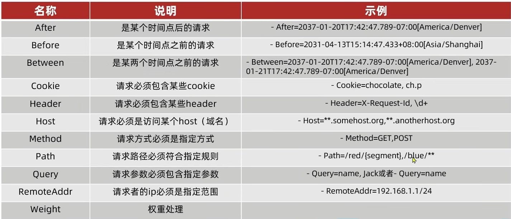

### 过滤器

过滤器可以对请求和响应做处理

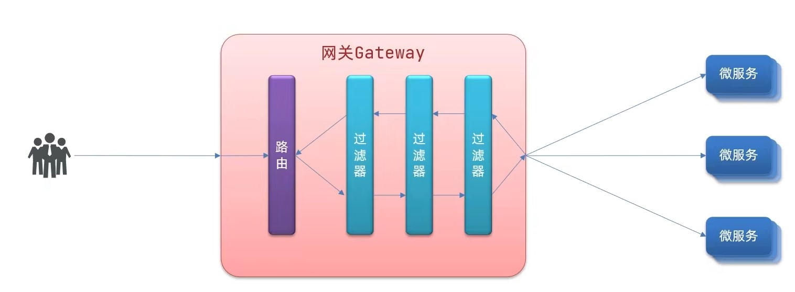

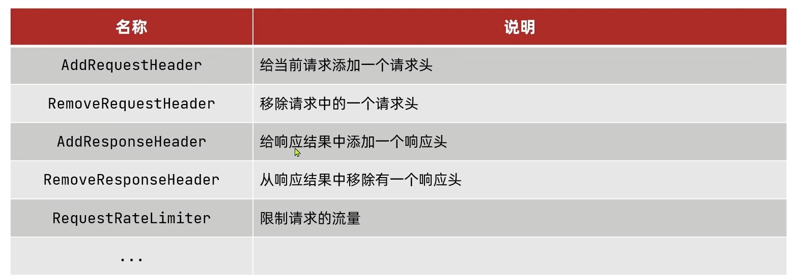

```properties
#路由过滤器,作用当前路由
spring.cloud.gateway.routes[0].filters[0]=AddRequestHeader=键,值
#默认过滤器,作用所有路由
spring.cloud.gateway.default-filters=AddRequestHeader=键,值
```

### 自定义全局过滤器

1. 实现GlobalFilter
2. 添加@Order注解或实现Ordered接口
3. 编写处理逻辑

```java
@Component
@Order(int类型filter顺序)
public class demoFilter implements GlobalFilter {
    @Override
    public Mono<Void> filter(ServerWebExchange exchange, GatewayFilterChain chain) {

//        //放行
//        return chain.filter(exchange);
        
        //设置状态码并拦截
        exchange.getResponse().setStatusCode(HttpStatus.MULTI_STATUS);
        return exchange.getResponse().setComplete();
    }
}
```

### 过滤器顺序

+ 每个过滤器都必须指定一个order值,order值越小,优先级越高,执行顺序越靠前
+ GlobalFilter通过实现@Order或Ordered接口来指定order值,具体值由我们自己决定
+ 路由过滤器和默认过滤器的order由spring决定,默认按声明顺序从1开始
+ 当order值一样时,默认过滤器>路由过滤器>全局自定义过滤器

### 跨域

``` yaml
spring:
  cloud:
    gateway:
      # 。。。
      globalcors: # 全局的跨域处理
        add-to-simple-url-handler-mapping: true # 解决options请求被拦截问题
        corsConfigurations:
          '[/**]':
            allowedOrigins: # 允许哪些网站的跨域请求 
              - "http://localhost:8090"
            allowedMethods: # 允许的跨域ajax的请求方式
              - "GET"
              - "POST"
              - "DELETE"
              - "PUT"
              - "OPTIONS"
            allowedHeaders: "*" # 允许在请求中携带的头信息
            allowCredentials: true # 是否允许携带cookie
            maxAge: 360000 # 这次跨域检测的有效期

```

