# 介绍

分布式开发基于网络编程,网络编程主要使用netty进行开发,如果不想只是增删改查,而是开发自己的分布式架构,就需要使用netty

# NIO编程

NIO:非阻塞IO

## 三大组件-Channel

Channel:双向通道,即可输出也可输入.以前学的InputStream只能输入,OutputStream只能输出

Buffer:内存缓冲,暂存Channel的数据

常见的Channel有:

+ FileChannel
+ DatagramChannel
+ SocketChannel
+ ServerSocketChannel

### FileChannel模式

FileChannel只能在阻塞模式下使用,且不能直接使用FileInputStream、FileOutputStream、RandomAccessFile来获取Channel,它们都有getChannel方法

+ FileInputSteam获取的channel只能读
+ FileOutputSteam获取的channel只能写
+ RandomAccessFile根据读写模式决定读写

### FileChannel常见方法

```java
//关闭
channel.close();
//写入
channel.write(buf);
//传输,两个channel传输数据,效率高,会利用操作系统底层优化
channel1.transferTo(int 起始,int 末位,channel2)
```


## 三大组件-Buffer

常见的Buffer:

+ ByteBufer
  + MappedByteBuffer
  + DirectByteBuffer
  + HeapByteBuffter
+ ShortBuffer
+ IntBuffer
+ LongBuffer
+ FloatBuffer
+ DoubleBuffter
+ CharBuffter

### ByteBuffter结构

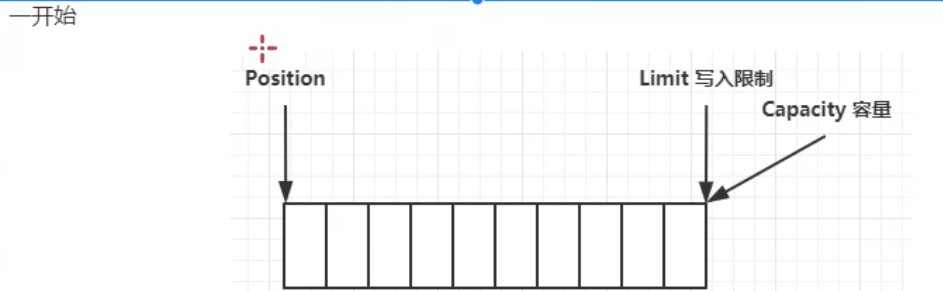

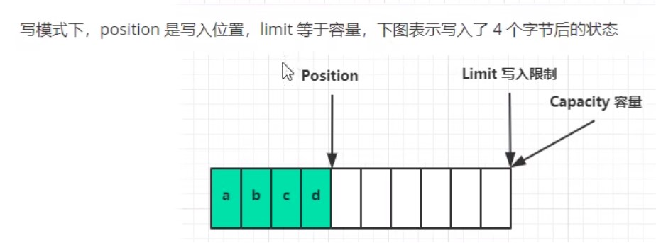

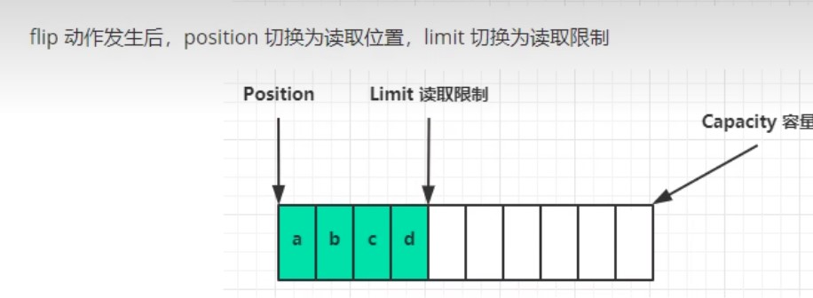

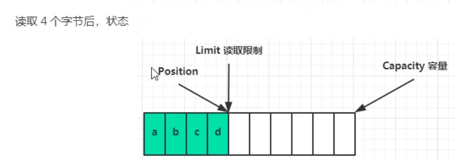

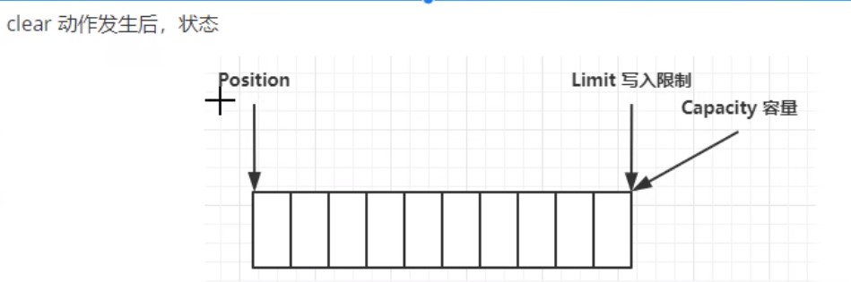

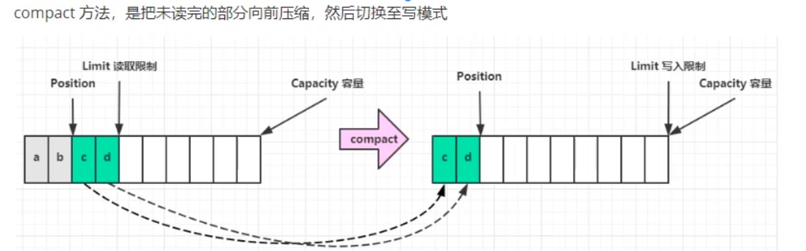

### ByteBuffter常见方法

```java
//分配空间,父类HeapBuffter,使用堆内存,读写慢,受GC(垃圾回收)影响
ByteBuffter buf = ByteBuffter.allocate(int);
//分配空间,父类DirectBuffter,使用系统内存,分配慢
ByteBuffter buf = ByteBuffter.allocate(int);
//获取长度
buf.capacity();
```

```java
//切换模式,读/写
buf.flip(); 
```

```java
//存入Buffter的数据,写入数据,有两种方法
//1.调用channel的read方法
int readBytes = channel.read(buf);
//2.调用Buffter自身的put方法
buf.put(byte(127));
```

```java
//取出Buffter的数据,读取数据,有两种方法
//1.调用channel的write方法
int writeBytes = channel.write(buf);
//2.调用Buffter自身的get方法
byte b = buf.get();
byte b = buf.get(byte[])//将读取的数据存入byte数组
//2.1 get方法会让指针向后走,如果不希望指针移动可以:
buf.rewind();//索引归0
byte b = buf.get(int 索引);//获取具体索引
//2.2 和rewind类似的方法有mark和reset
buf.mark();//标记当前索引
buf.reset;//索引回到标记
```

```java
//字符串转buffter,有三种方法
//1.最原始方法,字符串转字节数组,再存入buffter
ByteBuffter buf = ByteBuffter.put("最原始方法".getBytes());
//2.Charset指定编码格式方法,自动切换读模式
ByteBuffter buf = StandardCharsets.UTF_8.encode("转码方式");
//3.直接转化方式,自动切换读模式
ByteBuffter buf = ByteBuffter.wrap("直接转化".getBytes())
```

```java
//buffter转字符串
String str = StandardCharsets.UTF_8.decode(buffter).toString;
```


## 三大组件-Selector

传统的聊天通讯架构是使用多线程:

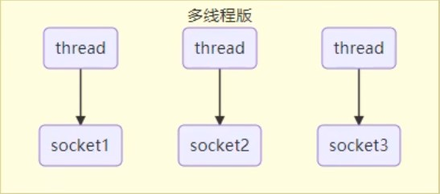

多线程的缺点:

+ 内存占用高
+ 线程上下文切换成本高
+ 只适合连接数少的场景

有一种优化分案就是使用线程池:

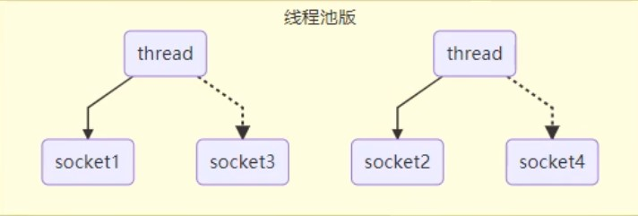

线程池的缺点:

+ 阻塞模式下,只能处理一个socket
+ 仅适合短连接场景

而selector的思路就是一个线程管理多个channel,获取channel发生的事件,非阻塞模式下,不会让线程吊死在一个channel上,适合连接数多,但流量低的场景

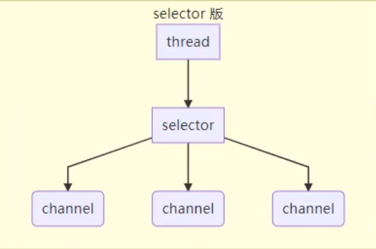

调用selector的select()会阻塞到channel直到发生了读写就绪事件,这些事件发生,select方法就会返回这些事件交给thread来处理

## 半包和黏包

假设我们要发送一条数据,数据之间以\n分隔:

```tex
hello,world\n
i'm zhangsan\n
how are you?\n
```

+ 半包:没有按照分隔符分隔:

  ```tex
  hello,world\n
  i'm zhang
  san\nhow are you?\n
  ```

+ 黏包:分隔符没有分隔

  ```tex
  hello,world\ni'm zhangsan\n
  how are you?\n
  ```

## 文件编程

### Path

jdk7引入了Path和Paths类

+ Path用来表示文件路径
+ Paths是工具类,用来获取Path实例

```java
Path source = Paths.get("路径");
Path source = Paths.get("路径1","路径2");//路径1+路径2
```

### Files

```java
// 检查文件是否存在
Files.exists(Path);
// 创建一级目录
Files.createDirectory(Path);
// 创建多级目录
Files.createDirectories(Path);
// 拷贝文件,若文件已存在会报错
Files.copy(Path source,Path target);
// 拷贝并覆盖文件
Files.copy(Path source,Path target,StandardCopyOption.REPLACE_EXISTING);
// 移动文件
Files.move(Path source,Path target);
// 删除文件或目录
Files.delete(Path source,Path target);
// 遍历文件夹或目录
Files.walkFileTree(Path path,new SimpleFileVistor<Path>(){
    @Override
    public FileVisitResult preVisitDirectory(Path dir,BasicFileAttributes attrs) throws IOException{
        // 遍历目录执行的逻辑
        System.out.printlb("====>"+dir);
        return super.preVisitDirectory(dir,attrs);
    }
    @Override
    public FileVisitResult visitFile(Path file,BasicFileAttributes attrs) throws IOException{
        // 遍历文件执行的逻辑
        System.out.printlb("====>"+file);
        return super.visitFile(file,attrs);
    }
});
// 遍历目录简化
Files.walk(Path path).forEach(path->{
    try{
       if(Files.isDirectory(path)){
           // 遍历目录执行的逻辑
       }
       if(Files.isRegularFile(path)){
           // 遍历文件执行的逻辑
       }
    }
});
   
```

## 网络编程

### 阻塞vs非阻塞

+ 阻塞模式下,没有建立连接,程序就会暂停,直到连接成功
+ 非阻塞模式下,没有建立连接,返回null

```java
ByteBuffter buf = ByteBUffter.allocate(16);
//创建服务器
ServerSocketChannel ssc = ServerSocketChannel.open();
ssc.configureBlocking(false);//ssc开启非阻塞
ssc.bind(new InetSocketAddress(int port));//绑定监听端口
List<SocketChannel> channels = new ArrayList<>();//用来接收获取的数据
while(true){
    //阻塞模式下,会在执行accept()后等待连接建立再往下执行
    //非阻塞模式下,没有建立连接accept()会返回Null
    //网络编程通常使用非阻塞,若x秒后无建立连接则跳出循环
    SocketChannel sc = ssc.accept();//建立连接
    if(ssc !=null){
        channels.add(sc);
        sc.configureBlocking(false);//sc开启非阻塞
    }
    for(SocketChannel channel : channels){
        //阻塞模式下,会在执行read()方法后,channel有数据再往下执行
        //非阻塞模式下,channel没有数据会返回0
        channel.read(buf);
        buf.flip();
        String msg = StandardCharsets.UTF_8.decode(buf).toString;
        System.out.println(msg);
        buf.clear();
    }
}
```

### 多路复用

非阻塞模式下,需要一个线程反复监听是否建立连接,这会浪费线程资源
使用selector监听,当有建立连接时再分配线程去做,无连接时线程休息

selector能监听的事件有:

+ accept:建立连接时触发
+ connect:连接客户端时触发
+ read:可读事件
+ write:可写事件

```java
//1.创建selector,管理多个channel
Selector selector  = Selector.open();
ServerSocketChannel ssc = ServerSocketChannel.open();
ssc.configureBlocking(false);//ssc开启非阻塞

//2.建立selector和channel联系
Selector sscKey = ssc.register(selector,0,null);
sscKey.interesOps(SelectionKey.OP_ACCEPT);//监听accept事件

ssc.bind(new InetSocketAddress(int port));//绑定监听端口
while(true){
    // 3.监听的事件触发执行,否则线程堵塞
    selector.select();
    // 4.处理监听的事件
    Iterator iter = selector().selectedKeys().iterator();
    
    while(iter.hasNext()){
        SelectionKey key = iter.next();
        //5.区分事件
        if(key.isAcceptable){//如果是accept事件
            ServerSocketChannell ssc = (ServerSocketChannel)key.channel();//获取触发事件的channel
            //处理事件,若事件不处理,则会一直处于不堵塞状态,也可以使用key.cancel()取消处理事件,返回堵塞状态
        	SocketChannel sc = ssc.accept();
            sc.configureBlocking(false);//sc开启非阻塞
            //6.把read事件也注册
            ByteBuffter buf = ByteBUffter.allocate(16);
            //可在注册时给key绑定buffter,也可以key.attach(buf)绑定,不需要buffter时,也可以key.attach(null)清空缓存
			Selector scKey = sc.register(selector,0,buf);
            //若要加入新事件而不想覆盖原有事件可scKey.interestOps()+SelectionKey.OP_XXX
            scKey.interesOps(SelectionKey.OP_READ);//监听read事件
        }else if(key.isReadable){//如果是read事件
            try{
                SocketChannel sc = (SocketChannel)key.channel();//获取触发事件的channel
            	ByteBuffter buf = (ByteBuffter)key.attachment();
            	int read = sc.read(buf);
                if(read == -1){
                    //服务器正常断开,取消事件
                    key.cancel();
                }else{
                    buf.flip();
        			String msg = StandardCharsets.UTF_8.decode(buf).toString;
        			System.out.println(msg);
                }
            }catch(IOException e){
                //服务器异常断开,取消事件
                e.printStackTrace();
                //remove删除selectedKeys里的事件指针
                //cancel取消selectedKeys里的事件行为
                key.cancel();
            }
        }
        //7.处理完事件,移除key
        iter.remove();
    }
}
```

被监听的事件发生,就会被加入selectedKeys,处理完事件后需要手动remove删除

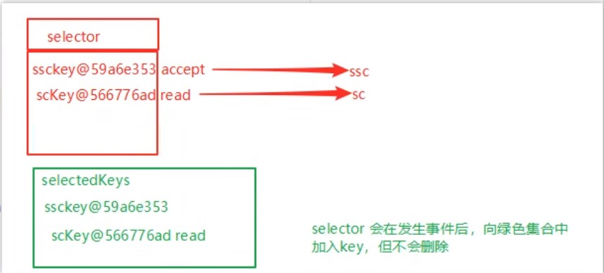

### 处理消息边界问题

当客户端发送的数据过大,需要动态的分配bytebuffter大小

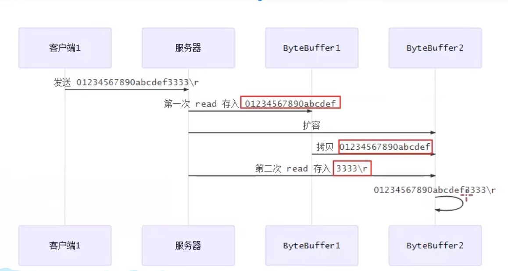

### stream vs channel

+ stream不会自动缓冲数据,channel会利用系统缓冲区(更底层)
+ stream只支持堵塞api,channel支持堵塞和非堵塞api,网络channel还支持多路复用
+ 二者都可以读写

# Netty入门

## 介绍

netty是一个基于事件驱动的网络应用框架,用于快速开发可维护、高性能的网络服务器和客户端

以下框架都使用了Netty,因为它们有网络通信需求

+ Casscandra - nosql 数据库
+ Spark - 大数据分布式计算框架
+ Hadoop - 大数据分布式存储框架
+ RocketMQ - 开源消息队列
+ ElasticSearch - 搜索引擎
+ gRPC - rpc框架
+ Dubbo - rpc框架
+ Spring 5.x - flux api 完全抛弃了tomcat,使用netty作为服务器
+ zookeeper - 分布式协调框架

### 优势

+ Netty vs NIO
  + NIO工作量大,bug多
  + Netty解决TCP传输问题,如粘包、半包
  + epoll空轮询导致CPU100%
  + 对API进行增强,使之更易用

## 安装

```xml
<dependency>
    <group>io.netty</group>
    <atrifactId>netty-all</atrifactId>
    <version>4.1.39.Final</version>
</dependency>
```

## 示例

### 服务端

```java
// 1. 启动器,负责组装netty组件,启动服务器
new ServerBootstrap()
    //2. 选择eventloop,eventloop里含有线程和selector,内有accept处理器,当有连接建立时,调用ChannelInitalizer事件定义器内的事件
    .group(new NioEventLoopGroup())
    //3. 选择channel,NioServerSocketChannel通用与linux和windows
    .channel(NioServerSocketChannel.class)
    //4 组装事件定义器,当某事件发生时执行定义器内的操作
    .chilHandler(
    	//5.通道事件定义其初始化
		new ChannelInitializer<NioSocketChannel>(){
        //5.1新建通道时执行的事件定义器
        @Override
        protected void initChannel(NioSocketChannel ch) throws Execption{
            //6.添加具体事件
            ch.pipleline().addLast(new LoggingHandle(日志级别));//打印日志
            ch.pipeline().addLast(new StringDecoder);//将ByteBuf转为String
            ch.pipeline.addLast(new ChannelInboundHandlerAdapter(){//自定义事件
                @Override //读事件
                public void channelRead(ChannelHandlerContext cts,Object msg)
                    System,out.println(msg);
            })
        	}
            
        }
	)
    //7.监听客户端端口
    .bind(8080); 
```

### 客户端

```java
// 1. 启动器,负责组装netty组件,启动客户端
new Bootstrap()
    //2. 选择eventloop,eventloop里含有线程和selector
    .group(new NioEventLoopGroup())
    //3. 选择channel,NioServerSocketChannel通用与linux和windows
    .channel(NioSocketChannel.class)
    //4 组装事件定义器,当某事件发生时执行定义器内的操作
    .handler(
    	//5.通道事件定义其初始化
		new ChannelInitializer<NioSocketChannel>(){
        //5.1新建通道时执行的事件定义器
        @Override
        protected void initChannel(NioSocketChannel ch) throws Execption{
            //6.添加具体事件
            ch.pipeline().addLast(new StringEncode);//将String转为ByteBuf
        	}    
        }
	)
    //6.连接到服务器
    .connect(new InetSocketAddress("ip","port"))
    .sync()//堵塞线程,直到连接建立,不然没连上还浪费资源
    //7.向服务器发送数据
    .channel().writeAndFlush("hello,world"); 
    
    
```

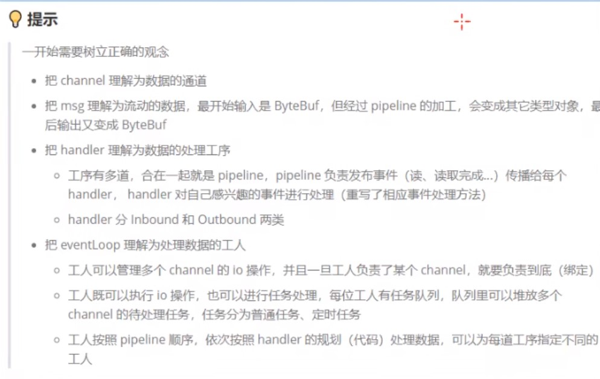

## EvenLoop

事件循环对象

EventLoop本质是一个单线程执行器(同时维护了一个Selector),里面有run方法处理Channel上源源不断的io事件

+ 继承j.u.c.SheduledExecutorService因此包含线程池所有方法
+ 继承netty自己的OrderEventExcutor
  + 提供boolean inEventLoop(Thread thread)方法判断线程池是否属于此EventLoop
  + 提供parent方法查看自己属于那个EventLoopGroup

事件循环组

EventLoopGroup是一组EventLoop,Channel一般会调用EventLoopGroup的register方法来绑定其中一个EventLoop,后续这个Channel上的io事件都由此EventLoop来处理(保证了io事件处理时的线程安全)

+ 继承netty自己的EventExecutorGroup
  + 实现了iterable接口提供遍历EventLoop的能力
  + 另有next方法获取下一个EventLoop

| 对象                  | 处理的事件                 |
| --------------------- | -------------------------- |
| NioEventLoopGroup     | io事件、普通事件、定时任务 |
| DefaultEventLoopGroup | 普通事件、定时任务         |

新建EventLoopGroup(int)不指定默认本机cpu线程数 * 2 NettyRuntime.availableProcessors() * 2

```java
EventLoopGroup group = new NioEventLoopGroup(2);
//执行普通任务
Feture feture = group.submit(()->{
    log.debug("ok");
});
//跳到下一个事件循环对象,跳完从头开始
group.next();
//执行定时任务
Feture feture = group.sheduleAtFixedRate(()->{
    log.debug("ok");
},int 延迟多久开始,int 每次间隔,TimeUnit.时间单位);
//执行io事件
new ServerBootstrap()
    .group(new NioEventLoopGroup())
```

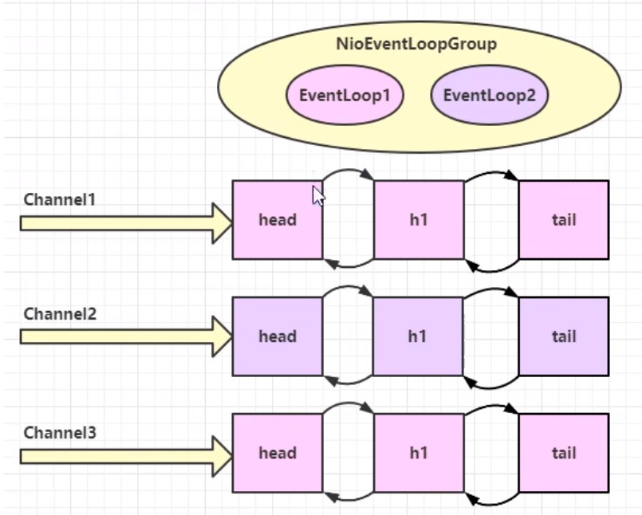

### 线程分工

由于EventLoop管理线程,我们可以设定某个EventLoop专门管理某些事件

+ 比如1个EventLoop专门管理连接(accept)事件,一般叫boss
+ 1个专门处理读写事件的(read/write),一般叫boss
+ 再比如若某个线程执行的很慢,可以专门交给其他线程处理,一般叫独立线程

```java
//独立线程
EventLoopGroup defaultGroup = new DefaultEventLoopGroup(1);
new ServerBootstrap()
        //boss只负责ServerSocketChannel上的accept事件,由于ServcerSocketChannel只有1个,所以他是单线程,worker负责socketChannel上的读写,每有1个新连接就会新建一个socketChannel,所以它是多线程,1个线程管理一个channel
    .group(new NioEventLoopGroup(),new NioEventLoopGroup())
    .channel(NioServerSocketChannel.class)
    .chilHandler(
		new ChannelInitializer<NioSocketChannel>(){
        @Override
        protected void initChannel(NioSocketChannel ch) throws Execption{
            //使用work里的线程
            ch.pipeline().addLast(new ChannelInboundHandlerAdapter(){
                @Override
                public void channelRead(ChannelHandlerContext ctx,Object msg)
                    ctx.fireChannelRead(msg);//把消息传给下一个handel(不受线程限制)
            });
            //使用独立线程
            ch.pipeline().addLast(defaultGroup,"handel名字",new ChannelInboundHandlerAdapter(){
                @Override
                public void channelRead(ChannelHandlerContext ctx,Object msg)
                    System,out.println(msg);
            });
        }
	)
    .bind(8080); 
```

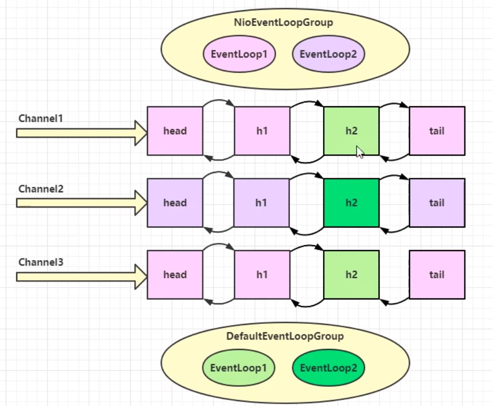

+ 线程分工可以提高吞吐量
+ 线程分工会增加线程响应时间

### 线程交换原理

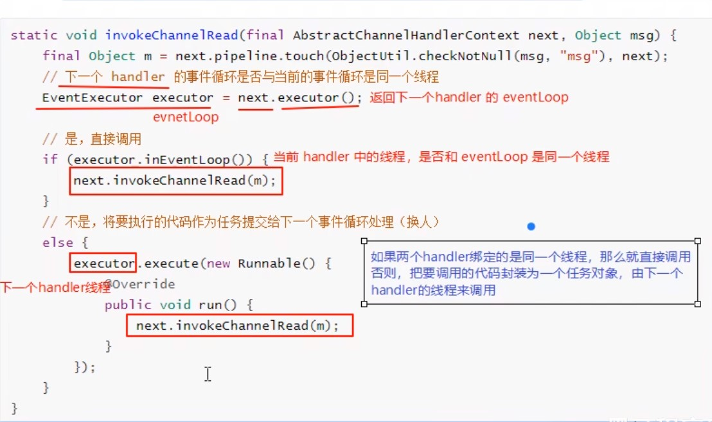

## Channel

主要方法

+ close() 关闭channel
+ closeFuture() 处理channel的关闭
  + sync方法作用是同步等待channel关闭
  + addListener方法是异步等待channel关闭
+ pipline()方法添加处理器
+ write()方法将数据写入
+ writeAndFlush()方法将数据写入并刷出

### sync堵塞线程

```java
//带有futre或者promise都是和异步方法配套出现的
ChannelFuture channelfuture = new Bootstrap()
    .group(new NioEventLoopGroup())
    .channel(NioSocketChannel.class)
    //connect是异步非堵塞的,真找执行连接的是nio
    .connect(new InetSocketAddress("ip","port"));

Channel channel = channelfuture.channel();
//堵塞线程,直到异步线程完成后才唤醒,居然原理看下图
channel.sync()
    .writeAndFlush("hello,world");
//channel.writeAndFlush("hello,world");  若这样写,可能channel,由于connect是异步非堵塞,可能此channel还没建立好连接,无法发送数据 
```

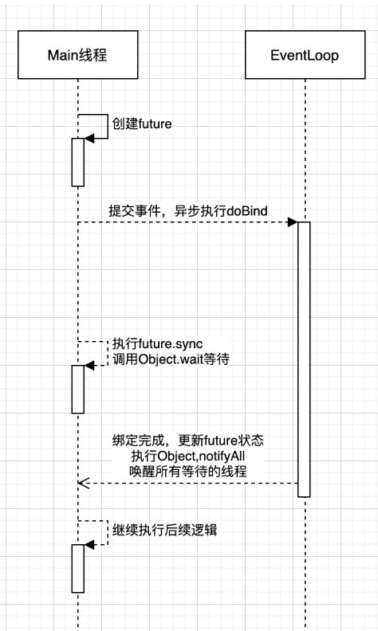

### addLister异步回调

异步线程结束后,会执行回调函数addLister方法,默认此方法里触发notifyAll唤醒所有等待线程,可以重写此方法,从而不需要用sync

```java
channelfuture.addListern(new ChannelFutureListenner(){
	@Override
    public void operationComplete(Channel future) throws Exception {
        Channel channel = channelfuture.channel();
        channel.writeAndFlush("hello,world");
    }
});
```

### close关闭的异步回调

我们希望在结束通信后在执行一些代码

```java
NioEventLoopGroup group = new NioEventLoopGroup();
//new Bootstrap()
//    .group(group)
// ...
new Thread(()->{
    Scanner scanner = new Scanner(System.in);
    while(thre){
        String line  = scanner.nextLine();
        if ("q".equals(line)){
            channel.close();
            //不能写在这,因为close是异步非堵塞的,可能关闭时间需要1s以上,会出现还没关闭就执行关闭后的代码 
            //log.debug("通信结束后执行的代码");
        }
    }
});
//不能写在这,因为关闭是用另一个线程去异步检测关闭
//log.debug("通信结束后执行的代码");

//正确做法是获取closeFuture
ChannelFuture closefuture = channelfuture.closeFuture();
//方法1,异步
closefuture.sync();
log.debug("通信结束后执行的代码");
//方法2,同步
channelFuture.addListener(future -> {
    log.debug("通信结束后执行的代码");
    //优雅关闭EventLoopGroup,优雅指等待group里的数据该发的发完,该收的收完再关闭
    group.shoutdownGracefully();       
});
```

### 回调事件

```java
pipeline.addLast(new ChannelInboundHandlerAdapter(){
    @Override
    public void channelActive(ChannelHandlerContext ctx) throws Exception {
        System.out.println("异步完成后执行回调");
    }
});
```


## Future & Promise

future可以理解我一种背包/容器,用来存储线程运行结果,当线程运行结束后,会将结果放入future中,也可以在线程运行中获取

Netty的future和jdk的future同名但它们是两个接口,netty的future继承jdk的future,promise继承netty的future并进行拓展

+ jdk future只能同步等待任务结束/成功/失败才能得到结果
+ netty future可以同步等待任务结束得到结果,也可以异步等待异步结束
+ netty promise不仅有netty future的功能,而且脱离了任务独立存在,只作为两个线程间传递结果的容器

| 功能/名称    | jdk Future                    | netty Future                                                 | Promise  |
| ------------ | ----------------------------- | ------------------------------------------------------------ | -------- |
| cancel       | 取消任务                      |                                                              |          |
| isCanceled   | 任务是否取消                  |                                                              |          |
| isDone       | 任务是否失败,不能区分成功失败 |                                                              |          |
| get          | 等待任务完成并获取结果        |                                                              |          |
| getNow       |                               | 获取任务结果,非阻塞,未完成返回null                           |          |
| await        |                               | 等待任务结束,如果任务结束,不会抛出异常,而是通过isSuccess判断 |          |
| sync         |                               | 等待任务结束,如果任务失败,抛出异常                           |          |
| isSucess     |                               | 判断任务是否成功                                             |          |
| cause        |                               | 获取失败信息,非阻塞,如果没有失败返回null                     |          |
| addLinstener |                               | 添加回调,异步接收结果                                        |          |
| setSucess    |                               |                                                              | 设置成功 |
| setFallure   |                               |                                                              | 设置失败 |

```java
//netty future使用
NioEventLoopGroup group = new NioEventLoopGroup();
EventLoop eventLoop = group.next();
//提交一个简单线程,并获取其容器
Future<Integer> future = eventLoop.submit(()-> {
    //等待1秒后在返回成功结果:70
    Thread.sleep(1000);
    return 70;
});
future.addListener(future2 -> {
    //获取结果
    System.out.println(future2.getNow());
});
```

## Handler & Pipeline

channelHandler用来处理Channel上的各种事件,分为入站和出站两种.所有的channelHandler被连成一串,就是pipline

+ 入站处理器在有数据进入channel时触发,通常是ChannelInboundHandlerAdaper,主要用来处理读取的数据
+ 出站处理器在有数据出channel时触发,通常是ChannelOutboundHandlerAdaper,主要用来处理写入的数据

pipline是一个双向链表,入站事件是正序触发,出战事件是倒序触发

```java
new ServerBootstrap()
    .group(new NioEventLoopGroup())
    .channel(NioServerSocketChannel.class)
    .childHandler(new ChannelInitializer<NioSocketChannel>(){
        @Override
        protected void initChannel(NioSocketChannel nioSocketChannel) throws Exception {
            //1.通过channel拿到pipeline
            ChannelPipeline pipeline = nioSocketChannel.pipeline();
            //2.添加入站事件 head -> h1 -> tail
            pipeline.addLast("h1",new ChannelInboundHandlerAdapter(){
                @Override
                public void channelRead(ChannelHandlerContext ctx, Object msg) throws Exception {
                    System.out.println("h1");
                    //唤醒下一个入站处理器,内部是fireChannelRead
                    super.channelRead(ctx, msg);
                }
            });
            //2.添加入站事件 head -> h1 -> h2 -> tail
            pipeline.addLast("h2",new ChannelInboundHandlerAdapter(){
                @Override
                public void channelRead(ChannelHandlerContext ctx, Object msg) throws Exception {
                    System.out.println("h2");
                    //触发出站事件
                    nioSocketChannel.writeAndFlush(ByteBufAllocator.DEFAULT.buffter.writeBytes("写入消息").getBytes());
                }
            });
            //2.添加出站事件 head -> h1 -> h2 -> h3 -> tail
            pipeline.addLast("h3",new ChannelOutboundHandlerAdapter(){
                @Override
                public void write(ChannelHandlerContext ctx, Object msg, ChannelPromise promise) throws Exception {
                    System.out.println("h3");
                    //唤醒下一个出站处理器
                    super.write(ctx, msg, promise);
                }
            });
            //2.添加出站事件 head -> h1 -> h2 -> h3 -> h4 -> tail
            pipeline.addLast("h4",new ChannelOutboundHandlerAdapter(){
                @Override
                public void write(ChannelHandlerContext ctx, Object msg, ChannelPromise promise) throws Exception {
                    System.out.println("h4");
                }
            });
        }
    });
```

打印出的结果是h1 h2 h4 h3

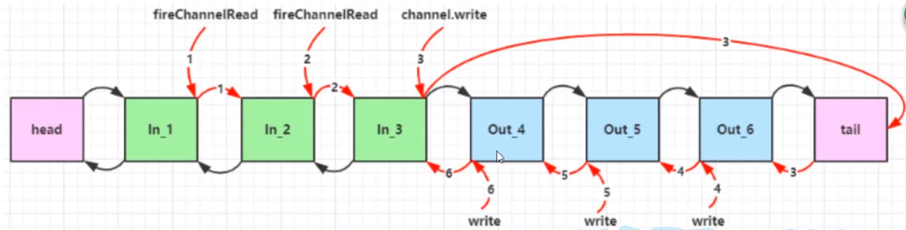

### 测试Handler

```java
ChannelInboundHandlerAdapter h1 = new ChannelInboundHandlerAdapter(){
    @Override
    public void channelRead(ChannelHandlerContext ctx, Object msg) throws Exception {
        System.out.println("h1");
        nioSocketChannel.writeAndFlush(".");
    }
});
ChannelOutboundHandlerAdapter h2 = new ChannelInboundHandlerAdapter(){
    @Override
    public void channelRead(ChannelHandlerContext ctx, Object msg) throws Exception {
        System.out.println("h2");
    }
}); 
EmbeddedChannel channel = new EmbeddedChannel(h1,h2);
channel.writeInbound(ByteBufAllocator.DEFAULT.buffter.writeBytes("写入消息").getBytes());//模拟入站
channel.writeOutbound(ByteBufAllocator.DEFAULT.buffter.writeBytes("写入消息").getBytes());//模拟出站
```

## ByteBuf

ByteBuf对比ByteBuffter

+ ByteBuf可以池化,放入ByteBuf池中重复利用,更节约内存
+ 读写指针分离,不用像ByteBuffter一样需要切换读写模式
+ 可以自动扩容
+ 链式调用
+ 有许多零拷贝方法

### 创建

ByteBuf和nio的ByteBuffter很相似,区别在于netty的ByteBuf不用指定大小,它会自动扩容

```java
//创建BytebUF
ByteBuf buf = new ByteBufAllocator.DEFAULT.buffter();
//一般用不上上面的方法,netty中可以用ChannelHandlerContext来创建
ctx.alloc().buffer();
```

### ByteBuf模式

```java
//创建基于堆内存的BytebUF
ByteBuf buf = new ByteBufAllocator.DEFAULT.heapBuffter(int);
//创建基于直接内存的BytebUF,默认就是直接内存
ByteBuf buf = new ByteBufAllocator.DEFAULT.buffter();
ByteBuf buf = new ByteBufAllocator.DEFAULT.directBuffter(int);
```

+ 直接内存创建和销毁代价高,但是其读写能力强,适合配合池化功能使用
+ 直接内存对GC(垃圾回收)压力小,不受JVM垃圾回收管理,但要手动释放

### 池化管理

类似线程池,ByteBuf创建和销毁比较慢,我们可以统一创建ByteBuf并重复利用和管理

+ 没有池化,每次创建代价都很昂贵,就算是堆内存,也会增加GC压力
+ 有池化,可以重复使用池里的ByteBuf,提升效率
+ 高并发时,池化更节约内存

### 组成

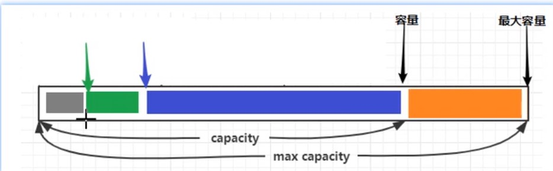

### 写入&读取

| 方法                                                     | 含义           | 备注     |
| -------------------------------------------------------- | -------------- | -------- |
| writeBoolean(boolean value)                              | 写入boolean值  |          |
| writeByte(int value)                                     | 写入byte值     |          |
| writeShort(int value)                                    | 写入short值    |          |
| writeInt(int value)                                      | 写入int值      | 大端写入 |
| writeIntLE(int value)                                    | 写入int值      | 小段写入 |
| writeLong(long value)                                    | 写入long值     |          |
| writeChart(int value)                                    | 写入chart值    |          |
| writeFloat(float value)                                  | 写入float值    |          |
| writeDouble(double value)                                | 写入double值   |          |
| writeBytes(ByteBuf src)                                  | 写入netty的buf |          |
| writeBytes(byte[] src)                                   | 写入byte[]     |          |
| writeCharSequence(CharSequence sequence,Charset charset) | 写入字符串     |          |
| readByte()                                               | 读取byte       |          |
| readInt()                                                | 读取int        |          |
| markReaderIndex()                                        | 标记           |          |
| resetReaderIndex()                                       | 从标记开始读取 |          |

### 自动扩容规则

+ 写入的数据没有超过512,则按16的整数倍扩容,比如写入15,就扩容16,写入17就扩容32
+ 写入的数据超过512,则按2^n扩容,比如写入512,则扩容1024

### 内存释放

netty中有堆外内存的ByteBuf实现,堆外内存最好用手动释放,而不是等GC回收

+ HeapByteBuf使用JVM内存,只需等待GC回收即可
+ DirectByteBuf使用直接内存,需要特殊方法回收
+ PooledByteBuf和它的子类使用池化机制,需要更复杂方法回收

Netty采用计数的方法来控制

+ 每个ByteBuf对象初始计数为1
+ 调用release方法计算减1,如果计数为0则ByteBuf被回收
+ 调用retain方法计数加1
+ 当计数为0时,底层内存会被回收,这时即使ByteBuf还在,其他方法也不能使用
+ 在pipline中,负责release的是head和tail
+ 在pipline中,若中途将ByteBuf转换为其他类型数据转递给下一个Handler,则需要在转换之前先手动release,因为转换后head/tail拿到的不是ByteBuf就不会release

### 零拷贝

| 方法                         | 功能            | 备注                      |
| ---------------------------- | --------------- | ------------------------- |
| slice(int 起始位置,int 长度) | 切分ByteBuf     | 切分本质不会产生新的内存  |
| duplicate()                  | 截取区别ByteBuf |                           |
| copy                         | 复杂ByteBuf     | 会产生新的内存来存ByteBuf |
| composite                    | 合并ByteBuf     | 本质不会产生新的内存      |

```java
//composite使用
ByteBuf buf1 = ByteBufAllocator.DEFAULT.buffter();
buf1.write(new Byte[]{1,2,3});
ByteBuf buf2 = ByteBufAllocator.DEFAULT.buffter();
buf2.write(new Byte[]{1,2,3});

CompositeByteBuf buffter = ByteBufAllocator.DEFAULT.compositeBuffter();
//bool指是否获取两个buf的写指针,默认false,建议ture
ByteBuf buf3 = buffter.addComponents(ture,buf1,buf2);

//也可以使用工具类Unpooled来合并(推荐)
ByteBuf buf3 = Unpooled.wrappedBuffter(buf1,buf2);
```


# Netty进阶

## 粘包和半包

粘包

+ 现象:发送abc def,接收abcdef
+ 原因
  + 应用层:接收方ByteBuf设置太大(Netty默认1024)
  + 滑动窗口:假设发送256bytes表示一个完整报文,由于接收方处理不及时且窗口大小足够大,这256bytes字节就会缓冲到接收方的滑动窗口中,当滑动窗口缓冲了多个保温就会粘包
  + Nagel算法:会造成粘包

半包

+ 现象:发送abcdef,接收abc def
+ 原因
  + 应用层:接收方ByteBuf小于实际发送数据量
  + 滑动窗口:假设接收方的滑动窗口只剩了128bytes,发送方的报文是256bytes,这时放不下了,只能先发送前128bytes,等待ack后才能发送剩余部分,这就造成了半包
  + MSS网卡限制:网卡有限制一次只能发送xx个bytes(一般限制为1500),超过后会将数据切分发送,就会照成半包

本质是因为TCP是流是协议,消息无边界

### 解决方案-短链接

客户端进行改造,一次就把数据发送完,发送完成后关闭所有连接

```java
try{
    ...
    buf.writeBytes(new byte[]{1,2,3});
    ctx.writeAndFlush(buf);
    ctx.channel().close();
}catch(InterruptedException e){
    boosGroup.shoutdownGracefully();
    workGroup.shoutdownGracefully();
}
```

短连接可以解决粘包问题,但不能解决半包问题

### 解决方案-定长解码器

客户端发送的数据长度固定,可以写一个函数,若长度不够补_,如发送abc,固定长度6,则实际发送abc___

接收端使用定长解码器

```java
//配置定长解码器
pipeline.addLast(new FixedLengthFrameDecoder(int 固定的长度))
```

定长解码器解决了粘包半包问题,但是造成了资源浪费

### 解决方案-行解码器

客户端发送的数据用分隔符分开

接收端使用行解码器

```java
//配置行解码器,超过最大长度未遇到分隔符则发送失败
//LineBasedFrameDecoder分隔符为/n
pipeline.addLast(new LineBasedFrameDecoder(int 最大长度));
//DelimiterBasedFrameDecoder自定义分隔符
ByteBuf delemiter= Unpooled.buffer();
delemiter.writeBytes(",".getBytes());
pipeline.addLast(new DelimiterBasedFrameDecoder(int 最大长度, delemiter));
delemiter.release();//释放资源             
```

### 解决方案-LTC解码器

LTC解码器根据协议规定获取内容长度,当发送的报文的内容不符合长度,则会等待直到符合为止

+ lengthFieldOffset:记录还有多少个字节才记录长度
+ lengthFieldLength:记录字段长度
+ lengthAdjustment:记录字段前面还有多少个字节才记录内容
+ initalBytesToStrip:剥离前面n个字节,只获取内容

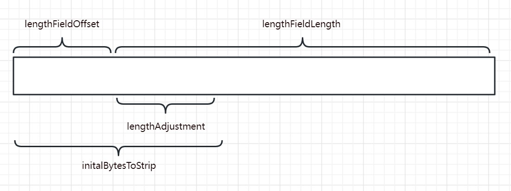

```java
//LTC会等待一条完整消息再去解析
pipeline.addLast(
    new LengthFieldBasedFrameDecoder(int 最大长度,lengthFieldOffset,lengthFieldLength,lengthAdjustment,initalBytesToStrip)
);
```

## 协议设计与解析

### redis协议

redis协议定义,

1. 在发送数据前先发送*n,n代表有几个指令
2. 在发送每一个指令前,需要先发送$n,n代表该指令长度
3. 在发送每一个指令后,需要用\n分隔

```tex
发送 set name zhangsan
*3\n
$3\n
set\n
$4\n
name\n
$8\n
zhangsan\n
```

### http协议

netty已经将http协议的编码解码器封装好了,直接调用即可

有两种写法

```java
//使用http服务端解码器
pipeline.addLast(new HttpServerCodec());
pipeline.addLast(new ChannelInboundHandlerAdapter(){
    @Override
    public void channelRead(ChannelHandlerContext ctx, Object msg) throws Exception {
        if (msg instanceof HttpRequest){
            //若消息为请求头(只含uri和请求头),执行命令
        }else if(msg instanceof HttpContent){
            //若消息为请求体,执行命令
        }
    }
});
```

```java
//使用http服务端解码器
pipeline.addLast(new HttpServerCodec());
//若消息为HttpRequest(只含uri和请求头)
pipeline.addLast(new SimpleChannelInboundHandler<HttpRequest>() {
    @Override
    protected void channelRead0(ChannelHandlerContext channelHandlerContext, HttpRequest httpRequest) throws Exception {
        //获取请求行
        httpRequest.uri();
        //响应
        DefaultFullHttpResponse response = 
            new DefaultFullHttpResponse(httpRequest.protocolVersion(), HttpResponseStatus.OK);
        byte[] bytes = "<h1>Hello, world<h1>".getBytes();
        //设置响应体长度
        response.headers().setInt(CONTENT_LENGTH,bytes.length);
        //设置响应体
        response.content().writeBytes(bytes);
    }
});
```

### 自定义协议

自定义协议需要考虑几个要素

+ 魔数:用来第一时间判断是否无效数据包
+ 版本号:可以支持协议的升级
+ 序列化算法:消息正文到底采用哪种序列化反序列化方式,如json、protobuf、hessian、jdk
+ 指令类型:判断业务是登录、注册、单聊、群聊
+ 请求序号:为了双工通信,提供异步能力
+ 正文长度
+ 消息正文

自定义消息编解码类(自定义编解码器必须和LTC一起使用,否则会出现粘包半包)

```java
public class MessageCodec extends ByteToMessageCodec<自定义实体类> {

    @Override
    protected void encode(ChannelHandlerContext channelHandlerContext, Object o, ByteBuf byteBuf) throws Exception {
        
    }

    @Override
    protected void decode(ChannelHandlerContext channelHandlerContext, ByteBuf byteBuf, List list) throws Exception {

    }
}

/**
 * 想要编解码器封装被重复使用,可以定义它为线程安全
 */
@ChannelHandler.Sharable
public class MessageCodecSgarable extends MessageToMessageCodec<ByteBuf,自定义类> {
    @Override
    protected void encode(ChannelHandlerContext channelHandlerContext, 自定义类 message, List<Object> list) throws Exception {
        
    }

    @Override
    protected void decode(ChannelHandlerContext channelHandlerContext, ByteBuf byteBuf, List<Object> list) throws Exception {

    }
}
```

这里写一个通用例子,后续可根据此例更改

```java
/**
 * 消息抽象父类,定义消息类型
 */
@Data
public abstract class Message implements Serializable {
    //根据消息类型返回消息类(非必要)
    public static Class<?> getMessageClass(int messageType){
        return messageClasses.get(messageType);
    }

    //请求序号
    private int sequenceId;

    //请求类型
    private int messageType;

    //抽象类,子类实现,获取消息类型
    public abstract int getMessageType();

    //定义消息类型常量
    public static final int LoginRequestMessage = 0;

    //定义消息类常量(非必要)
    private static final Map<Integer, Class<? extends Message>> messageClasses = new HashMap<>();
    static {
        messageClasses.put(LoginRequestMessage, LoginRequestMessage.class);
    }
}
```

```java
/**
 * 消息请求实现类,定义消息信息,并定义消息具体类型
 */
@Data
@ToString(callSuper = true)
public class LoginRequestMessage extends Message {
    private String username;
    private String password;

    public LoginRequestMessage() {
    }

    public LoginRequestMessage(String username, String password) {
        this.username = username;
        this.password = password;
    }

    @Override
    public int getMessageType() {
        return LoginRequestMessage;
    }
}

```


```java
/**
 * 消息响应实体类,定义消息是否成功,和返回消息类型
 */
@Data
@ToString(callSuper = true)
public class LoginResponseMessage extends Message{
    private boolean success;
    private String reason;

    public LoginResponseMessage(boolean success, String reason) {
        this.success = success;
        this.reason = reason;
    }

    @Override
    public int getMessageType() {
        return LoginResponseMessage;
    }
}
```


```java
public class MessageCodec extends ByteToMessageCodec<Message> {
    @Override
    public void encode(ChannelHandlerContext ctx, Message msg, ByteBuf out) throws Exception {
        // 4 字节的魔数
        out.writeBytes(new byte[]{1, 2, 3, 4});
        // 1 字节的版本,
        out.writeByte(1);
        // 1 字节的序列化方式 jdk 0 , json 1
        out.writeByte(0);
        // 1 字节的指令类型
        out.writeByte(msg.getMessageType());
        // 4 个字节,请求序号
        out.writeInt(msg.getSequenceId());
        // 无意义，对齐填充,为了使除内容外的报文符合2^n
        out.writeByte(0xff);
        // 获取内容的字节数组,原本应该用if判断序列化方式再做,这里为了方便统一用jdk序列化
        ByteArrayOutputStream bos = new ByteArrayOutputStream();
        ObjectOutputStream oos = new ObjectOutputStream(bos);
        oos.writeObject(msg);
        byte[] bytes = bos.toByteArray();
        // 7. 4字节长度,int就是4个字节
        out.writeInt(bytes.length);
        // 8. 写入内容
        out.writeBytes(bytes);
    }

    @Override
    protected void decode(ChannelHandlerContext ctx, ByteBuf in, List<Object> out) throws Exception {
        // 读取4个字节,魔数
        int magicNum = in.readInt();
        // 读取1个字节,版本
        byte version = in.readByte();
        // 读取1个字节,序列化方式
        byte serializerType = in.readByte();
        // 读取1个字节,消息类型
        byte messageType = in.readByte();
        // 读取4个字节,请求序号
        int sequenceId = in.readInt();
        // 跳过1个字节读取
        in.readByte();
        // 读取4个字节,长度
        int length = in.readInt();
        // 反序列化,原本应该用if判断序列化方式再做,这里为了方便统一用jdk序列化
        byte[] bytes = new byte[length];
        in.readBytes(bytes, 0, length);
        ObjectInputStream ois = new ObjectInputStream(new ByteArrayInputStream(bytes));
        Message message = (Message) ois.readObject();
        // 将数据返回至handle
        out.add(message);
    }
}
```

```java
pipeline.addLast(
    new LengthFieldBasedFrameDecoder(1024,12,4,0,0));
pipeline.addLast(
    new MessageCodec());
```

#### 线程同步工具

```java
CountDownLatch WAIT_FOR_LOGIN = new CountDownLatch(1);
//建立连接后,我们开一个线程,向服务器发送数据后让线程等待,直到服务器响应给我们数据再唤醒线程
@Override
public void channelActive(ChannelHandlerContext ctx) throws Exception {
    new Thread(()->{
    	ctx.writeAndFlush(message);
        //发送数据后让线程等待
    	WAIT_FOR_LOGIN.await();
	},"login");
})
//
@Override
public void channelRead(ChannelHandlerContext ctx, Object msg) throws Exception {
  //收到数据后唤醒线程
  WAIT_FOR_LOGIN.countDown();  
})
```

#### 线程共享工具

```java
CountDownLatch WAIT_FOR_LOGIN = new CountDownLatch(1);
//设置共享数据为false
AtomicBoolean LOGIN = new AtomicBoolean(false);
//建立连接后,我们开一个线程,向服务器发送数据后让线程等待,直到服务器响应给我们数据再唤醒线程
@Override
public void channelActive(ChannelHandlerContext ctx) throws Exception {
    new Thread(()->{
    	ctx.writeAndFlush(message);
        //发送数据后让线程等待
    	WAIT_FOR_LOGIN.await();
        //判断共享数据
        if (LOGIN.get()) {
            //...
        }
	},"login");
})
//
@Override
public void channelRead(ChannelHandlerContext ctx, Object msg) throws Exception {
  	//收到数据后唤醒线程
  	WAIT_FOR_LOGIN.countDown();
    //调整共享数据为true
  	LOGIN.set(true);
})
```

### 连接断开事件

这个和close关闭的异步回调区别在于

+ close回调监控的是自己的channel
+ 断开事件监控的是与自己连接的channel

退出分为正常退出和异常退出

```java
pipeline.addLast(new ChannelInboundHandlerAdapter(){
    @Override
    public void channelInactive(ChannelHandlerContext ctx) throws Exception {
        //正常断开触发事件,channel.close()触发
        super.channelInactive(ctx);
    }
    @Override
    public void exceptionCaught(ChannelHandlerContext ctx, Throwable cause) throws Exception {
        //异常断开触发事件,连接断开触发事件
        super.exceptionCaught(ctx, cause);
    }
}
```

### 空闲检测

若连接时间过长,则判断连接处于假死连接

假死连接原因

+ 当网络设备出现故障,底层TCP已经断开,但应用程序没有感知到,仍然占用资源
+ 公网网络不文档,出现丢包.如果连续出现丢包,这时现象是客户端数据发不出去,服务端也一直收不到数据,就这么一直耗着
+ 应用程序线程堵塞,无法进行数据读写

假死连接问题

+ 假死的连接占用资源不能自动释放
+ 向假死的连接发送数据,得到的反馈是发送超时

Netty提供空闲检测器,它会检测某个连接空闲时间是否过长,或者写读时间是否过长

```java
//服务端增加空闲检测
//单位秒
pipeline.addLast(new IdleStateHandler(int 读时间,int 写时间,int 总时间));
// ChannelDuplexHandler 可以同时作为入站和出站处理器
ch.pipeline().addLast(new ChannelDuplexHandler() {
    // 用来触发特殊事件
    @Override
    public void userEventTriggered(ChannelHandlerContext ctx, Object evt) throws Exception{
        IdleStateEvent event = (IdleStateEvent) evt;
        // 触发了读空闲事件
        if (event.state() == IdleState.READER_IDLE) {
            log.debug("已经 ns 没有读到数据了");
            ctx.channel().close();
        }
    }
});
```

#### 心跳检测

客户端也增加空闲检测,若n秒内没有触发写事件则向服务端发送一个空数据,表示客户端还活着

```java
//客户端增加空闲检测,客户端的写时间要服务端小于读时间,因为数据发送也需要时间,万一客户端发送了,但是还没到服务端,服务端以为空闲就断开了就不好了
//单位秒
pipeline.addLast(new IdleStateHandler(int 读时间,int 写时间,int 总时间));
// ChannelDuplexHandler 可以同时作为入站和出站处理器
ch.pipeline().addLast(new ChannelDuplexHandler() {
    // 用来触发特殊事件
    @Override
    public void userEventTriggered(ChannelHandlerContext ctx, Object evt) throws Exception{
        IdleStateEvent event = (IdleStateEvent) evt;
        // 触发了写空闲事件
        if (event.state() == IdleState.WITER_IDLE) {
            log.debug("已经 ns 没有写到数据了");
            //PingMessage是自定义的message
            ctx.writeAndFlush(new PingMessage())
        }
    }
});
```


# Netty优化

## 封装序列化函数

```java
/**
 * 用于扩展序列化、反序列化算法
 */
public interface Serializer {

    // 反序列化方法
    <T> T deserialize(Class<T> clazz, byte[] bytes);

    // 序列化方法
    <T> byte[] serialize(T object);


    enum Algorithm implements Serializer {
        /**
         * jdk序列化
         */
        Java {
            @Override
            public <T> T deserialize(Class<T> clazz, byte[] bytes) {
                try {
                    ObjectInputStream ois = new ObjectInputStream(new ByteArrayInputStream(bytes));
                    return (T) ois.readObject();
                } catch (IOException | ClassNotFoundException e) {
                    throw new RuntimeException("反序列化失败", e);
                }
            }

            @Override
            public <T> byte[] serialize(T object) {
                try {
                    ByteArrayOutputStream bos = new ByteArrayOutputStream();
                    ObjectOutputStream oos = new ObjectOutputStream(bos);
                    oos.writeObject(object);
                    return bos.toByteArray();
                } catch (IOException e) {
                    throw new RuntimeException("序列化失败", e);
                }
            }
        },

        /**
         * json序列化工具
         */
        Json {
            @Override
            public <T> T deserialize(Class<T> clazz, byte[] bytes) {
                String result = new String(bytes, StandardCharsets.UTF_8);
                return JSON.parseObject(result, clazz);
            }

            @Override
            public <T> byte[] serialize(T object) {
                JSONObject json = (JSONObject) JSONObject.toJSON(object);
                return json.toString().getBytes(StandardCharsets.UTF_8);
            }
        }
    }
}
```

在编解码器中使用

```java
public class MessageCodec extends ByteToMessageCodec<Message> {
    @Override
    public void encode(ChannelHandlerContext ctx, Message msg, ByteBuf out) throws Exception {
        out.writeBytes(new byte[]{0, 0, 0, 0});
        out.writeByte(1);
        out.writeByte(0);
        out.writeByte(msg.getMessageType());
        out.writeInt(msg.getSequenceId());
        out.writeByte(0xff);
        //序列化
        byte[] bytes = Serializer.Algorithm.Json.serialize(msg);
        out.writeInt(bytes.length);
        out.writeBytes(bytes);
    }

    @Override
    protected void decode(ChannelHandlerContext ctx, ByteBuf in, List<Object> out) throws Exception {
        int magicNum = in.readInt();
        byte version = in.readByte();
        byte serializerType = in.readByte();
        byte messageType = in.readByte();
        int sequenceId = in.readInt();
        in.readByte();
        int length = in.readInt();
        byte[] bytes = new byte[length];
        in.readBytes(bytes, 0, length);
        //反序列化
        Class<?> messageClass = Message.getMessageClass(messageType);
        Message message = (Message) Serializer.Algorithm.Json.deserialize(messageClass,bytes);
        out.add(message);
    }
}
```

## 超时连接

客户端n秒无法和服务器建立连接,则抛出异常

和心跳不同的是,这个是连接前,心跳是连接后

```java
//单位毫秒
new Bootstrap()
    .option(ChannelOption.CONNECT_TIMEOUT_MILLIS,300);
//需要注意,服务端配置有两个,一般服务端不需要配置超时连接
//new ServerBootstrap().option();//配置serviceSocketChannel
//new ServerBootstrap().childOption();//配置socketChannel
    
```

## 连接队列

Tcp连接发生时,在第一次握手,该连接会被放在syns queue半连接队列中,当三次握手结束才会将连接转移到全连接中开始正常连接

这样做是因为若一瞬间连接量过多,网卡可能过载,所以会将还没建立好的连接先暂时放在半连接中,等建立好了再拿来传输数据,拿去数据传输后就会从全连接内移除


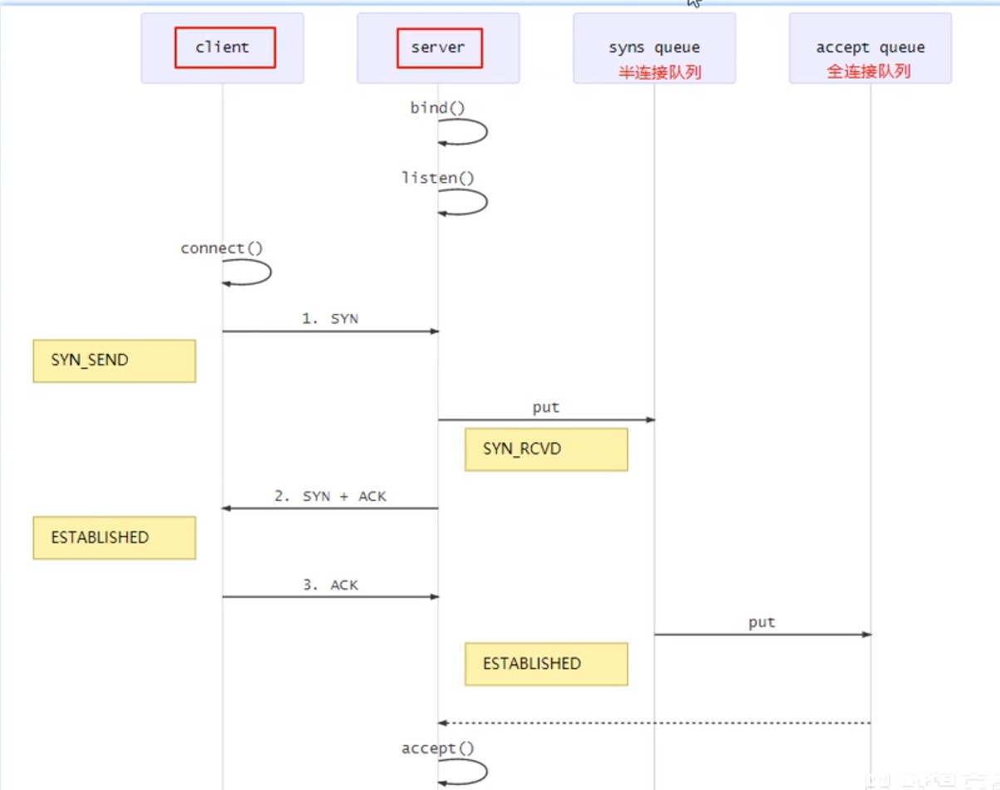

+ 在linux中,半连接大小在/proc/sys/net/ipv4/tcp_max_syn_backlog指定
+ 在linux中,全连接大小在/proc/sys/net/core/somaxconn指定
+ 在netty里,可通过option指定全连接大小,它会在系统文件和软件中取最小的值作为队列大小

```java
//centos默认1024 ubantu默认4096
new ServerBootstrap()
    .option(ChannelOption.SO_BACKLOG,1024);
```

## nagle算法

netty默认打开nagle算法,当服务器接收到几批小数据,它会将这批小数据整合在一起在发生

Nagle算法试图减少TCP包的数量和结构性开销, 将多个较小的包组合成较大的包进行发送.但这不是重点, 关键是这个算法受TCP延迟确认影响, 会导致相继两次向连接发送请求包

一般建议关闭,使用TCP_NODELAY无延迟发送,设置为true即可

```java
new ServerBootstrap()
    .childOption(ChannelOption.TCP_NODELAY,true);
new Bootstrap()
    .option(ChannelOption.TCP_NODELAY,true)
```

## 发送缓冲区&接收缓冲区

缓冲区指TCP的滑动窗口,不建议修改,大多数网卡驱动会根据网络情况自动调整缓冲区

```java
//配置接收缓冲区
new ServerBootstrap()
    .childOption(ChannelOption.SO_SNDBUF,1);
//配置发送缓冲区
new Bootstrap()
    .option(ChannelOption.SO_RCVBUF,1)
```

## ByteBuf分配器

netty发送的数据可以配置ByteBuf类型

可配置连接时创建的ByteBuf是否使用池对象,默认使用

```java
//配置ByteBuf
new ServerBootstrap()
    .childOption(ChannelOption.ALLOCATOR, PooledByteBufAllocator.DEFAULT);
//配置ByteBuf
new Bootstrap()
    .option(ChannelOption.ALLOCATOR, PooledByteBufAllocator.DEFAULT)
```

## 接收方ByteBuf

发送数据的时候,我们可以自定义一个ByteBuf来发送,这个Buf可以是堆内存也可以是直接内存

接收数据的时候,netty会用创建直接内存的Buf来接收

netty默认接收的数据必须是直接内存,可以通过SO_RCVBUF进行更改,具体是否池化由ALLOCATOR决定

```java
//配置ByteBuf
new ServerBootstrap()
    .childOption(ChannelOption.SO_RCVBUF, PooledByteBufAllocator.DEFAULT);
//配置ByteBuf
new Bootstrap()
    .option(ChannelOption.SO_RCVBUF, PooledByteBufAllocator.DEFAULT)
```

## 判断发送成功

有些情况下,我们希望发送消息后,不在读线程中获取回调,而是就在发送线程上获取回调,这就需要一个异步promise


```java
getChannel().writeAndFlush(msg);

// 准备一个空 Promise 对象，来接收结果             指定 promise 对象异步接收结果线程
DefaultPromise<Object> promise = new DefaultPromise<>(getChannel().eventLoop());

// 等待 promise 结果
promise.await();
if(promise.isSuccess()) {
    // 调用正常
    
} else {
    // 调用失败
    
}
```

## 客户端封装bootstrap

封装bootstrap获取channel的方法,在我们调用封装好的方法获取channel时,需要加上同步锁,避免一台客户端重复调用多个channel进行连接

```java
// 初始化channel
private static Channel channel = null;
private static final Object LOCK = new Object();

// 获取唯一的 channel 对象
public static Channel getChannel() {
    if (channel != null) {
        return channel;
    }
    synchronized (LOCK) { //  t2
        if (channel != null) { // t1
            return channel;
        }
        initChannel();
        return channel;
    }
}

// 创建channel 方法
private static void initChannel() {
    NioEventLoopGroup group = new NioEventLoopGroup();
    LoggingHandler LOGGING_HANDLER = new LoggingHandler(LogLevel.DEBUG);
    MessageCodecSharable MESSAGE_CODEC = new MessageCodecSharable();
    RpcResponseMessageHandler RPC_HANDLER = new RpcResponseMessageHandler();
    Bootstrap bootstrap = new Bootstrap();
    bootstrap.channel(NioSocketChannel.class);
    bootstrap.group(group);
    bootstrap.handler(new ChannelInitializer<SocketChannel>() {
        @Override
        protected void initChannel(SocketChannel ch) throws Exception {
            ch.pipeline().addLast(new ProcotolFrameDecoder());
            ch.pipeline().addLast(LOGGING_HANDLER);
            ch.pipeline().addLast(MESSAGE_CODEC);
            ch.pipeline().addLast(RPC_HANDLER);
        }
    });
    try {
        channel = bootstrap.connect("localhost", 8080).sync().channel();
        channel.closeFuture().addListener(future -> {
            group.shutdownGracefully();
        });
    } catch (Exception e) {
        log.error("client error", e);
    }
}
```

## 心跳检测

Netty帮我们封装好了心跳检测,我们不必自己做空闲检测

服务端配置SO_KEEPALIVE

客户端Socket会每隔段的时间（大约两个小时）就会利用空闲的连接向服务器发送一个数据包。这个数据包并没有其它的作用，只是为了检测一下服务器是否仍处于活动状态。如果服务器未响应这个数据包，在大约11分钟后，客户端Socket再发送一个数据包，如果在12分钟内，服务器还没响应，那么客户端Socket将关闭。如果将Socket选项关闭，客户端Socket在服务器无效的情况下可能会长时间不会关闭。

```java
new ServerBootstrap()
    .childOption(ChannelOption.SO_KEEPALIVE, true)
```

## 服务端整合spring

服务端整合spring,做到开启服务的同时开启服务端

```java
@Component
public class TCPServer {
    final EventLoopGroup boss = new NioEventLoopGroup();
    final EventLoopGroup worker = new NioEventLoopGroup();
    private LoggingHandler LOGGING_HANDLER = new LoggingHandler(LogLevel.DEBUG);
    private LoginRequestMessageHandler LOGIN_HANDLER = new LoginRequestMessageHandler();
    private QuitHandler QUIT = new QuitHandler();

    private TCPServer() {
    }

    public void startup() {
        try {
            ServerBootstrap serverBootstrap = new ServerBootstrap();
            serverBootstrap.channel(NioServerSocketChannel.class);
            serverBootstrap.group(boss, worker);
            serverBootstrap.childHandler(new ChannelInitializer<SocketChannel>() {
                @Override
                protected void initChannel(SocketChannel socketChannel){
                    ChannelPipeline pipeline = socketChannel.pipeline();
                }
            });
            Channel channel = serverBootstrap.bind("localhost",8088).sync().channel();
            channel.closeFuture().sync();
        } catch (Exception e) {
            e.printStackTrace();
        } finally {
            boss.shutdownGracefully();
            worker.shutdownGracefully();
        }
    }

}
```

```java
@SpringBootApplication
public class Application {

    public static void main(String[] args) {
        ConfigurableApplicationContext ctx = Application.run(demoApplication.class, args);
        TCPServer tcpServer = ctx.getBean(TCPServer.class);
        tcpServer.startup();
    }
}
```

## 线程安全

由于EventLoopGroup是循环使用的,当用完最后一个eventloop后就会从第一个eventloop开始使用,若这时第一个eventloop的事件,比如读事件还没结束,再去拿去第一个eventloop去操作会产生线程安全问题,所以要加上锁,让后来的请求等第一个eventloop完成并解锁后再拿去使用

```java
@Component
@ChannelHandler.Sharable
public class NettyServerHandler extends ChannelInboundHandlerAdapter {

    private static Lock lock_1 = new ReentrantLock();
    private static Lock lock_2 = new ReentrantLock();
    private static Lock lock_3 = new ReentrantLock();
    private static Lock lock_4 = new ReentrantLock();

    @Override
    public void channelActive(ChannelHandlerContext ctx) {
        lock_1.lock();
        try {
        } catch (Exception e) {
            log.error("客户端连接错误:" + e.getMessage());
        } finally {
            lock_1.unlock();
        }
    }

    @Override
    public void channelInactive(ChannelHandlerContext ctx) {
        lock_2.lock();
        try {
        } catch (Exception e) {
            log.error("客户端断开连接错误:" + e.getMessage());
        } finally {
            lock_2.unlock();
        }
    }

    @Override
    public void channelRead(ChannelHandlerContext ctx, Object msg) {
        lock_3.lock();
        try {
        } catch (Exception e) {
            log.error("读取数据失败:" + e.getMessage());
        } finally {
            lock_3.unlock();
        }
    }

    @Override
    public void userEventTriggered(ChannelHandlerContext ctx, Object evt) {
        lock_4.lock();
        try {
        } catch (Exception e) {
            log.error("error:" + e.getMessage());
        } finally {
            lock_4.unlock();
        }
    }
}
```


# Netty常见参数

# 源码分析


