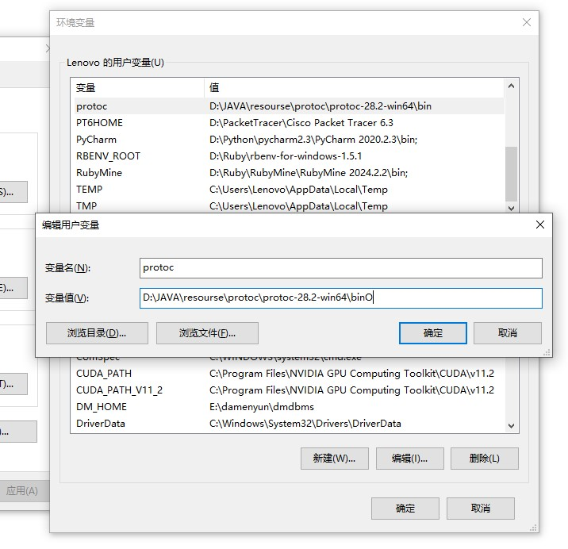

# gRpc介绍

gRPC（**g**oogle **R**emote **P**rocedure **C**all）是一个由 Google 开发的高性能、开源的远程过程调用（RPC）框架。它允许客户端和服务器之间通过 HTTP/2 协议通信，并支持多种语言和平台。gRPC 特别适用于分布式系统和微服务架构，因其高效的网络传输和灵活的通信机制。

## gRPC 的主要特点：

1. **跨语言支持**： gRPC 支持多种编程语言，包括 C++、Java、Go、Python、Ruby、Node.js 等。因此，不同语言编写的服务可以轻松互相通信。
2. **基于 Protocol Buffers（protobuf）**： gRPC 使用 Protocol Buffers 作为接口定义语言（IDL）和序列化工具。protobuf 定义了服务方法和消息结构，并且比传统的 JSON 或 XML 更高效，占用的带宽更小。
3. **HTTP/2 传输协议**： gRPC 使用 HTTP/2 作为底层传输协议，提供了许多优点，如双向流、头部压缩、多路复用请求等。这使得 gRPC 的传输速度更快、效率更高，特别是在高并发和流式传输的场景下。
4. **同步与异步通信**： gRPC 支持多种通信模式，包括传统的同步 RPC 调用、异步的客户端和服务器流式传输，甚至是双向流式通信。
5. **负载均衡、认证、拦截器等高级特性**： gRPC 内置了很多实用的功能，如负载均衡、身份认证、超时管理、拦截器等，帮助开发者轻松实现可靠的远程通信服务。

## gRPC 的工作流程：

1. **定义服务**：使用 `.proto` 文件定义服务和消息结构。你可以在文件中定义服务、请求和响应消息。
2. **生成代码**：通过 `protoc` 编译器生成相应的客户端和服务器代码（例如 Ruby、Python 等语言的文件）。
3. **实现服务**：在服务器端实现服务逻辑，并启动 gRPC 服务器。
4. **调用服务**：客户端通过生成的代码，调用服务器端的服务方法，进行 RPC 调用。

## 通信模式：

- **简单 RPC**：客户端发送一次请求，服务器返回一次响应。
- **服务器流式 RPC**：客户端发送请求后，服务器可以多次返回响应。
- **客户端流式 RPC**：客户端可以多次发送请求，服务器在处理完后返回一个响应。
- **双向流式 RPC**：客户端和服务器可以同时进行多次请求和响应的交互。

gRPC 广泛应用于微服务架构、云计算平台以及需要高效通信的分布式系统中。

# Protocol 编码

为了实现跨语言的远程你调用,Google使用了一种统一的编码方式,可根据指定的.proto文件生成对应的***消息体***、***请求Request***和***响应Response***.

可以简单理解为根据不同的语言生成对应的代码

## Protocol Buffters编译器

可从官网上下载对应的Protocol Buffters编译器,并使用指定生成对应的代码https://github.com/protocolbuffers/protobuf/releases

根据不同的开发环境下载对应的版本,这里以win版本作为案例.将下载的文件解压,并配置对应的环境变量



这里介绍一些

常用的指令

| 指令                 | 说明           |
| -------------------- | -------------- |
| --cpp_out=OUT_DIR    | 生成C++代码    |
| --java_out=OUT_DIR   | 生成Java代码   |
| --js_out=OUT_DIR     | 生成Js代码     |
| --kotlin_out=OUT_DIR | 生成kotlin代码 |
| --php_out=OUT_DIR    | 生成php代码    |
| --python_out=OUT_DIR | 生成py代码     |
| --ruby_out=OUT_DIR   | 生成rb代码     |

```bash
# 这里以生成java为例,在当前目录生成(需要提前写好.proto文件)
protoc --ruby_out=./ ./MyPtoto.proto
```

*** 注意,除了需要安装Protocol Buffters,还有安装对应的语法插件,比如使用java就要在maven里安装protobuf-java支持库,用来生成对应的支持文件,具体安装方法在后面的开发语言篇中***

## proto语法

生成代码之前需要定义好对应的生成规则,也就是grpc通讯的消息体、请求和响应格式

### 基础语法结构

#### 1.1 语法声明

每个 `.proto` 文件都需要指定语法版本，通常使用 `proto3`：

```protobuf
syntax = "proto3";
```

#### 1.2 包声明

指定包名，类似于命名空间，用于避免消息或服务名称冲突：

```protobuf
package com.example.myapp;
```

#### 1.3 导入其他 `.proto` 文件

使用 `import` 语句导入其他 `.proto` 文件中的定义：

```protobuf
import "other.proto";
```

#### 1.4 定义消息

消息是 Protocol Buffers 的核心，用来定义数据结构。消息中可以包含字段，每个字段都有一个名称、类型和唯一的标识号

```protobuf
message 消息体名 {
    int32 id = 1;         // 一个整型字段，编号1
    string name = 2;      // 一个字符串字段，编号2
    bool is_active = 3;   // 一个布尔字段，编号3
}
```

#### 1.5 定义服务

服务是 gRPC 的核心，定义了远程过程调用（RPC）的接口。每个服务包含多个 RPC 方法。根据通讯方式的不同,服务也分为4种

+ 单一响应:发送一个请求得到一个响应
+ 使用场景:调用的远程方法是一个计算函数,只会返回一次结果

```protobuf
service 服务名 {
    rpc 服务方法名 (请求消息体) returns (响应消息体);
}
```

+ 客户端流式:发送多个请求,直到客户端确定complete,服务端才响应
+ 使用场景:调用的远程方法需要传递一个文件,这个文件需要分批上传

```protobuf
service 服务名 {
    rpc 服务方法名 (stream 请求消息体) returns (响应消息体);
}
```

+ 服务端流式:发送一个请求,服务端返回多个响应,直到服务端complete
+ 使用场景:调用的远程方法返回一个文件,这个文件分批返回

```protobuf
service 服务名 {
    rpc 服务方法名 (请求消息体) returns (stream 响应消息体);
}
```

+ 双向流式:发送多个请求,直到客户端确定complete,服务端才响应,服务端返回多个响应,直到服务端complete
+ 使用场景:调用的远程方法是一个计算函数,只会返回一次结果

```protobuf
service 服务名 {
    rpc 服务方法名 (stream 请求消息体) returns (stream 响应消息体);
}
```

个人经验:一般直接定义双向流式,然后在代码里面进行控制.比如我定义的是一个双向流式,但实际上业务中仅使用到单向,那么请求和响应的时候发出一个数据就直接complete结束就行

#### 案例

```protobuf
syntax = "proto3";

package com.llllluuusa;

service StudyService {
  rpc StudyMethod(StudyRequest) returns (StudyResponse);
}

message StudyRequest {
  string message = 1;
}

message StudyResponse {
  string reply = 1;
}
```

### 消息类型

字段定义了消息的数据成员，格式如下：

```protobuf
<类型> <字段名> = <标签>;
```

#### 2.1标量类型

常用的标量类型包括：

- **整数类型**：`int32`、`int64`、`uint32`、`uint64`、`sint32`、`sint64`、`fixed32`、`fixed64`、`sfixed32`、`sfixed64`
- **浮点类型**：`float`、`double`
- **布尔类型**：`bool`
- **字符串类型**：`string`
- **字节类型**：`bytes`

#### 2.2数组类型

使用 `repeated` 定义可以重复的字段，相当于列表或数组。

```protobuf
message Group {
  repeated string members = 1;
}
```

#### 2.3键值类型

使用 `map` 定义键值对集合。

```protobuf
message Dictionary {
  map<string, int32> word_count = 1;
}
```

#### 2.4互斥类型

`oneof` 用于定义互斥的字段，某一时刻只能设置其中一个

```protobuf
message SampleMessage {
  oneof test_oneof {
    string name = 4;
    int32 id = 5;
  }
}
```

个人经验:一般使用string类型,数据用json格式,这样方便统一数据格式转换,二是json格式相对其他格式序列化后所占用的空间小,传输数据更方便

# Java On gRpc

在java中使用gRpc需要先安装Protocol Buffters和对应的支持库,Protocol Buffters上文有介绍如何安装,这里介绍支持库的安装

## 安装支持库

```xml
<?xml version="1.0" encoding="UTF-8"?>
<project xmlns="http://maven.apache.org/POM/4.0.0"
         xmlns:xsi="http://www.w3.org/2001/XMLSchema-instance"
         xsi:schemaLocation="http://maven.apache.org/POM/4.0.0 http://maven.apache.org/xsd/maven-4.0.0.xsd">
    <modelVersion>4.0.0</modelVersion>

    <groupId>com.llllluuusa</groupId>
    <artifactId>gRPC</artifactId>
    <version>1.0-SNAPSHOT</version>

    <dependencies>
        <!-- gRPC 核心库 -->
        <dependency>
            <groupId>io.grpc</groupId>
            <artifactId>grpc-netty-shaded</artifactId>
            <version>1.57.2</version> <!-- 请根据需要选择版本 -->
        </dependency>

        <!-- gRPC protobuf 库 -->
        <dependency>
            <groupId>io.grpc</groupId>
            <artifactId>grpc-protobuf</artifactId>
            <version>1.57.2</version>
        </dependency>

        <!-- gRPC 生成的代码库 -->
        <dependency>
            <groupId>io.grpc</groupId>
            <artifactId>grpc-stub</artifactId>
            <version>1.57.2</version>
        </dependency>

        <!-- Protobuf Java 支持库 -->
        <dependency>
            <groupId>com.google.protobuf</groupId>
            <artifactId>protobuf-java</artifactId>
            <version>3.24.3</version>
        </dependency>
    </dependencies>

    <build>
        <extensions>
            <!-- Maven protobuf 插件，用于 gRPC 和 protobuf 文件的生成 -->
            <extension>
                <groupId>kr.motd.maven</groupId>
                <artifactId>os-maven-plugin</artifactId>
                <version>1.7.0</version>
            </extension>
        </extensions>

        <plugins>
            <!-- 用于生成 protobuf 和 gRPC 代码 -->
            <plugin>
                <groupId>org.xolstice.maven.plugins</groupId>
                <artifactId>protobuf-maven-plugin</artifactId>
                <version>0.6.1</version>
                <configuration>
                    <protocArtifact>com.google.protobuf:protoc:3.24.3:exe:${os.detected.classifier}</protocArtifact>
                    <pluginId>grpc-java</pluginId>
                    <pluginArtifact>io.grpc:protoc-gen-grpc-java:1.57.2:exe:${os.detected.classifier}</pluginArtifact>
                </configuration>
                <executions>
                    <execution>
                        <goals>
                            <goal>compile</goal>
                            <goal>compile-custom</goal>
                        </goals>
                    </execution>
                </executions>
            </plugin>
        </plugins>
    </build>


    <properties>
        <maven.compiler.source>8</maven.compiler.source>
        <maven.compiler.target>8</maven.compiler.target>
        <project.build.sourceEncoding>UTF-8</project.build.sourceEncoding>
    </properties>

</project>
```

## 生成代码

通过maven将代码生成出来,生成的代码位置于`target/generated-sources/protobuf/grpc-java`

```bash
mvn clean complete
```

## 客户端
### 单一请求客户端
```java
// 连接 gRPC 服务
ManagedChannel channel = ManagedChannelBuilder.forAddress("localhost", 8080)
    .usePlaintext()
    .build();

// 创建 gRPC 客户端存根
服务名Grpc.服务名BlockingStub stub =服务名Grpc.newBlockingStub(channel);
// 为客户端添加拦截器(如果有)
//服务名Grpc服务名BlockingStub stub =服务名Grpc.newBlockingStub(
//                ClientInterceptors.intercept(channel, new 拦截器()));

// 创建请求
请求名 request = 请求名.newBuilder()
    .setMessage("我是请求消息")
    .build();

// 发送请求并获取响应
响应名 response = stub.服务方法名(request);

// 打印服务端的响应
System.out.println("服务端执行结果:" + response.getReply());

// 关闭通道
channel.shutdown();
```
### 流式请求客户端
```java
// 创建 gRPC 通道
ManagedChannel channel = ManagedChannelBuilder.forAddress("localhost", 8080)
    .usePlaintext()
    .build();

// 创建存根
服务名Grpc.服务名Stub stub = 服务名Grpc.newStub(channel);
// 为客户端添加拦截器(如果有)
//服务名Grpc服务名BlockingStub stub =服务名Grpc.newBlockingStub(
//                ClientInterceptors.intercept(channel, new 拦截器()));

// 创建服务端响应的观察者,若服务端是流式使用改方法
StreamObserver<响应名> responseObserver = new StreamObserver<响应名>() {
    @Override
    public void onNext(响应名 response) {
        // 服务端返回响应时处理
        System.out.println("服务端执行结果:" + response.getReply());
    }

    @Override
    public void onError(Throwable t) {
        System.out.println("服务端响应异常");
        t.printStackTrace();
    }

    @Override
    public void onCompleted() {
        // 当服务端完成响应时
        System.out.println("服务端响应结束");
    }
};

// 创建请求流的观察者,若请求是流式使用该方法
StreamObserver<请求名> requestObserver = stub.服务方法(responseObserver);
// 发送多个请求
requestObserver.onNext(请求名.newBuilder().setMessage("我是请求消息1").build());
requestObserver.onNext(请求名.newBuilder().setMessage("我是请求消息2").build());
requestObserver.onNext(请求名.newBuilder().setMessage("我是请求消息3").build());
// 发送完成请求
requestObserver.onCompleted();

// 关闭通道
channel.shutdown();
```

## 服务端

### 单一响应服务端

```java
public class 服务名Impl extends 服务名Grpc.服务名eImplBase {

    @Override
    public void 服务方法(请求名 request, StreamObserver<响应名> responseObserver) {
        // 获取请求中的消息
        String message = request.getMessage();
        System.out.println("客户端发送的请求:" + message);
        // 创建响应
        响应名 response = 响应名.newBuilder()
                .setReply("我是响应结果")
                .build();

        // 将响应发送回客户端
        responseObserver.onNext(response);
        responseObserver.onCompleted();
    }
}
```

### 流式响应服务端

```java
public class 服务名Impl extends 服务名Grpc.服务名eImplBase {
    @Override
    public StreamObserver<请求名> 服务方法(final StreamObserver<响应名> responseObserver) {
        return new StreamObserver<请求名>() {

            @Override
            public void onNext(请求名 request) {
                // 获取请求中的消息
        		String message = request.getMessage();
       			System.out.println("客户端发送的请求:" + message);
                // 当收到每个请求时，立即生成响应
                响应名 response = 响应名.newBuilder()
                        .setReply("我是响应结果 " + request.getMessage())
                        .build();

                // 发送响应给客户端
                responseObserver.onNext(response);
            }

            @Override
            public void onError(Throwable t) {
                t.printStackTrace();
            }

            @Override
            public void onCompleted() {
                // 当客户端流结束时，通知响应已完成
                responseObserver.onCompleted();
            }
        };
    }
}
```

## 拦截器

服务端拦截器允许你在请求被服务方法处理之前或之后进行一些额外的操作。常见的使用场景包括：

- 日志记录
- 认证与授权
- 监控

### 服务端拦截器

```java
public class XxServerInterceptor implements ServerInterceptor {

    @Override
    public <ReqT, RespT> ServerCall.Listener<ReqT> interceptCall(
            ServerCall<ReqT, RespT> call,
            Metadata headers,
            ServerCallHandler<ReqT, RespT> next) {

        // 打印请求信息（可以根据需要记录更多信息）
        System.out.println("调用的方法:  " + call.getMethodDescriptor().getFullMethodName());

        // 继续处理请求，传递到下一个处理器
        return next.startCall(call, headers);
    }
}
```

### 客户端拦截器

```java
public class XxClientInterceptor implements ClientInterceptor {

    @Override
    public <ReqT, RespT> ClientCall<ReqT, RespT> interceptCall(
            MethodDescriptor<ReqT, RespT> method,
            CallOptions callOptions,
            Channel next) {

        // 打印调用的方法名称
        System.out.println("调用的方法: " + method.getFullMethodName());

        // 继续处理调用
        return next.newCall(method, callOptions);
    }
}
```


## 启动类

```java
public class StartgRpc {
    // 启动 gRPC 服务
    public static void main(String[] args) throws IOException, InterruptedException {
        Server server = ServerBuilder.forPort(8080)
                .addService(new StudyServiceImpl())
            	.intercept(new 拦截器) // 服务端拦截器
            	.intercept(new 拦截器2) // 可配置多个拦截器
                .build()
                .start();

        System.out.println("gRpc服务启动...");

        // 让服务保持运行
        server.awaitTermination();
    }
}
```

# Ruby On gRpc

在ruby中使用gRpc需要先安装Protocol Buffters和对应的支持库,Protocol Buffters上文有介绍如何安装,这里介绍支持库的安装

## 安装支持库
```ruby
source 'https://rubygems.org' # 可以换清华源或者科学上网

gem 'grpc'            # gRPC 库
gem 'google-protobuf' # Protobuf 库
gem 'grpc-tools'   # gRPC 工具
```

## 生成代码

通过grpc-tools将代码生成出来,生成的代码位置于指定目录

```bash
grpc_tools_ruby_protoc -I .proto所在目录 --ruby_out=生成的实体类目录 --grpc_out=生成的服务目录 ./需要编译的.proto文件
# grpc_tools_ruby_protoc -I ./ --ruby_out=./ --grpc_out=./ ./studyProto.proto
```

*** 注意***:grpc-tools生成的文件默认导入目录是在根目录,这就导致可能会出现找不到文件的异常 `require': cannot load such file -- studyProto_pb (LoadError) `,需要手动修改生成的`xx_services_pb.rb`这个文件

```ruby
require 'grpc'
# require 'studyProto_pb'
require_relative 'studyProto_pb' # 改一下导入方法即可
```

## 客户端

### 单一请求客户端

```ruby
require 'grpc'

require_relative 'studyProto_services_pb'

# 创建 gRPC stub，指定服务端的地址和端口
stub = Com::Llllluuusa(配置的包名)::服务名::Stub.new(
    'localhost:8080',
    :this_channel_is_insecure,
    # interceptors: [拦截器r.new],
    )

# 构造请求消息
request = Com::Llllluuusa(配置的包名)::请求名.new(message: '我是请求消息')

# 调用服务方法并接收响应
begin
    response = stub.服务方法(request)
    puts "服务端响应结果: #{response.reply}"
rescue GRPC::BadStatus => e
    puts "服务端响应失败: #{e.details}"
end
```

### 流式请求客户端

```ruby
require 'grpc'

require_relative 'studyProto_services_pb'

# 创建客户端 Stub
stub = Com::Llllluuusa(配置的包名)::服务名::Stub.new(
    'localhost:8080',
    :this_channel_is_insecure,
    # interceptors: [拦截器r.new],
    )

# 准备一个 Enumerator 来提供客户端的请求流
requests = Enumerator.new do |yielder|
  yielder << Com::Llllluuusa(配置的包名)::请求名.new(message: '我是请求消息1')
  sleep 1
  yielder << Com::Llllluuusa(配置的包名)::请求名.new(message: '我是请求消息2')
  sleep 1
  yielder << Com::Llllluuusa(配置的包名)::请求名.new(message: '我是请求消息3')
end

# 发起双向流式/客户端流式调用
response_stream = stub.服务方法(requests)
# 发起服务端流式调用
# request = Com::Llllluuusa(配置的包名)::请求名.new(message: '我是请求消息')
# response_stream = stub.服务方法(request)

# 读取服务器的响应流
begin
  response_stream.each do |response|
  	puts "服务端响应结果: #{response.reply}"
  end
rescue GRPC::BadStatus => e
  puts "服务端响应失败: #{e.details}"
end
```

## 服务端

### 单一请求服务端
```ruby
require 'grpc'
require_relative 'study_services_pb'  # 生成的 gRPC 服务文件

# 实现服务类，继承自生成的服务
class 服务端Server < Com::Llllluuusa(配置的包名)::服务名::Service
  # 实现普通 RPC 方法
  def 服务方法(request, _unused_call)
    # 处理客户端请求，返回响应
    puts "客户端发送的请求: #{request.message}"
    Com::Llllluuusa(配置的包名)::响应名.new(reply: "我是响应结果")
  end
end
```


### 流式请求服务端
```ruby
require 'grpc'
require_relative 'study_services_pb'  # 生成的 gRPC 服务文件

# 实现服务类，继承自生成的服务
class 服务端Server < Com::Llllluuusa(配置的包名)::服务名::Service
  # 实现普通 RPC 方法
  def 服务方法(call)
    # 处理客户端请求流
    call.each_remote_read do |request|
      puts "客户端发送的请求: #{request.message}"
    end
      
	# 返回响应
    yield Com::Example::StudyResponse.new(reply: "我是响应结果1")
    yield Com::Example::StudyResponse.new(reply: "我是响应结果2")
    yield Com::Example::StudyResponse.new(reply: "我是响应结果3")
  end
end
```

## 拦截器

### 服务端拦截器
```ruby
class XxInterceptor < GRPC::ServerInterceptor
  def request_response(request, metadata: {}, &block)
    # 打印调用的方法名称
    puts "Calling method: #{metadata['grpc.method']}"

    # 调用 RPC 方法
    yield(request, metadata, &block)
  end
end
```

### 客户端拦截器
```ruby
require 'grpc'

class XxInterceptor < GRPC::ClientInterceptor
  def request_response(request, metadata: {}, &block)
    # 获取当前调用的方法名称
	puts "Calling method: #{metadata['grpc.method']}"

    # 调用 RPC 方法
    response = yield(request, metadata, &block)

    # 返回响应
    response
  end
end
```

## 启动类
```ruby
require 'grpc'
require_relative '服务端Server'  # 服务端接口

# 启动 gRPC 服务器
# server = GRPC::RpcServer.new(interceptors: [拦截器.new])
server = GRPC::RpcServer.new
server.add_http2_port('0.0.0.0:8080', :this_port_is_insecure)
server.handle(服务端Server)
puts 'gRpc服务启动...'
server.run_till_terminated
```

