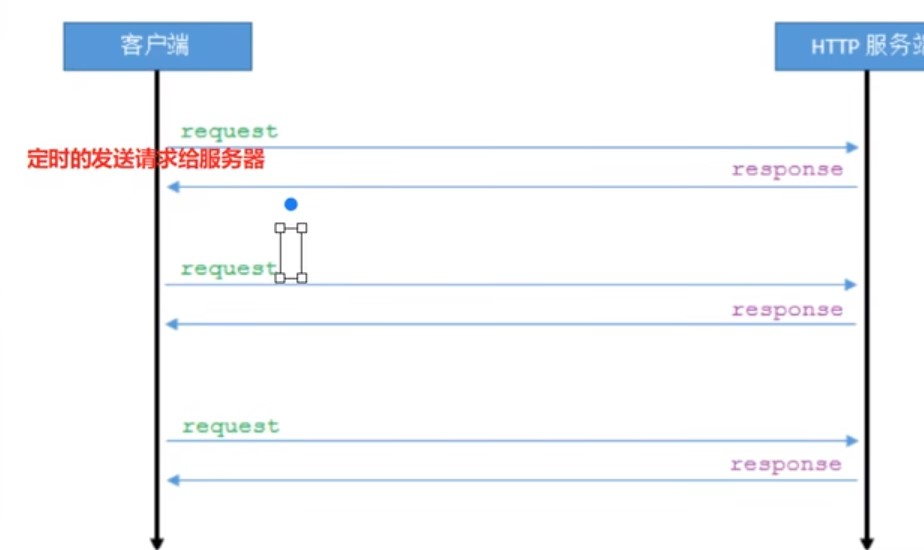
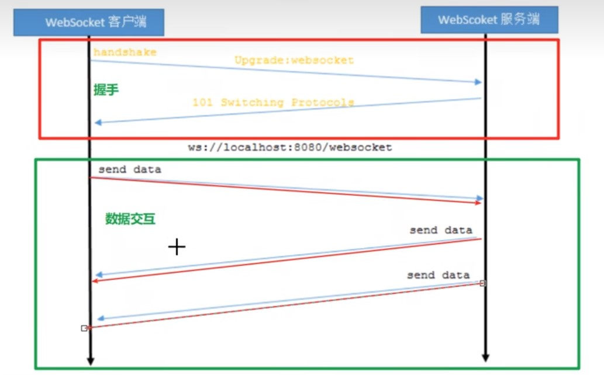
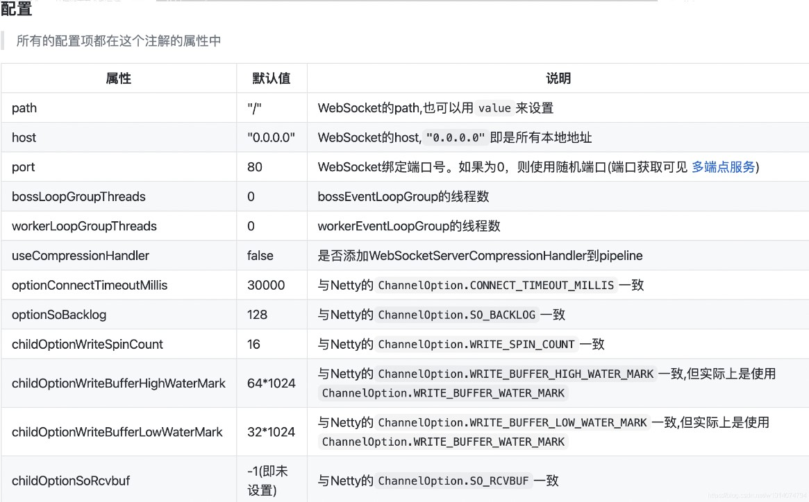

# 介绍

websocket是一种网络通信协议.RFC6455定义了它的通信标准

websocket是HTML5开始提供的一种在单个TCP连接上进行全双工通讯的协议.

## 对比HTTP

HTTP协议是一种无状态的、无连接的、单向的应用层协议.它采用了请求/响应模型.通信请求只能由客户端发起,服务端对请求做出应答处理.

这种通信模型有一个弊端.HTTP协议无法实现服务器主动向客户端发起消息

这种单向请求的特点,注定了如果服务器有连续的状态变化,客户端要获知就非常麻烦.大多数Web应用程序通过频繁的异步AJAX请求实现长轮询.轮询的效率低,非常浪费资源(因为必须不停连接,或者HTTP连接始终的打开)

http协议:



websocket协议:



## 协议规则

websocket协议由两部分组成:握手和数据交互

来自客户端的握手请求头如下:

```http
GET ws://localhost/chat HTTP/1.1
Host: localhost
Upgrade: websocket
Connection: Upgrade
Sec-WebSocket-Key: dGHlIHNhbXBsZsbub25jZQ==
Sec-WebSocket-Extensions:permessage-defalte
Sec-WebSocket-version: 13
```

来自服务器的握手看起来像如下形式:

```html
HTTP/1.1 101 Switching Protocols
Upgrade: websocket
Connection: Upgrade
Sec-WebSocket-Key: s3pPLMBiTxaQ9kYGzzhZRbk+xOo=
Sec-WebSocket-Extensions:permessage-defalte
```

| 头名称                    | 说明                                                       |
| ------------------------- | ---------------------------------------------------------- |
| Connection: Upgrade       | 表示该HTTP请求是一个协议升级请求                           |
| Upgrade: websocket        | 协议升级为WebSocket的版本                                  |
| Sec-WebSocket-version: 13 | 客户端支持WebSocket的版本                                  |
| Sec-WebSocket-Key         | base64编码的24位随机字符,表示本次请求客户端/服务端的唯一Id |
| Sec-WebSocket-Extensions  | 协议拓展类型                                               |

# 客户端实现

## websocket对象

http5支持使用websocket

以下API用于创建websocket对象:

```js
//url格式: ws//ip地址:端口号/路径
var ws = new WebSocket(url);
```

## websocket事件

websocket对象的相关事件

| 事件    | 事件处理程序          | 描述                       |
| ------- | --------------------- | -------------------------- |
| open    | websocket对象.onopen  | 连接建立时触发             |
| message | websocket对象.onopen  | 客户端接收服务端数据时触发 |
| error   | websocket对象.onerror | 通信发生错误时触发         |
| close   | websocket对象.onclose | 连接关闭时触发             |

## websocket方法

websocket相关方法

| 方法   | 描述       |
| ------ | ---------- |
| send() | 发送消息\| |

# 服务端spring实现

## 安装依赖

```xml
<dependency>
    <groupId>javax</groupId>
    <artifactId>javaee-api</artifactId>
    <version>7.0</version>
    <scope>provided</scope>
</dependency>
```

## 方法和事件

Tomcat7版本开始支持websocket,并实现了Java WebSocket规范

Java WebSocket应用由一系列的WebSocketEndpoint组成.Endpoint是一个java对象,代表websocket连接的一段,对于服务端,我们可以视为处理具体websocket消息的接口,就像servlet之与http请求一样

我们可以通过两种方式定义Endpoint:

+ 第一种是编程式,即继承类javax.websocket.Endpoint并实现其方法
+ 第二种是注解式,即定义一个POJO,并添加@ServerEndpoint相关注解

Endpoint实例在websocket握手时创建,并在客户端与服务端链接过程中有效,最后在链接关闭时结束.在Endpoint接口中明确定义了其生命周期相关的方法,规范实现者确保生命周期的各个阶段调用实例的相关方法.生命周期方法如下:

| 方法    | 含义秒速                                                     | 注解     |
| ------- | ------------------------------------------------------------ | -------- |
| onClose | 当会话关闭时调用                                             | @OnClose |
| onOpen  | 当开启一个新的会话时调用,该方法是客户端与服务端握手成功后调用的方法 | @OnOpen  |
| onError | 当连接过程中异常时调用                                       | @onError |

***服务端如何接收客户端发送的数据呢?***

通过Session添加MessageHandler消息处理器来接收消息,当采用注解方式定义Endpoint时,我们还可以通过使用@OnMessage注解指定接收消息的方法

*** 服务端如何推送数据给客户端呢?***

发送消息则由RemoteEndpoint完成,其实例由Session维护,根据使用情况,我们可以通过Session.getBasicRemote获取同步消息发送的实例,然后调用其sendXxx()方法就可以发送消息,可以通过Session.getAsyncRemote获取异步消息发送实例

| 方法                                  | 含义     |
| ------------------------------------- | -------- |
| session.getBasicRemote().sendText("") | 发送消息 |

## 案例


```java
/**
 * 1. 代表这是一个websocket服务
 * 2. 指定放问到该服务的地址，地址可使用占位符
 */
@ServerEndpoint(value="/websocket/{uid}",configurator=GetHttpSessionConfigurator.class) 
public class MyWebSocket {
 	private Session session;
    private HttpSession httpSession;
    /**
     * @OnOpen 被修饰的方法会在建立连接后执行，会传入Session对象（客户端与服务端建立的长连接通道）
     * @PathParam("uid") 获取url上的参数绑定到修饰的变量上
     */
    @OnOpen
    public void onOpen(Session session, @PathParam("uid") String uid) throws IOException {
        this.session = session;   
        this.httpSession= (HttpSession) config.getUserProperties().get(HttpSession.class.getName());
        session.getBasicRemote().sendText(uid + " 欢迎连接 WebSocket !");
        
        //redis或map存储建立连接的用户信息
    }
 
 
    /**
     * @OnClose 被修饰的方法会在连接关闭后执行
     */
    @OnClose
    public void onClose() {
        System.out.println("webSocket关闭连接");
    }
 
    /**
     * @OnMessage 被修饰的方法用于接收客户端发来的消息
     */
    @OnMessage
    public void onMessage(String message, Session session) throws IOException {
        System.out.println("收到消息： " + message);
        // 发送消息到客户端
        session.getBasicRemote().sendText("消息已收到");
    }
 
    /**
     * @OnError 被修饰的方法将会在发生错误时执行
     */
    @OnError
    public void onError(Throwable error){
        System.out.println("发生错误");
        error.printStackTrace();
    }
 
 
}
```

```java
@Configuration
public class WebSocketConfig{
    @Bean
    //注入ServerEndpointExporter bean对象,自动注册使用了@ServerEndpoint
    public ServerEndpointExporter serverEndpointExporter(){
        return new ServerEndpointExporter();
    }
}
```

```java
public class GetHttpSessionConfigurator extends Configurator {

    @Override
    public void modifyHandshake(ServerEndpointConfig sec,
            HandshakeRequest request, HandshakeResponse response) {
        HttpSession httpSession=(HttpSession) request.getHttpSession();
        // 存httpsession进Config里
        sec.getUserProperties().put(HttpSession.class.getName(),httpSession);
    }
    
}

```


# 服务端springboot实现

## 安装依赖

```xml
<dependency>
    <groupId>org.springframework.boot</groupId>
    <artifactId>spring-boot-starter-websocket</artifactId>
</dependency>
```

## 案例

```java
/**
* 处理器类
*/
 
public class MySocketHandler extends TextWebSocketHandler {
 
    /**
     * 收到消息
     */
    @Override
    protected void handleTextMessage(WebSocketSession session, TextMessage message) throws Exception {
 
        System.out.println("接收到消息： "+message.getPayload());
 
        session.sendMessage(new TextMessage("消息已收到"));
    }
 
    /**
     * 建立连接之后
     */
    @Override
    public void afterConnectionEstablished(WebSocketSession session) throws Exception {
        session.sendMessage(new TextMessage("欢迎 "+session.getAttributes().get("uid")+" 连接到WebSocket服务！"));
    }
 
 
    /**
     * 断开连接后
     */
    @Override
    public void afterConnectionClosed(WebSocketSession session, CloseStatus status) throws Exception {
        System.out.println("断开连接");
    }
 
}
```

```java
 /**
* 拦截器类
*/
@Component
public class MyShakeInterceptor  implements HandshakeInterceptor {
 
    /**
     * 建立连接之前执行 ， 若返回false则不进行连接
     */
    @Override
    public boolean beforeHandshake(ServerHttpRequest serverHttpRequest, ServerHttpResponse serverHttpResponse, WebSocketHandler webSocketHandler, Map<String, Object> map) throws Exception {
        System.out.println("开始建立连接 baby ~");
        map.put("uid",1001);
        return true;
    }
 
    /**
     * 建立连接之后
     */
    @Override
    public void afterHandshake(ServerHttpRequest serverHttpRequest, ServerHttpResponse serverHttpResponse, WebSocketHandler webSocketHandler, Exception e) {
        System.out.println("连接成功了 baby ~");
    }
}
```

```java
 /**
* 配置类
*/
@Configuration
@EnableWebSocket
public class WebSocketConfig implements WebSocketConfigurer {
 
    @Autowired
    private MyShakeInterceptor myShakeInterceptor;
 
    @Override
    public void registerWebSocketHandlers(WebSocketHandlerRegistry registry) {
        registry.addHandler(createWebSocketHandler(),"/ws")
                .setAllowedOrigins("*")
                .addInterceptors(myShakeInterceptor);
    }
 
    @Bean
    public WebSocketHandler createWebSocketHandler(){
        return new MySocketHandler();
    }
}
```

# 服务端netty实现

## 安装

```xml
<dependency>
    <groupId>org.yeauty</groupId>
    <artifactId>netty-websocket-spring-boot-starter</artifactId>
    <version>0.10.0</version>
</dependency>
```

## 方法和事件



## 案例

```properties
server.port=8080

#ws相关属性配置
ws.host=0.0.0.0
ws.port=8333
# 解决返回页面中文乱码问题
server.servlet.encoding.force=true
server.servlet.encoding.charset=UTF-8
```

```java
@ServerEndpoint(path = "/myWs",host = "${ws.host}",port = "${ws.port}")
//@Component
public class MyWebSocket {

    /**
     *建立ws连接前的配置
     */
/*    @BeforeHandshake
    public void handshake(Session session, HttpHeaders headers, @RequestParam String req, @RequestParam MultiValueMap reqMap, @PathVariable String arg, @PathVariable Map pathMap){
        //采用stomp子协议
        session.setSubprotocols("stomp");
        if (!"ok".equals(req)){
            System.out.println("Authentication failed!");
            session.close();
        }
    }*/

    @OnOpen
    public void onOpen(Session session, HttpHeaders headers, @RequestParam String req, @RequestParam MultiValueMap reqMap, @PathVariable String arg, @PathVariable Map pathMap){
        System.out.println("new connection");
    }

    @OnClose
    public void onClose(Session session) throws IOException {
        System.out.println("one connection closed");
    }

    @OnError
    public void onError(Session session, Throwable throwable) {
        throwable.printStackTrace();
    }

    @OnMessage
    public void onMessage(Session session, String message) {
        System.out.println("接收的消息为：" + message);
        session.sendText("Hello Netty!");
    }

    @OnBinary
    public void onBinary(Session session, byte[] bytes) {
        for (byte b : bytes) {
            System.out.println(b);
        }
        session.sendBinary(bytes);
    }

    @OnEvent
    public void onEvent(Session session, Object evt) {
        if (evt instanceof IdleStateEvent) {
            IdleStateEvent idleStateEvent = (IdleStateEvent) evt;
            switch (idleStateEvent.state()) {
                case READER_IDLE:
                    System.out.println("read idle");
                    break;
                case WRITER_IDLE:
                    System.out.println("write idle");
                    break;
                case ALL_IDLE:
                    System.out.println("all idle");
                    break;
                default:
                    break;
            }
        }
    }
}

```

