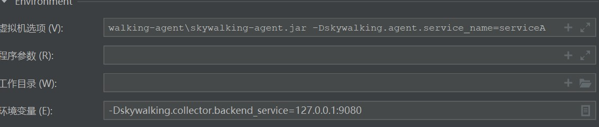

# 介绍

SkyWalking是一个开源的应用性能监控工具，最初由中国移动研究院提供，后来成为了Apache软件基金会的一个顶级项目。它旨在帮助开发人员监控和管理分布式系统的性能，包括应用程序、服务和基础设施组件。

# 本地部署

## 下载

前往https://skywalking.apache.org/downloads/下载SkyWalking APM和Java Agent

## 配置

### 配置端口

在apache-skywalking-apm-bin\webapp.yml

```yaml
server:
  port: 9080
```

### 配置数据库

默认使用h2数据库,保存在本地,这里修改为mysql数据库

skywalking只支持8以上的mysql

将mysql连接驱动mysql-connector-java-8.0.15.jar放入apache-skywalking-apm-bin\oap-libs

在mysql中新建数据库skywalking

在apache-skywalking-apm-bin\config\application.yml中配置数据库信息

```yaml
storage:
  selector: ${SW_STORAGE:mysql}
mysql:
    properties:
      jdbcUrl: ${SW_JDBC_URL:"jdbc:mysql://localhost:3306/skywalking?rewriteBatchedStatements=true"}
      dataSource.user: ${SW_DATA_SOURCE_USER:用户名}
      dataSource.password: ${SW_DATA_SOURCE_PASSWORD:密码}
```

## 启动

在apache-skywalking-apm-bin\bin\startup.bat启动即可,微服务启动需添加参数



```sh
-javaagent:D:\mytool\apache-skywalking-java-agent-8.14.0\skywalking-agent\skywalking-agent.jar -Dskywalking.agent.service_name=服务名 
```

```sh
-Dskywalking.collector.backend_service=skywalking端口Ip:端口
```

# 服务器部署

